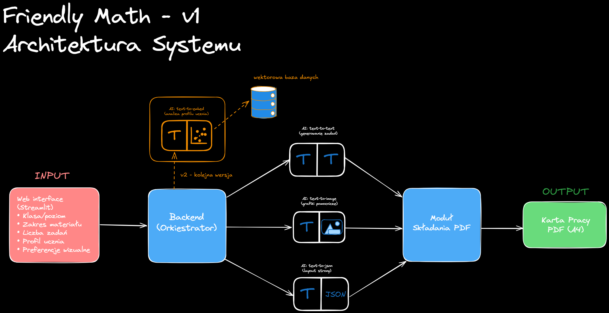

⚠️ **Status projektu: MVP v0.8.0 (Day 10 & 11 — ilustracje per zadanie, ułamki szkolne)**  
  
Aktualna wersja aplikacji prezentuje **funkcjonalne MVP**:
 - działający interfejs Streamlit,
 - wybór profilu ucznia (dyskalkulia, ADHD, standardowy, itd.),
 - pełny flow: input → generacja zadań przez AI → layout (AI) → grafika → PDF v1,
 - **generowanie zadań przez OpenAI API** (dostosowane do profilu),
 - **layout sterowany AI** (font size, spacing) + wymuszony layout dla profili dyskalkulia/ADHD,
 - **ilustracja przy każdym zadaniu** (dla dyskalkulia/ADHD/trudności zawsze; dla standardowy/zdolny – opcja „Ilustracja w karcie”),
 - **ilustracje zgodne z treścią**: dodawanie (grupy kół), odejmowanie (przekreślenie „zabranych”), mnożenie (siatka), dzielenie (grupy), ułamki (koło podzielone),
 - **ułamki zwykłe w zapisie szkolnym** w PDF (licznik, kreska ułamkowa, mianownik zamiast 1/2),
 - **PDF v1**: tło strony (pastelowe dla low-stimuli), separator, dynamiczne łamanie tekstu, stopka z numerem strony,
 - eksport do PDF z polskimi znakami (DejaVu Sans),
 - zapis PDF do pliku + przycisk pobierania.
  
Opis funkcji oznaczonych jako **v1** dotyczy **kolejnych etapów** (np. klucz odpowiedzi, interaktywne zadania).

---

# Friendly Math 🧮

**Friendly Math** to inteligentna aplikacja wspierająca naukę matematyki
uczniów szkoły podstawowej, ze szczególnym uwzględnieniem uczniów
z opiniami i orzeczeniami PPP (np. dyskalkulia, ADHD, trudności w koncentracji).

Aplikacja umożliwia szybkie generowanie **czytelnych, niskobodziecowych kart pracy (PDF)**,
dostosowanych do indywidualnych potrzeb ucznia.

## ✅ Co działa w wersji v0.8.0 (MVP)

W aktualnej wersji użytkownik może:
- wybrać klasę ucznia (1–8),
- wybrać zakres materiału (dodawanie, odejmowanie, mnożenie, dzielenie, ułamki, równania),
- wybrać **profil ucznia** (dyskalkulia, ADHD, standardowy, zdolny, trudności w nauce, dysleksja),
- włączyć **„Ilustracja w karcie”** (dla standardowy/zdolny opcjonalnie; dla dyskalkulia/ADHD/trudności zawsze),
- wygenerować **zadania przez OpenAI API** (dostosowane do profilu i klasy),
- wygenerować **layout** (AI) z większymi fontami i odstępami dla dyskalkulia/ADHD,
- wygenerować **ilustrację przy każdym zadaniu** (zgodną z treścią: grupy kół, siatka, koło ułamkowe itd.),
- **wygenerować i pobrać PDF v1** (A4, polskie znaki):
  - tło strony (pastelowe dla profili low-stimuli),
  - separator pod sekcją "Zadania:",
  - **ułamki w zapisie szkolnym** (licznik, kreska, mianownik),
  - dynamiczne łamanie tekstu (dostosowane do szerokości strony i fontu),
  - stopka z numerem strony,
- zapisać PDF do `data/out/worksheet.pdf`.

⚠️ Po zmianie kodu (np. w `app/pdf/generator.py`) **zrestartuj Streamlit**, żeby załadować nową wersję.

---

## 🎯 Cel projektu (v1)

- wspieranie uczniów z trudnościami w nauce matematyki,
- ułatwienie pracy nauczycielom i terapeutom,
- generowanie kart pracy dopasowanych do profilu ucznia,
- tworzenie materiałów edukacyjnych gotowych do druku (PDF A4).

---

## 👤 Co może zrobić użytkownik (v1)

Użytkownik (nauczyciel / terapeuta) może:
- wybrać klasę i zakres materiału,
- określić liczbę i typ zadań,
- wybrać **profil ucznia** (funkcjonalny, bez danych osobowych),
- wygenerować kartę pracy w formacie PDF (A4),
- opcjonalnie wygenerować wersję z odpowiedziami.

---

## 🧠 Profile uczniów (PPP)

Friendly Math wykorzystuje **profile uczniów (Pupil Profile Presets)**,
które wpływają na sposób tłumaczenia i konstruowania zadań.

Przykładowe profile:
- dyskalkulia,
- ADHD.

Profile **nie przechowują danych osobowych** i służą wyłącznie
do dostosowania stylu dydaktycznego.

---

## 🏗️ Jak to działa (v1)

1. Użytkownik wprowadza parametry karty pracy.
2. System:
   - generuje zadania matematyczne,
   - tworzy proste grafiki wspierające rozumienie,
   - układa treść w czytelny, niskobodziecowy layout.
3. Wynikiem jest gotowa karta pracy PDF do wydruku.

---

# EN Technical Overview

## Architecture

The application consists of:
- Streamlit-based web UI,
- backend prompt and task generation logic,
- image generation utilities,
- PDF layout and export module.

---

## Student Profiles (PPP – Technical)

Student profiles are implemented as **prompt-level presets** that dynamically
modify the system prompt and teaching behavior of the AI.

Profiles currently supported:
- Dyskalkulia
- ADHD

Profiles are implemented as modular Python classes and can be extended easily.

---

## Tech Stack

- Python 3.11
- Streamlit
- OpenAI API
- Pillow
- ReportLab

---

## Project Status

**v1 / MVP**

The current focus is on validating:
- pedagogical assumptions,
- usability for teachers and therapists,
- quality of generated worksheets.

---

## Roadmap (high-level)

Future versions may include:
- interactive student mode,
- step-by-step hints,
- error analysis,
- adaptive difficulty levels.

---

## Local Development Setup

### Requirements
- Miniconda or Anaconda
- Python 3.11
- Git

### Clone repository
git clone https://github.com/tombalab/friendly-math.git
cd friendly-math

### Create Conda environment
conda create -n friendly-math python=3.11
conda activate friendly-math

### Install dependencies
pip install -r requirements.txt

### Environment variables
cp .env.example .env

### Run Streamlit app
streamlit run app/ui/app.py

### App will be available at:

http://localhost:8501