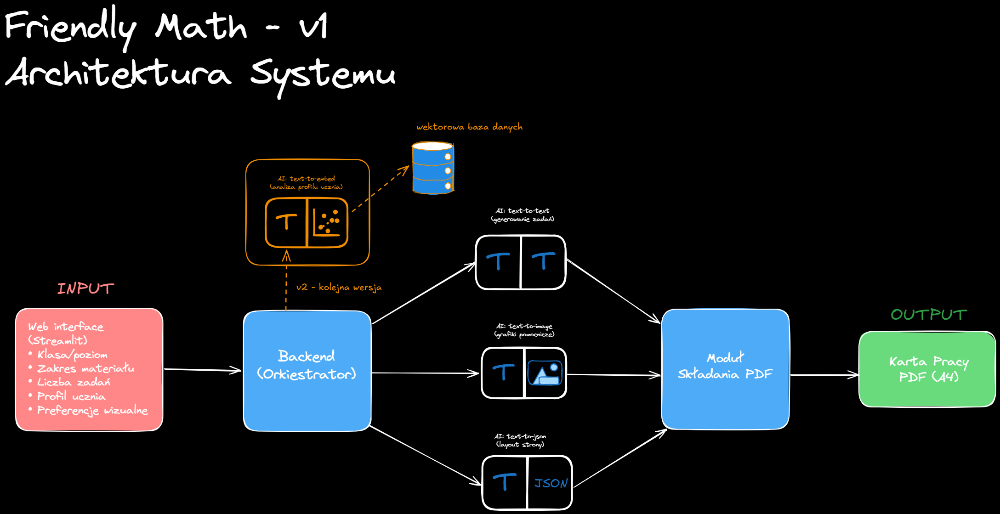

> 📌 **Notatka (kwiecień 2026):** Po przerwie rozpoczynam prace nad **wersją v2** projektu.
> Plan rozwoju i backlog pomysłów: zobacz sekcję [Roadmap](#roadmap-high-level) oraz tablicę Trello projektu.

---

⚠️ **Status projektu: MVP v1.0.0**  
  
Aktualna wersja aplikacji to **funkcjonalne MVP v1.0**:
 - działający interfejs Streamlit (sensowne domyślne, opisy pól, stopka „Friendly Math v1.0”),
 - pełny flow: parametry → generacja zadań (OpenAI API) → layout (AI) → grafika → PDF,
 - **opcja „Dołącz stronę z odpowiedziami”** — na końcu PDF strona „Odpowiedzi” (dla prostych działań),
 - **obsługa błędów**: brak klucza API lub timeout → czytelny komunikat i ewentualne zadania zastępcze,
 - ilustracja przy każdym zadaniu (zgodna z treścią), ułamki w zapisie szkolnym w PDF,
 - eksport do PDF (A4, polskie znaki), zapis do `data/out/worksheet.pdf` + przycisk pobierania.
  
Przykładowe wygenerowane karty: `data/worksheets_samples/`.


---

# Friendly Math 🧮

**Friendly Math** to inteligentna aplikacja wspierająca naukę matematyki
uczniów szkoły podstawowej, ze szczególnym uwzględnieniem uczniów
z opiniami i orzeczeniami PPP (np. dyskalkulia, ADHD, trudności w koncentracji).

Aplikacja umożliwia szybkie generowanie **czytelnych, niskobodziecowych kart pracy (PDF)**,
dostosowanych do indywidualnych potrzeb ucznia.

## ✅ Co działa w wersji v1.0.0 (MVP)

- **Panel boczny**: klasa (domyślnie 2), zakres materiału (dodawanie, odejmowanie, mnożenie, dzielenie, ułamki, równania), liczba zadań (5), profil ucznia, opcje ilustracji i klucza odpowiedzi, przycisk „Generuj kartę”.
- **Okno główne**: lista wygenerowanych zadań oraz sekcja „Karta pracy PDF” — podgląd stron jako obrazy (jeśli zainstalowano PyMuPDF), ścieżka do pliku, przycisk „Pobierz PDF”.
- **Klucz odpowiedzi**: opcjonalna strona „Odpowiedzi” w PDF (proste działania).
- **Obsługa błędów**: brak OPENAI_API_KEY lub timeout API → czytelny komunikat; zadania zastępcze gdy API niedostępne.
- **Ilustracje**: jedna per zadanie, dopasowane do tematu; celowo ograniczone tak, by zawsze były czytelne (najlepiej przy dodawaniu, odejmowaniu, prostym mnożeniu).

Przykładowe karty: `data/worksheets_samples/`.  
Po zmianie kodu **zrestartuj Streamlit**.

---

## 🎯 Cel projektu (v1)

- wspieranie uczniów z trudnościami w nauce matematyki,
- ułatwienie pracy nauczycielom i terapeutom,
- generowanie kart pracy dopasowanych do profilu ucznia,
- tworzenie materiałów edukacyjnych gotowych do druku (PDF A4).

---

## 👤 Co może zrobić użytkownik (v1)

Użytkownik (nauczyciel / terapeuta) może:
- wybrać klasę i zakres materiału,
- określić liczbę i typ zadań,
- wybrać **profil ucznia** (funkcjonalny, bez danych osobowych),
- wygenerować kartę pracy w formacie PDF (A4),
- opcjonalnie wygenerować wersję z odpowiedziami.

---

## 🧠 Profile uczniów (PPP)

Friendly Math wykorzystuje **profile uczniów (Pupil Profile Presets)**,
które wpływają na sposób tłumaczenia i konstruowania zadań.

Przykładowe profile:
- dyskalkulia,
- ADHD.

Profile **nie przechowują danych osobowych** i służą wyłącznie
do dostosowania stylu dydaktycznego.

---

## 🏗️ Jak to działa (v1)

1. Użytkownik wprowadza parametry karty pracy.
2. System:
   - generuje zadania matematyczne,
   - tworzy proste grafiki wspierające rozumienie,
   - układa treść w czytelny, niskobodziecowy layout.
3. Wynikiem jest gotowa karta pracy PDF do wydruku.

---

# EN Technical Overview

## Architecture

The application consists of:
- Streamlit-based web UI,
- backend prompt and task generation logic,
- image generation utilities,
- PDF layout and export module.



---

## Student Profiles (PPP – Technical)

Student profiles are implemented as **prompt-level presets** that dynamically
modify the system prompt and teaching behavior of the AI.

Profiles currently supported:
- Dyskalkulia
- ADHD

Profiles are implemented as modular Python classes and can be extended easily.

---

## Tech Stack

- Python 3.11
- Streamlit
- OpenAI API
- Pillow, ReportLab
- PyMuPDF (opcjonalnie — podgląd PDF jako obrazy w UI)

---

## Deploy na Streamlit Cloud

1. Wypchnij repozytorium na GitHub.
2. Wejdź na [share.streamlit.io](https://share.streamlit.io), zaloguj się przez GitHub.
3. **New app** → wybierz repo `friendly-math`, branch `main`, plik główny: `app/ui/app.py`, ścieżka: `app/ui/app.py`.
4. W **Advanced settings** ustaw **Python version**: 3.11.
5. W sekcji **Secrets** dodaj (np. TOML):
   ```toml
   OPENAI_API_KEY = "sk-..."
   ```
6. Deploy — aplikacja będzie dostępna pod linkiem `https://...streamlit.app`.

Uwaga: bez `OPENAI_API_KEY` w Secrets aplikacja uruchomi się, ale generowanie zadań wyświetli komunikat o braku klucza.

---

## Wypychanie na Git (release v1.0.0)

Z katalogu projektu:

```bash
git add .
git status   # sprawdź, co trafi do commita
git commit -m "v1.0.0 MVP: sidebar, podgląd PDF, ilustracje ograniczone, README i deploy"
git branch -M main   # opcjonalnie, jeśli główna gałąź to main
git remote add origin https://github.com/TWOJ_USER/friendly-math.git   # tylko przy pierwszym pushu
git push -u origin main
```

Zamień `TWOJ_USER` na swoją nazwę użytkownika GitHub. Po pushu możesz wykonać deploy na Streamlit Cloud (kroki powyżej).

---

## Project Status

**v1.0.0 — MVP**

The current focus is on validating:
- pedagogical assumptions,
- usability for teachers and therapists,
- quality of generated worksheets.

---

## Roadmap (high-level)

Future versions may include:
- interactive student mode,
- step-by-step hints,
- error analysis,
- adaptive difficulty levels.

---

## Local Development Setup

### Requirements
- Miniconda or Anaconda
- Python 3.11
- Git

### Clone repository
git clone https://github.com/tombalab/friendly-math.git
cd friendly-math

### Create Conda environment
conda create -n friendly-math python=3.11
conda activate friendly-math

### Install dependencies
pip install -r requirements.txt

### Environment variables
cp .env.example .env

### Run Streamlit app
streamlit run app/ui/app.py


### App will be available at:

http://localhost:8501