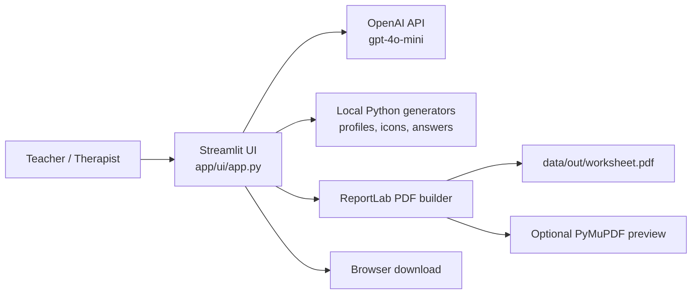
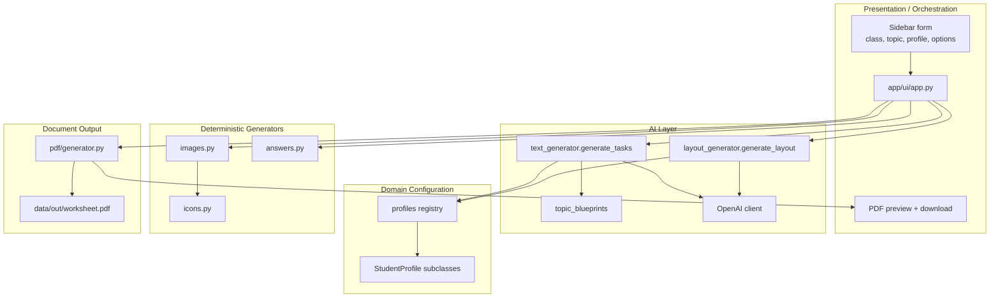
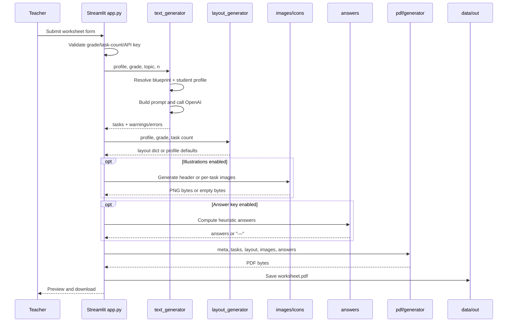
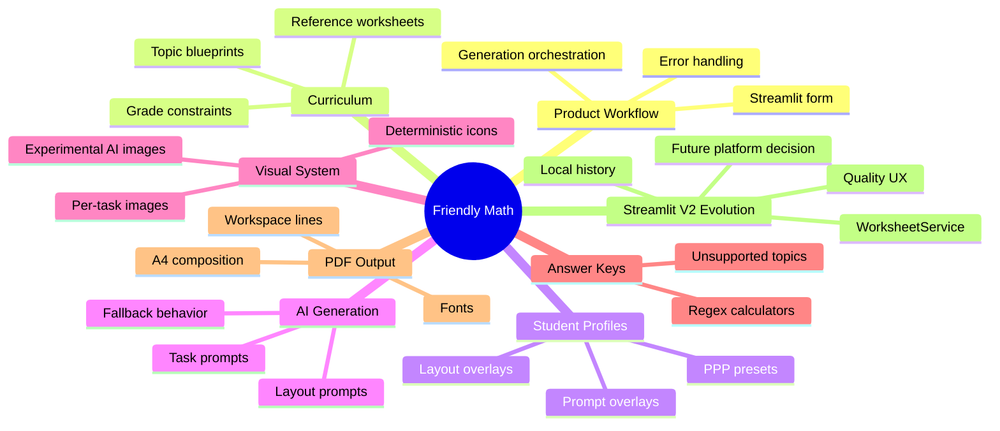
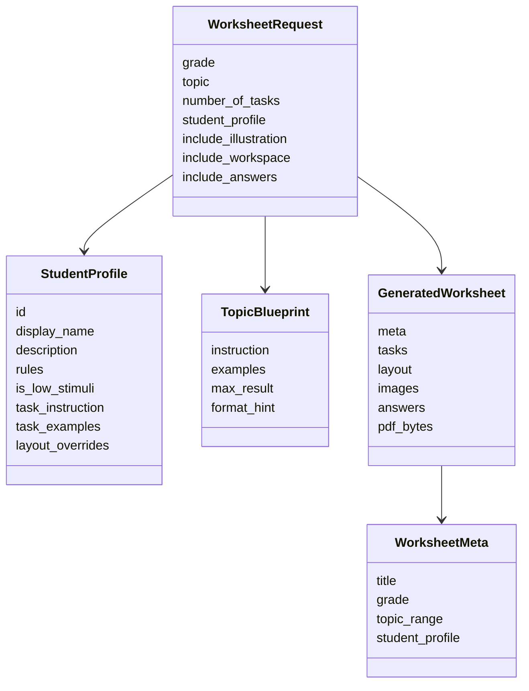
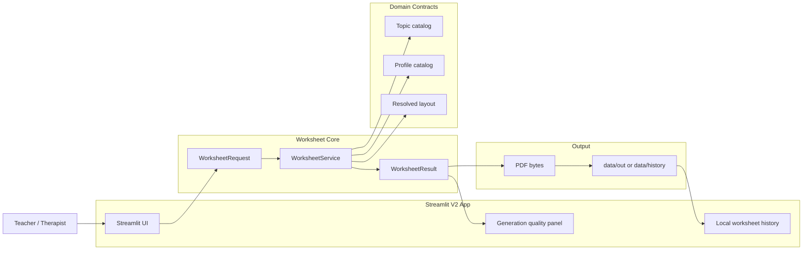

# Friendly Math Architecture And Domain Overview

## Executive Summary

Friendly Math is currently a v1 Streamlit MVP for generating printable math worksheets for Polish primary school students. The business value is concentrated in a short teacher workflow: choose grade, topic, student support profile, and worksheet options; generate tasks with AI; compose a readable low-stimulus PDF; optionally include visuals and an answer key.

The system is a single-user Python application with a linear generation pipeline. Its strongest architectural assets are the separation of curriculum blueprints, PPP student profiles, deterministic image/PDF generation, and a simple Streamlit orchestration layer. Its largest risks are product consistency and quality-control gaps: profile definitions are not fully reflected in the UI/docs, topic names are not normalized across generators, answer key coverage is partial, PDF typography depends on a missing font asset, and there is no automated regression suite around worksheet quality.

The v2 decision has changed: Friendly Math v2 stays on Streamlit. The immediate goal is a high-quality worksheet-generation MVP, not a platform migration. FastAPI, Next.js, Supabase, chat memory, and voice are future options only after the Streamlit MVP proves worksheet quality and teacher value.

## Current System Context

Friendly Math v1 has no persistent users, student records, worksheet history, database, queue, or object storage. It writes the most recent worksheet to a shared local path and returns the generated PDF bytes to Streamlit for preview and download.

## Business Domain

The core domain is individualized worksheet generation for early math education. The product is not a generic worksheet factory: its differentiator is support for students with PPP-related needs such as dyscalculia, ADHD, dyslexia, general learning difficulties, and giftedness.

Primary business actors:

- Teacher or therapist: configures and generates printable worksheets.
- Student: consumes the generated PDF offline or in class.
- Future parent/teacher organization: will own student profiles, worksheet history, and chat/voice sessions in v2.

Primary business objects:

- Worksheet request: grade, topic, task count, student profile, illustration flag, workspace flag, answer key flag.
- Curriculum topic blueprint: topic and grade-specific pedagogical constraints, examples, numeric limits, and expected format.
- Student profile preset: PPP-driven rules that affect prompt style, layout, stimulation level, and examples.
- Generated task: one student-facing task line.
- Worksheet PDF: printable artifact with metadata, tasks, optional visuals, workspace lines, and optional answers.
- Reference worksheet: gold-standard sample used for quality comparison and future evaluation.

## Current Runtime Architecture

The UI is currently the application service. It validates only simple constraints, calls every generation step synchronously, handles errors with Streamlit messages, and writes the final artifact.

## Generation Flow

## Domain Boundaries For Detailed Documentation

Detailed domain documents are split across these areas:

- Worksheet orchestration and Streamlit UX.
- Curriculum and topic blueprints.
- Student profiles and PPP pedagogy.
- AI task and layout generation.
- Visual assets and image generation.
- Answer key computation.
- PDF composition and printable output.
- Reference worksheets and quality evaluation.
- Streamlit v2 product evolution.

## Current Domain Model

Important modeling issue: these concepts exist mostly as Python dictionaries, strings, and dataclasses rather than a single explicit application-level request/response contract. That is acceptable for a Streamlit MVP, but it should be formalized before v2 API extraction.

## Target V2 Direction

The target v2 architecture keeps Streamlit as the product shell while extracting enough domain structure to make worksheet generation testable and trustworthy. The highest-value path is:

1. Stabilize current v1 domain contracts: profile ids, topic ids, worksheet request, layout schema, answer coverage.
2. Keep Streamlit as the v2 UI, but extract orchestration into a `WorksheetService` callable from tests.
3. Add regression tests and reference worksheet checks before adding more product surface area.
4. Add a Streamlit quality panel and optional local worksheet history without accounts or student personal data.
5. Reconsider platform migration, chat, and voice only after Streamlit v2 proves worksheet quality and teacher value.

## Architectural Strengths

- The code already separates curriculum blueprints from student profiles.
- Student profiles use a registry pattern, which is a good consolidation point.
- PDF generation is deterministic and mostly isolated from OpenAI behavior.
- Deterministic icons avoid external visual asset management.
- Reference worksheet JSON files create a foundation for future evaluation.
- Degraded behavior exists for task, layout, and image failures.

## Architectural Risks

- `app/ui/app.py` owns orchestration, validation, error handling, persistence, and UI rendering at once.
- Profile ids are duplicated as raw strings across UI, registry, PDF, and layout logic.
- Some implemented profiles are not selectable or not documented consistently.
- Topic ids are raw display strings, which creates mismatches between blueprints, image safety checks, answer coverage, and UI copy.
- The answer key can silently return `"—"` for important topics while the user-facing option may imply broader support.
- PDF Polish-character support depends on a font path that appears not to be committed.
- Future platform work would introduce persistent student records and multi-user access, but Streamlit v2 should avoid personal data until privacy, ownership, and artifact isolation are designed.
- There is no meaningful automated test suite for core business quality.

## Recommended Architectural Principles

- Treat topic ids and profile ids as stable domain identifiers, not UI labels.
- Keep AI generation behind explicit interfaces that return structured results with warnings.
- Make unsupported behavior visible to the teacher, especially answer keys and illustrations.
- Prefer deterministic validators and reference checks for high-volume worksheet quality.
- Extract business orchestration before changing infrastructure.
- Delay chat/voice complexity until worksheet generation is reliable and profile semantics are unified.

