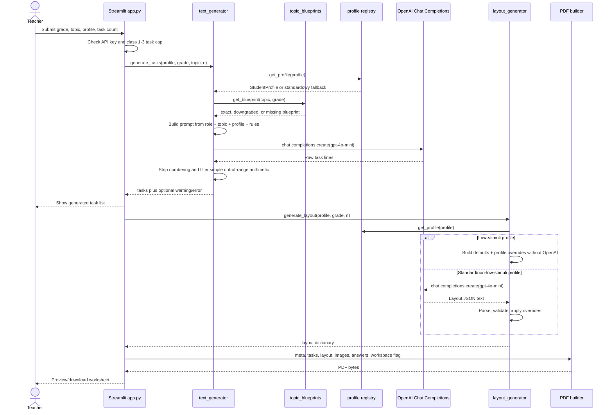
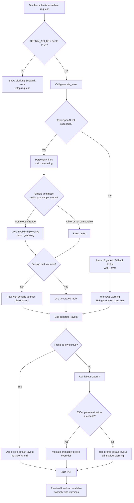

# AI Generation Domain

## Purpose

The AI generation domain covers the two places where Friendly Math v1 asks an LLM to make product decisions:

- `app/ai/text_generator.py` generates student-facing math task text.
- `app/ai/layout_generator.py` generates or selects PDF layout parameters.

From a business perspective, this domain is the trust boundary between a teacher's intent and the generated worksheet. The system promises a worksheet that is grade-aware, topic-aware, and adapted to a student support profile. The AI layer helps with variety and wording, but the product value depends on surrounding deterministic guardrails: curriculum blueprints, profile presets, validation, visible fallback behavior, and printable PDF composition.

The current v1 design is pragmatic for a local Streamlit MVP. It has a simple synchronous flow, a single OpenAI model, low temperature, and fallbacks that keep PDF generation available. The main architectural risk is that degraded AI output can still look like a successful worksheet unless the UI clearly explains what changed.

## Current Responsibilities

### Task Generation

`generate_tasks(profile, grade, topic, n)` is responsible for:

- Resolving the selected student profile through `get_profile()`.
- Resolving the topic and grade through `get_blueprint()`.
- Building a Polish prompt with curriculum constraints, few-shot examples, and profile-specific style guidance.
- Calling OpenAI chat completions.
- Normalizing task lines by stripping blank lines and model-added numbering.
- Filtering simple arithmetic tasks whose computed result exceeds the grade or blueprint range.
- Filling missing task slots with generic placeholder arithmetic.
- Returning a dictionary with `tasks`, `profile`, `grade`, `topic`, and optional `_warning` or `_error`.

This function owns most of the pedagogical AI risk. It decides whether the generated tasks match the requested topic, grade, and profile closely enough to continue into the PDF.

### Layout Generation

`generate_layout(profile, grade, number_of_tasks)` is responsible for:

- Resolving the selected student profile through `get_profile()`.
- Skipping OpenAI entirely for profiles marked `is_low_stimuli`.
- Calling OpenAI for non-low-stimuli layout JSON when needed.
- Parsing the returned JSON, including simple cleanup for fenced code blocks.
- Coercing numeric layout fields into integers.
- Filling missing layout keys from defaults.
- Applying grade constraints for classes 1-3.
- Giving profile `layout_overrides` precedence over AI output.
- Falling back to profile defaults on any exception.

Layout generation is lower business risk than task generation because its output is constrained to font sizes, spacing, margins, and colors. It still affects accessibility and print quality, especially for PPP profiles.

### Orchestration Boundary

`app/ui/app.py` is the current application orchestrator. It:

- Blocks generation if `OPENAI_API_KEY` is missing.
- Blocks class 1-3 requests with more than 15 tasks.
- Calls `generate_tasks()`.
- Displays task-generation errors as warnings and still proceeds with fallback tasks.
- Calls `generate_layout()`.
- Optionally generates illustrations and answers.
- Passes tasks, layout, images, answers, and metadata to the PDF builder.

There is no separate worksheet generation service yet. That means AI generation, UI messaging, degraded behavior, and PDF orchestration are coupled to the Streamlit request lifecycle.

## Request And Response Sequence



## Prompt Construction

### Task Prompt Layers

`_build_prompt()` uses three layers.

The base task contract tells the model to act as a Polish early-school math teacher and generate exactly `n` tasks, one per line, without numbering or commentary.

The topic section comes from `TOPIC_BLUEPRINTS` when a blueprint exists. It includes:

- the selected topic and grade,
- `instruction`, which defines number ranges, operation type, format, and grade expectations,
- `examples`, which act as few-shot examples,
- optional `max_result`, used later by deterministic validation.

If no blueprint exists for the topic and grade, the topic section falls back to `profile.task_instruction` and `profile.task_examples`. This protects the workflow, but it weakens the business guarantee that curriculum drives content. In a missing-blueprint path, the requested topic may be represented only by the raw topic label in the prompt.

The profile section is added for every non-`standardowy` profile. It includes `profile.display_name` and `profile.task_instruction`. This is intended to adapt style, not replace curriculum. Examples:

- `dyskalkulia`: very simple numbers, one step, natural language beside symbols.
- `ADHD`: short one-sentence commands, one operation, clear repeated format.
- `dysleksja`: short commands and readable text, without simplifying math below grade level.
- `trudności w nauce`: simple numbers, short commands, much workspace.
- `zdolny`: slightly harder numbers and optional two-step chains.

The system message repeats the role and curriculum expectation: early-school math teacher in Poland, compliant with the indicated grade, and consistent with examples.

### Layout Prompt

The layout prompt is used only for profiles where `is_low_stimuli` is false. It asks the model to return only JSON with this schema:

- `title_font_size`
- `metadata_font_size`
- `section_font_size`
- `task_font_size`
- `margin`
- `title_spacing`
- `metadata_spacing`
- `section_spacing`
- `task_spacing`
- `line_spacing`
- `text_color`
- `background_color`

The prompt encodes broad layout policy:

- `standardowy`: standard fonts, roughly 11-14 px.
- `zdolny`: smaller fonts and more content per page.
- `dysleksja`: larger line spacing and task font size.
- All profiles: black text on white background and margins around 40-60 px.

The model is not trusted as final authority. `_validate_layout()` fills missing keys, coerces numeric values, applies class 1-3 readability constraints, and forces profile overrides after AI output.

## OpenAI Usage

Both AI modules use the official `openai` package and `OpenAI(api_key=os.getenv("OPENAI_API_KEY"))`. Environment variables are loaded with `python-dotenv`.

Task generation settings:

- Model: `gpt-4o-mini`.
- Temperature: `0.3`.
- Max completion tokens: `2000`.
- Timeout: `30.0` seconds, passed per request.
- Client lifecycle: lazy module-level singleton.

Layout generation settings:

- Model: `gpt-4o-mini`.
- Temperature: `0.3`.
- Max completion tokens: `2000`.
- Timeout: not explicitly set, so it relies on the OpenAI client default.
- Client lifecycle: lazy module-level singleton.

The dependency is unpinned in `requirements.txt` as `openai`, so SDK behavior can change between installs. `reportlab` is duplicated once unpinned and once pinned to `4.2.5`, which is outside the AI layer but relevant to reproducible worksheet output.

The UI currently requires `OPENAI_API_KEY` before any generation begins. Even though layout can skip OpenAI for low-stimuli profiles, task generation always needs the key in the normal UI path.

## Validation And Fallbacks

### Profile Lookup

`get_profile()` returns a registered profile by exact id, then by case-insensitive match, then falls back to `standardowy`. This avoids crashes on unknown profile strings but can silently remove intended accommodations.

The registry includes `standardowy`, `dyskalkulia`, `ADHD`, `dysleksja`, `trudności w nauce`, and `zdolny`. The UI currently exposes all except `dysleksja`, even though help text mentions it.

### Blueprint Lookup

`get_blueprint(topic, grade)` normalizes the topic by trimming and lowercasing, then:

- returns an exact grade blueprint when available,
- otherwise returns the nearest lower grade for the same topic,
- otherwise returns `None`.

This downgrade behavior is useful for continuity, but it can be misleading if the UI lets a teacher choose a topic-grade pair that only has a much lower-grade blueprint.

### Task Output Cleanup

After OpenAI returns text, `generate_tasks()`:

- splits content into non-empty lines,
- strips model-added numeric prefixes such as `1.` and `1)`,
- attempts to compute simple `a op b` patterns,
- drops computed tasks whose results exceed the grade or blueprint maximum,
- keeps non-computable tasks because the validator cannot safely evaluate them.

If fewer than `n` tasks remain, the function pads the list with generic addition placeholders such as `Policz: 2 + 3 = ____`.

If any exception occurs, including API errors, timeouts, parsing errors, or missing API key in direct calls, the function returns exactly three fallback tasks:

- `Policz: 3 + 4 = ____`
- `Policz: 7 − 2 = ____`
- `Policz: 5 + 5 = ____`

It also returns `_error` with the exception string. The UI displays a warning and still builds a PDF.

### Layout Validation

Layout validation is intentionally deterministic:

- `_base_defaults()` provides safe defaults.
- `_apply_grade_constraints()` increases task font size and margin for grades 1-3.
- `_validate_layout()` fills missing fields and coerces numeric values.
- `profile.layout_overrides` wins over AI output.

Any exception in layout generation returns `_build_layout_from_profile()`. This fallback is good for reliability, but it is currently only printed to stdout with a warning icon string. The UI usually receives a normal layout dictionary and may not know a fallback happened.

## Low-Stimuli Layout Shortcut

Low-stimuli profiles are defined by `StudentProfile.is_low_stimuli`. Current low-stimuli profiles are:

- `dyskalkulia`
- `ADHD`
- `trudności w nauce`

For these profiles, `generate_layout()` skips OpenAI and directly builds the layout from defaults plus profile overrides. The shared low-stimuli overrides produce:

- larger title, metadata, section, and task fonts,
- wider margins,
- larger spacing between title, metadata, sections, tasks, and lines,
- a subtle `#fafafa` background.

This is a strong architectural choice. It reduces cost, latency, and variability for the students most sensitive to visual noise. It also makes accessibility behavior auditable: the profile class, not the model, owns the low-stimuli layout contract.

There are two current alignment issues:

- `dysleksja` is not marked low-stimuli, but it has layout overrides for larger spacing and readable task text. That is reasonable pedagogically, but the UI does not expose the profile.
- `app/ui/app.py` keeps its own hardcoded `low_stimuli_profiles` list for image policy instead of using the profile registry. This can drift from the layout policy.

## Failure And Fallback Flow



## Business And Architectural Risks

### Cost

Each successful standard request can make two OpenAI calls: one for tasks and one for layout. Low-stimuli profiles reduce this to one call because layout is local. Illustrations and answers are deterministic in the current files reviewed here.

The layout call has questionable business value for profiles whose layout can be represented by stable rules. Moving more layout decisions into deterministic profile presets would reduce cost without reducing worksheet quality.

The system has no cost attribution by worksheet, profile, topic, or user. A future multi-user product will need per-request usage logging before billing, quotas, or abuse controls are practical.

### Latency

The full workflow is synchronous inside Streamlit. The teacher waits for task generation, layout generation where applicable, optional image generation, optional answer computation, PDF creation, disk write, and preview rendering.

Task generation has a 30 second timeout. Layout generation has no explicit timeout in the code, so a slow layout call may wait on SDK defaults. There is no retry policy, no cancellation model beyond the Streamlit request lifecycle, and no background job queue.

### Reliability

Reliability is mixed by design:

- The UI blocks missing API key before generating.
- Task generation catches broad exceptions and returns printable fallback tasks.
- Layout generation catches broad exceptions and returns profile defaults.
- Image and preview failures are non-blocking.

This keeps the teacher workflow alive, but it can produce a worksheet that no longer matches the original business intent. The biggest example is task fallback: a request for fractions, money, time, or measurements can degrade into generic addition/subtraction tasks.

### Curriculum Quality

Blueprint prompts are a strong guardrail, but validation is shallow. The system can reject some out-of-range arithmetic, but it cannot validate:

- word problem operation count,
- money conversions,
- elapsed time,
- measurement conversions,
- perimeter formulas,
- intuitive fraction pedagogy,
- whether output follows `format_hint`,
- whether a downgraded blueprint is pedagogically appropriate for the selected grade.

For teachers, this means AI output still requires review, especially outside simple arithmetic.

### Identifier Drift

Topics and profiles are still raw strings in many places. A topic label selected in the UI must line up with blueprints, prompts, answer parsing, images, preview scripts, and PDF metadata. A profile id must line up with registry entries, layout policy, image policy, and UI labels.

This is manageable in v1, but risky for v2 persistence. Once raw Polish labels are saved in a database or API contract, later normalization will require compatibility aliases and migrations.

## Observability Gaps

The current AI layer has almost no structured observability.

Missing or weak signals:

- No structured log of prompt version, model, temperature, timeout, or token usage.
- No persisted request id connecting UI submit, OpenAI calls, warnings, PDF output, and download.
- No metric for task-generation success, timeout, fallback, padding, or dropped tasks.
- No metric for blueprint resolution status: exact, downgraded, or missing.
- No metric for layout source: AI, low-stimuli shortcut, or fallback.
- No record of OpenAI latency per call.
- No cost estimate per worksheet.
- No capture of validation warnings as typed events.
- Layout fallback only prints to stdout, which Streamlit users and future APIs may not see.
- Unsupported answers and skipped images are not summarized as generation quality signals.
- No regression dataset is wired to compare generated tasks against reference worksheets.

For a local MVP, this is acceptable. For a product, these gaps make it difficult to answer basic operating questions: how often worksheets degrade, which topics fail, which profiles cost more, whether prompt changes improve quality, and whether teachers receive trustworthy answer keys.

## Pragmatic Improvements

### 1. Introduce A Typed AI Generation Result

Replace ad hoc `_warning` and `_error` dictionary keys with typed result objects:

```python
@dataclass(frozen=True)
class TaskGenerationResult:
    tasks: list[str]
    warnings: list[str]
    errors: list[str]
    model: str
    used_blueprint: bool
    blueprint_resolution: str
    fallback_used: bool
    padded_count: int
    dropped_count: int
```

Do the same for layout with `source` values such as `ai`, `low_stimuli_profile`, and `fallback_profile`.

### 2. Preserve Topic Intent In Fallbacks

Fallback tasks should be generated from the resolved topic blueprint or a deterministic topic template. Generic addition is acceptable as a last resort, but it should not be the first degraded output for every topic.

Near-term implementation path:

- Add simple deterministic templates for the most common topic families.
- Use blueprint examples as fallback seeds when available.
- If only generic fallback is available, make the UI warning explicit: the worksheet no longer matches the requested topic.

### 3. Make Blueprint Resolution Visible

Return blueprint metadata from `get_blueprint()` or wrap it in a resolver:

- requested topic,
- requested grade,
- resolved grade,
- status: `exact`, `downgraded`, or `missing`,
- user-facing warning.

This would let the UI explain when class 5 is using a class 3 topic blueprint or when a class 1 request has no matching topic definition.

### 4. Move Layout Toward Deterministic Policy

The low-stimuli shortcut shows that deterministic layout policy works. Extend that idea:

- Keep profile-driven defaults for every profile.
- Use AI layout only as an experimental option or remove it from the main flow.
- Keep `_validate_layout()` as a safety net if AI layout remains.
- Add explicit timeout to the layout OpenAI call if it remains.

This would reduce cost and latency while making accessibility behavior more predictable.

### 5. Centralize Profile And Topic Policy

Use the profile registry as the source for UI profile options and low-stimuli policy. Avoid duplicating `low_stimuli_profiles` in `app/ui/app.py`.

Introduce stable topic ids and a capability map that describes:

- blueprint support,
- grade availability,
- answer support,
- header image support,
- per-task image support,
- validator depth,
- fallback template availability.

The same map should drive UI labels, warnings, tests, and future API responses.

### 6. Add Minimal AI Observability

Before changing infrastructure, add lightweight structured events in the current app:

- `worksheet_request_started`
- `task_generation_completed`
- `task_generation_fallback`
- `layout_generation_completed`
- `layout_generation_fallback`
- `worksheet_pdf_built`

Each event should include topic, grade, profile id, task count, source/fallback flags, warning counts, duration, and model. Avoid logging full prompts or generated student data by default; task text can be sampled only in development or explicit evaluation mode.

### 7. Add Regression Checks Around Reference Worksheets

Use existing reference worksheets as the beginning of an evaluation suite:

- Prompt smoke tests for representative topic/profile pairs.
- Validation tests for out-of-range arithmetic filtering.
- Fallback tests for missing blueprint and API failure paths.
- Layout tests for low-stimuli profiles.
- PDF smoke tests that assert bytes are produced and answer pages are included when requested.

This should be done before expanding Streamlit v2 or revisiting any later FastAPI/Next.js migration, so the product does not inherit untested generation behavior.

### 8. Pin Operationally Important Dependencies

Pin the OpenAI SDK once the current API usage is confirmed. Clean up duplicate `reportlab` entries. This reduces accidental behavior changes from fresh installs.

## Architectural Bottom Line

Friendly Math's AI generation layer has the right high-level shape: curriculum blueprints define content, student profiles adapt accessibility, and deterministic PDF generation turns the result into a printable artifact. The strongest local design choice is the low-stimuli layout shortcut, because it reserves AI for places where variation matters and keeps accessibility rules deterministic.

The next step is not more prompt text. The next step is product-grade generation control: typed results, visible fallback metadata, topic-preserving fallback tasks, registry-driven profile policy, explicit layout timeouts, and basic observability. Those improvements make the Streamlit v2 MVP more trustworthy for teachers and create a cleaner service boundary for any future platform option.
