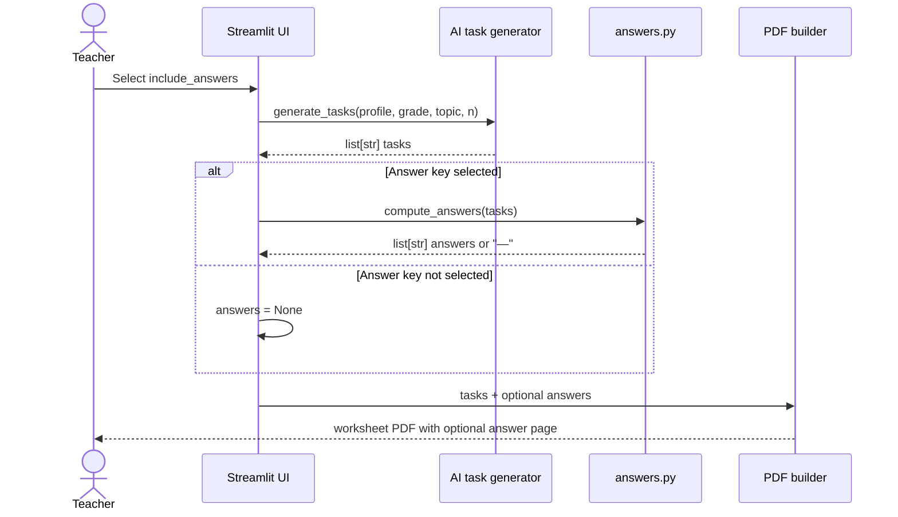
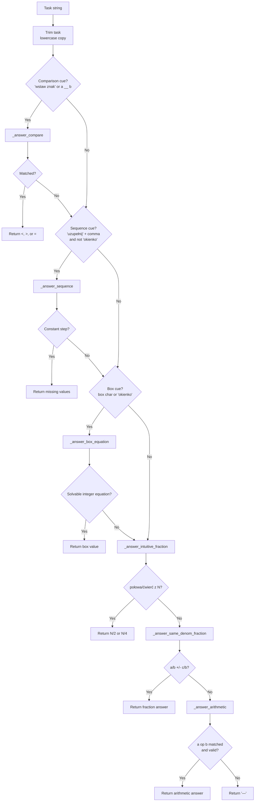
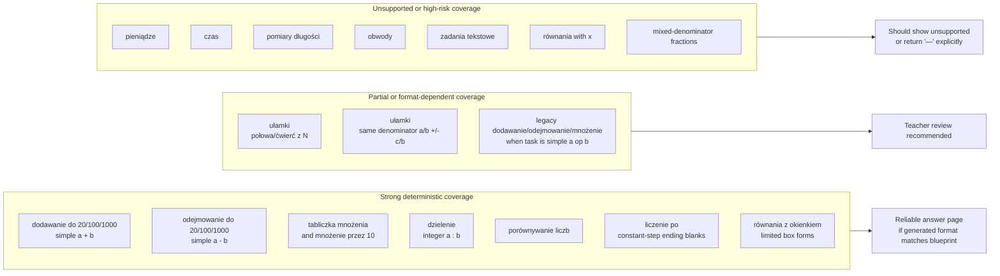
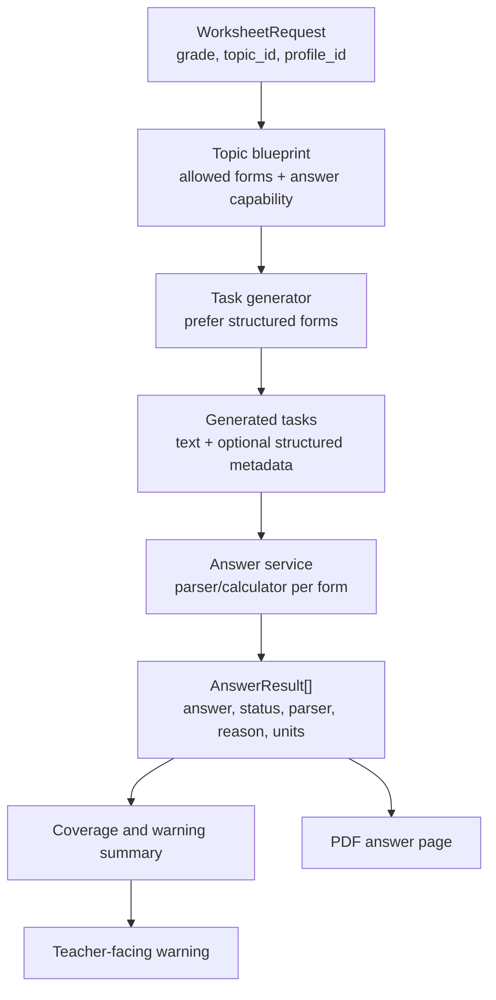

# Answer Keys Domain

## Purpose

The answer-key domain computes optional teacher-facing answers for generated worksheet tasks. In Friendly Math v1 it is intentionally deterministic: after AI generates task text, `app/generators/answers.py` tries to recognize known task forms with regular expressions and simple calculators, then returns either an answer string or `"—"` when the task is outside supported coverage.

From a business perspective, answer keys are not just a convenience page. They are a teacher trust feature. A teacher may use the generated PDF in class, give it to a student, or hand it to a parent or therapist. If the answer page is wrong, ambiguous, or silently incomplete, the product can look more confident than it is. This domain therefore needs explicit coverage rules, visible unsupported behavior, and regression checks as part of Streamlit v2.

## Business Role

Answer keys support three business jobs:

- They reduce teacher preparation time by removing the need to solve every generated task manually.
- They make worksheets easier to review before printing, especially when a teacher generates many variants.
- They create a future evaluation signal: generated tasks can be checked against expected answers, topic constraints, and reference worksheets.

The current design is appropriate for an MVP because it avoids asking the LLM to solve its own output. The parser either computes a deterministic result or declines. That is a strong architectural principle. The current weakness is that decline behavior is only represented as `"—"` in the answer page; the UI option says "Dołącz stronę z odpowiedziami", which may imply fuller support than the system actually provides.

## Current Runtime Position

The answer key is computed late in the worksheet workflow:

1. `app/ui/app.py` collects the teacher request.
2. `app/ai/text_generator.py` generates task strings using topic blueprints and profile guidance.
3. If the teacher selected `include_answers`, `app/ui/app.py` calls `compute_answers(tasks)`.
4. `app/pdf/generator.py` receives the optional answer list and renders a separate "Karta odpowiedzi" page when the list length matches the task list.

This makes the answer key a post-generation parser, not a source of truth for task generation. It does not know the selected topic, grade, profile, blueprint, or expected units. It only sees the final task strings.



## Supported Task Forms

The public contract is task-string based, so support is defined by recognizable text patterns rather than topic IDs.

Supported forms:

- Simple arithmetic: `a + b`, `a - b`, `a × b`, `a · b`, `a * b`, `a : b`, `a / b`, `a ÷ b`, including negative integers in the parser.
- Number comparison: `Wstaw znak < , > lub =: 7 __ 9`.
- Arithmetic sequences: `Uzupełnij: 2, 4, 6, __, __`, when the known values have a constant step and blanks are represented as `__`.
- Box equations: `a OP ☐ = c` and `☐ OP b = c`, with box variants such as `☐`, `[]`, `[ ]`, `□`, `▢`, and `▭`.
- Intuitive fractions: phrasing containing `połowa` or `połowę` with `z N`, and `ćwierć` variants with `z N`.
- Same-denominator written fractions: `1/4 + 2/4 = ____` or `5/6 - 2/6 = ____`, for addition and subtraction only.

Important implementation details:

- Division answers are returned only when the result is an integer.
- Same-denominator fraction answers are not simplified, except a result equal to the denominator is returned as `1`.
- Negative same-denominator fraction results return `"—"`.
- Box multiplication requires exact integer division.
- The parser returns the first supported interpretation based on dispatch order. It does not validate the result against grade, topic, blueprint, or units.

## Unsupported Topics And Forms

The module docstring explicitly treats complex forms as unsupported: word problems, money, time, length measurements, and perimeter. In practice, some of these strings can still be accidentally parsed if they contain a simple `a op b` pattern. For example, a money task like `5 zł + 2 zł` may be computed as `7` without units, even though money-specific rules such as grosze conversion are not implemented.

Unsupported or unreliable areas:

- Word problems requiring semantic understanding, multi-step reasoning, or choosing the operation from prose.
- Money tasks involving `zł`, `gr`, mixed units, change, or conversion.
- Time tasks involving clocks, minutes, hours, Roman numerals, duration, or formatted times such as `8:15`.
- Length and measurement tasks involving `cm`, `mm`, `m`, `km`, or mixed units.
- Perimeter tasks requiring a geometry formula from prose.
- Algebraic equations using `x`, such as `x + 8 = 15`, even though legacy class 4+ topic blueprints can generate them.
- Fraction operations with different denominators, multiplication, division, simplification requirements, or equivalent-answer acceptance.
- Intuitive fraction prompts that do not use the narrow `z N` wording.
- Box equations written as `c = a + ☐`, equations with more than one blank, decimals, mixed numbers, and non-integer answers in most equation forms.
- Sequences with non-constant steps, missing internal values, or blank tokens other than `__`.

## Parser Dispatch Flow

`compute_answers()` maps every task through `_answer_for_task()`. The dispatcher uses ordered heuristics, with special forms checked before generic arithmetic so placeholders such as `__` or `☐` are not swallowed by a broad `a op b` regex.



## Support And Coverage Map

The answer-key coverage is narrower than the curriculum blueprint coverage. This is acceptable if visible to the teacher, but risky if the checkbox suggests universal support.



## Relation To Generated Tasks

The answer parser depends heavily on the shape of AI-generated task text. The system tries to control that shape through `TOPIC_BLUEPRINTS`:

- Blueprint examples for arithmetic topics use `Policz: a OP b = ____`, which is ideal for `_answer_arithmetic()`.
- `porównywanie liczb` examples use `a __ b`, which is ideal for `_answer_compare()`.
- `liczenie po` examples use comma-separated constant-step sequences ending in `__`, which is ideal for `_answer_sequence()`.
- `równania z okienkiem` examples use the `☐` symbol in the two supported equation orientations.
- `ułamki` examples are mixed: class 2-3 prompts include drawing/coloring tasks that cannot be answered by the parser, while some examples ask `Ile to jest połowa z 20?`. Class 4+ examples use same-denominator written fractions, which the parser can compute.
- Everyday math blueprints intentionally produce prose and units. These are good pedagogical tasks, but they are not good parser inputs yet.

The important architectural point is that `topic_blueprints.py` currently describes generation format, while `answers.py` independently guesses what format it received. There is no shared capability registry saying "this topic form supports answer keys" or "this generated task must satisfy parser X".

## Relation To Reference Worksheets

The reference worksheets in `data/reference_worksheets` already include hand-authored `answers` arrays. They are a strong foundation for answer-key evaluation because they pair task text with expected results.

Current useful coverage in reference samples:

- Addition for ADHD and dyscalculia profiles uses repeated `Policz: a + b = ____` forms that should be fully supported.
- Standard multiplication uses repeated `Policz: a × b = ____` forms that should be fully supported.
- The dyslexia fractions sample includes same-denominator and different-denominator examples. The current parser supports same denominators, but it will return `"—"` or an incomplete answer for different denominators such as `1/2 + 1/4`, while the reference file expects `3/4`.

The reference files are not currently wired into automated checks. That leaves a gap between having gold data and using it to protect teacher-facing behavior.

## Output Contract

Public function:

```python
compute_answers(tasks: list[str]) -> list[str]
```

Contract:

- Input is a list of task strings.
- Output is a list of strings with the same length and order.
- Each output item is either a computed answer or `"—"` for unsupported/unsolved tasks.
- The function does not raise for normal unsupported task formats.
- The function does not return structured metadata, confidence, parser name, units, or warnings.
- The function does not receive topic, grade, profile, blueprint, or locale context.

Downstream PDF contract:

- `app/ui/app.py` passes `answers = compute_answers(tasks)` only when the answer checkbox is selected.
- `build_worksheet_pdf_bytes()` renders the answer page only when `answers` is truthy and `len(answers) == len(tasks_list)`.
- The PDF displays answer strings as-is. `"—"` is a visible answer-page item, but there is no legend explaining that it means unsupported.

This minimal contract keeps the renderer simple, but it also hides important product information. A future contract should distinguish "unsupported", "ambiguous", "computed", and "computed with units" instead of flattening everything into strings.

## Teacher Trust Risks

The biggest risks are not runtime failures. They are quiet mismatches between what the teacher thinks the answer page means and what the parser actually guarantees.

- Silent partial coverage: a worksheet can contain a mix of solved answers and `"—"` with no UI warning before PDF generation.
- False confidence: generic arithmetic can parse the first `a op b` inside a money or word-problem task and return a number without understanding the problem.
- Unit loss: even when the numeric result is correct, answers do not preserve `zł`, `gr`, `cm`, `min`, or other required units.
- Topic mismatch: the parser does not know the selected topic, so it cannot refuse broad arithmetic parsing for topics that should require semantic handling.
- Fraction mismatch: class 4+ or reference tasks may require unlike-denominator fraction arithmetic, but the parser only supports same denominators.
- Algebra mismatch: the UI includes legacy `równania`, while the parser supports box equations but not `x`.
- No correctness audit: there is no automatic count of unsupported answers, no parser coverage summary, and no test gate around reference worksheets.
- Ambiguous display: `"—"` can look like a dash answer rather than "unsupported by answer-key engine".

## Tests And Evaluation Gaps

Recommended test areas are clear, but not yet visible as an automated suite:

- Unit tests for every parser branch in `answers.py`.
- Negative tests for unsupported topics to prevent accidental misleading arithmetic answers.
- Golden tests using `data/reference_worksheets/*.json`, comparing `compute_answers(tasks)` with each file's `answers`.
- Coverage reporting by topic and profile, especially for generated samples from `topic_blueprints.py`.
- Regression tests for Polish operator variants: `−`, `×`, `·`, `:`, and `÷`.
- Tests for PDF answer-page contract: answer count must match task count, and unsupported answers should render consistently.
- Evaluation that separates "parser did not support this task" from "parser supported but computed incorrectly".

The reference worksheet gap is especially important. The existing JSON format already has `tasks`, `answers`, and `quality_criteria`, which is enough to start a lightweight deterministic eval without changing product behavior.

## Pragmatic Improvements

Near-term improvements that fit the current architecture:

1. Add a parser result object internally, for example `AnswerResult(answer, status, parser, reason)`, while keeping the PDF-compatible string list at the boundary.
2. Add a UI/PDF note when any answer is unsupported: `"— oznacza: klucz odpowiedzi nie obsługuje tego typu zadania"`.
3. Add topic-aware answer policy in `app/ui/app.py` or a small domain service so broad arithmetic parsing can be disabled for known unsupported topics like `pieniądze`, `czas`, `pomiary długości`, `obwody`, and `zadania tekstowe`.
4. Add golden tests from `data/reference_worksheets`, starting with addition and multiplication, then documenting the known fraction failure for unlike denominators.
5. Move answer-key capability metadata into or beside `topic_blueprints.py`, so each topic can declare `answer_key: supported | partial | unsupported` and the UI can explain coverage before generation.
6. Add parsers only where they are deterministic and high-value: `x` equations, money conversions, simple unit conversions, perimeter formulas, and unlike-denominator fractions.
7. Prefer structured generated tasks for v2, such as `{prompt, answer, topic_id, form_id, units}`, so the answer key becomes a validation/checking layer rather than a regex-only reconstruction layer.

## Target V2 Shape

For a multi-user API-backed product, answer keys should become an explicit domain service:



The business goal is not to answer every possible math problem. It is to make the system honest about what it can answer automatically, reliable where it claims support, and clear enough that a teacher can decide whether the generated worksheet is ready to use.
