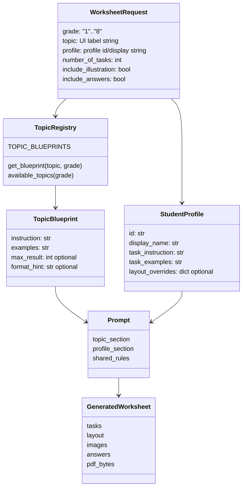
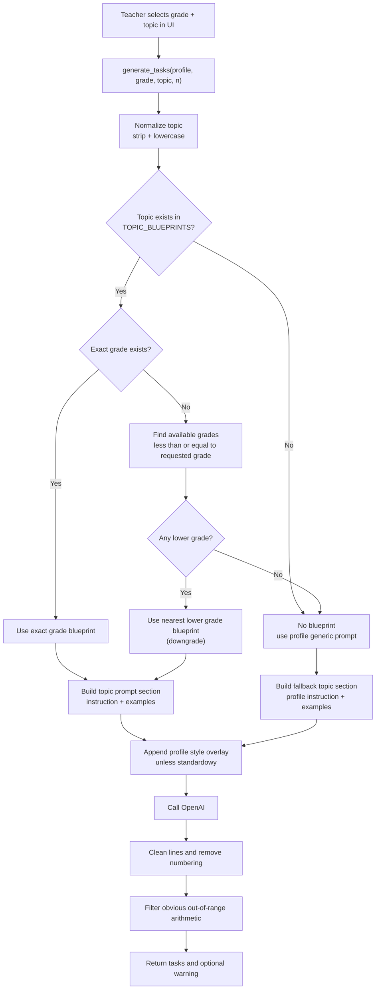
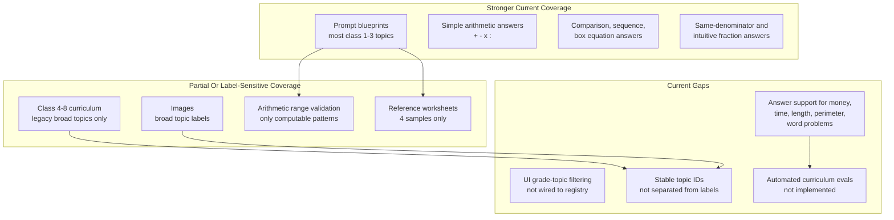

# Curriculum Topic Blueprints Domain

## Purpose

The curriculum and topic-blueprints domain defines what a worksheet topic means for a given grade. It is the system's main pedagogical guardrail: before profile styling, layout, illustrations, answers, or PDF composition matter, the generator needs to know the intended mathematical scope.

From a business perspective, this domain turns a teacher's broad selection, such as "klasa 2" and "dodawanie do 100", into concrete constraints: number range, task format, allowed operation complexity, and representative examples. In Friendly Math v1 this is the closest thing to a curriculum contract.

## Business Role Of Curriculum Constraints

The product promise is not simply "AI writes math exercises". A teacher or therapist needs a worksheet that is appropriate for a student's grade and support needs, printable without heavy review, and defensible against the Polish early-school curriculum expectations.

Curriculum constraints serve several business jobs:

- They reduce the chance that the AI generates material outside the teacher's intent.
- They encode grade-specific boundaries for classes 1-3, where number ranges and task form are especially important.
- They provide few-shot examples that shape output format and improve consistency.
- They make support profiles safer: dyscalculia, ADHD, dyslexia, giftedness, and learning-difficulty profiles should adapt the delivery style without losing the underlying topic.
- They create a future evaluation target: generated worksheets can be compared against reference worksheets and expected topic capabilities.

The strongest current design choice is that `app/ai/topic_blueprints.py` separates curriculum semantics from both UI code and profile code. The main weakness is that topic identity is still a raw Polish UI label, so the same string must be correct across the form, blueprint lookup, prompts, answer parsing, images, and PDF metadata.

## Current Domain Model

The model exists mostly as dictionaries and strings, not as explicit domain objects. `Blueprint` is a `TypedDict`, but the topic itself, grade-topic validity, capability metadata, and UI presentation are implicit.

## Topic And Grade Model

`TOPIC_BLUEPRINTS` is keyed as `topic -> grade -> Blueprint`. The topic key is intended to match the Streamlit `Zakres materiału` selectbox label after trimming and lowercasing.

Current topic families:

- Number sense: `liczenie po`, `porównywanie liczb`.
- Mental arithmetic for classes 1-3: `dodawanie do 20`, `dodawanie do 100`, `dodawanie do 1000`, `odejmowanie do 20`, `odejmowanie do 100`, `odejmowanie do 1000`, `tabliczka mnożenia`, `mnożenie przez 10`, `dzielenie`, `równania z okienkiem`.
- Everyday math and geometry: `ułamki`, `pieniądze`, `czas`, `pomiary długości`, `obwody`, `zadania tekstowe`.
- Legacy class 4+ topics: `dodawanie`, `odejmowanie`, `mnożenie`, `równania`.

Most early-school topics have explicit entries for grades 1-3 where the curriculum changes materially. Some topics start later, for example `dodawanie do 100` starts at grade 2, `ułamki` starts at grade 2, `obwody` starts at grade 2, and legacy class 4+ topics start at grade 4.

The current UI allows all topics for all grades. That means grade-topic validity is advisory rather than enforced. If the teacher chooses a combination with no blueprint and no lower-grade fallback, the task generator falls back to profile-level generic instructions.

## Blueprint Lookup And Downgrade Behavior

`get_blueprint(topic, grade)` implements a conservative in-topic lookup:

Important behavior:

- Exact topic labels matter. `dodawanie do 20` and `dodawanie` are different topics, not aliases.
- Downgrade happens only within the selected topic. Grade 5 with `ułamki` uses the grade 4 `ułamki` blueprint; grade 5 with `dodawanie do 20` uses the grade 2 `dodawanie do 20` blueprint.
- Lookup never upgrades. Grade 1 with `dodawanie do 100`, `ułamki`, `pieniądze`, or `obwody` returns no blueprint because those topics start at grade 2.
- The module comment mentions a possible `default` fallback, but the code does not implement a per-topic `default` key. Current fallback is either nearest lower grade or `None`.
- `available_topics(grade)` can filter topics by grade-aware availability, but `app/ui/app.py` does not currently use it.

This downgrade strategy is useful for preserving continuity in older grades, but it can also preserve a too-easy blueprint when the UI allows unrestricted combinations.

## Prompt Relationship

`app/ai/text_generator.py` is the main consumer of the blueprint domain. Prompt construction has three layers:

1. Base role and output contract: be a Polish early-school math teacher, generate exactly `n` one-line tasks, no numbering, no commentary.
2. Topic section: if a blueprint exists, include its `instruction` and `examples`; otherwise use `profile.task_instruction` and `profile.task_examples`.
3. Profile style section: for non-`standardowy` profiles, append a profile-specific instruction about task style.

The intended business rule is clear: curriculum chooses the mathematical content; the profile adapts accessibility and presentation. That separation is valuable. It prevents a support profile from becoming a separate curriculum path.

The fallback path weakens this rule. When no blueprint exists, the profile's generic examples become the only topic content. This protects the UI flow, but it may generate tasks that do not match the requested topic, especially for invalid grade-topic pairs or spelling/label drift.

## Runtime Use And Validation

After OpenAI returns task lines, `text_generator` performs lightweight deterministic cleanup and validation:

- It strips model-added numeric prefixes such as `1.` or `1)`.
- It tries to compute simple `a op b` arithmetic tasks.
- It filters tasks whose computed result exceeds the grade or blueprint `max_result`.
- It allows non-computable tasks, including word problems, box equations, fractions, comparisons, time, money, and measurement, because the simple validator cannot verify them.
- If too few tasks remain, it fills missing slots with generic addition placeholders.

The result is pragmatic for an MVP, but it means blueprint constraints are stronger at prompt time than at validation time. `max_result` only protects simple arithmetic patterns. Topic format, examples, non-arithmetic correctness, and many grade-specific constraints are not mechanically enforced.

## Relation To UI Labels

The UI currently duplicates topic and profile choices as hardcoded Streamlit selectbox options in `app/ui/app.py`.

Topic relationship:

- The UI labels mostly match `TOPIC_BLUEPRINTS` keys exactly.
- The UI does not call `available_topics(grade)`, so it does not hide topics that are unavailable for a selected grade.
- The UI help text describes class 4+ as keeping `dodawanie / odejmowanie / mnożenie / ułamki / równania`, but the same selectbox also exposes early-school scoped topics to classes 4-8.
- The PDF receives the raw selected topic as `WorksheetMeta.topic_range`, so any label mismatch becomes visible in the generated artifact.

Profile relationship:

- The profile registry includes `standardowy`, `dyskalkulia`, `ADHD`, `dysleksja`, `trudności w nauce`, and `zdolny`.
- The UI selectbox omits `dysleksja`, while the illustration help text mentions it.
- The UI independently defines `low_stimuli_profiles` instead of asking the selected profile object whether it is low-stimuli.

The architectural issue is not Polish labels themselves; it is that labels act as stable identifiers. Future API and persistence work should separate a stable `topic_id` from `label_pl`, aliases, grade availability, and capability flags.

## Relation To Answer And Image Systems

The answer and image systems consume generated task text and selected topic labels, but they do not share a capability model with the blueprint registry.

Answer system:

- `app/generators/answers.py` supports simple arithmetic, number comparison, sequences, box equations, same-denominator fractions, and intuitive half/quarter questions.
- It intentionally returns `"—"` for complex word problems, money, time, measurements, and perimeter.
- The UI help text lists supported answer types, but it does not summarize unsupported answers after generation.

Image system:

- `app/generators/images.py` can generate a header image for many topics, but the visual themes in `icons.py` know canonical broad labels such as `dodawanie`, `odejmowanie`, `mnożenie`, `dzielenie`, and `ułamki`.
- Per-task images are much narrower. Safe illustration limits are keyed by broad labels like `dodawanie`, not scoped blueprint topics like `dodawanie do 20` or `dodawanie do 100`.
- `równania` is explicitly skipped, but the UI's current skip check is `topic.lower() == "równania"`, while the class 1-3 blueprint topic is `równania z okienkiem`.
- Unsupported or unsafe images return empty bytes and are omitted from the PDF.

This creates a capability mismatch: the blueprint system may fully support a topic for prompt generation while the image or answer system only partially supports it, or supports a different label vocabulary.

## Coverage Map

## Reference Worksheets

`data/reference_worksheets` introduces a quality baseline that is adjacent to, but not yet integrated with, the blueprint system.

Current samples cover:

- Grade 1 `dodawanie` for `ADHD`.
- Grade 2 `dodawanie` for `dyskalkulia`.
- Grade 5 `mnożenie` for `standardowy`.
- Grade 6 `ułamki` for `dysleksja`.

Each sample contains metadata, tasks, answers, and `quality_criteria`. The README positions these files as quality reference material, future few-shot prompt input, and future eval data.

The main mismatch is topic granularity. Reference samples use broad topics such as `dodawanie`, while early-school blueprints use scoped topics such as `dodawanie do 20` and `dodawanie do 100`. That is workable for human review, but weak for automated lookup. If these samples become prompt examples or eval fixtures, they should either adopt stable topic IDs or explicitly declare the matching blueprint topic and valid grade range.

## Coverage Gaps

### Curriculum Scope

Class 1-3 topic coverage is substantially richer than class 4-8 coverage. Older grades mostly rely on broad legacy topics and downgrade behavior. This is acceptable for an early-school MVP, but the UI offers grades 1-8, so users can reasonably expect grade-aware coverage across the full range.

### Grade-Topic Availability

The registry knows enough to answer "which topics are available for this grade", but the UI does not use that capability. Teachers can request combinations that have no blueprint or combinations that downgrade to a much lower grade.

### Identifier Normalization

Topic labels are duplicated across UI, blueprints, images, icons, answers, references, preview scripts, and PDF metadata. There is no alias map for cases like `dodawanie` versus `dodawanie do 20`, or `równania` versus `równania z okienkiem`.

### Validation Depth

Prompt constraints are richer than deterministic validation. The system can catch some out-of-range arithmetic results, but it does not validate word problem operation count, money formats, elapsed time, measurement conversions, perimeter formulas, or fraction pedagogy.

### Capability Visibility

Unsupported answers and skipped images are mostly silent in the final user experience. A teacher can ask for an answer key or illustrations and receive partial support without a clear capability summary.

### Reference Coverage

The reference worksheet set is useful but small. It does not yet cover every major topic family, each grade band, every profile, or important degraded paths such as no blueprint, answer unsupported, and image skipped.

## Risks

- Curriculum drift: because AI output is only partially validated, prompt changes can silently change worksheet difficulty or format.
- Label drift: a topic label change in the UI can break blueprint lookup, image support, or reference matching without type errors.
- Misleading downgrade: older-grade requests can receive a lower-grade blueprint and still look successful to the teacher.
- False confidence in answer keys: `"—"` is technically honest, but a full answer page with many missing answers may not meet teacher expectations.
- Visual mismatch: scoped topics like `dodawanie do 20` can miss per-task image support because image safety keys use broad topics.
- Evaluation blind spots: reference worksheets are not yet connected to automated checks, so regressions remain manual.
- V2 migration risk: if raw labels become persisted API values, later normalization will require migrations and compatibility aliases.

## Pragmatic Improvement Opportunities

### 1. Introduce Stable Topic IDs

Create a topic catalog where each topic has:

- `id`, such as `addition_to_20`, `fractions`, or `box_equations`.
- `label_pl`, such as `dodawanie do 20`.
- `aliases`, including legacy labels like `dodawanie`.
- `grade_min`, `grade_max`, and explicit availability.
- `blueprints_by_grade`.
- Capability metadata for answers, header images, per-task images, and validation depth.

Keep Polish labels in the UI and PDF, but stop using them as primary identifiers.

### 2. Make The UI Registry-Driven

Use the topic catalog or `available_topics(grade)` to populate the `Zakres materiału` selectbox after grade selection. At minimum, annotate topics that will use a fallback or downgrade.

This would prevent many avoidable fallback prompts and make the teacher's choices more trustworthy.

### 3. Return Blueprint Metadata

Instead of returning only a `Blueprint | None`, return resolution metadata:

- selected topic ID and label,
- requested grade,
- resolved grade,
- resolution status: `exact`, `downgraded`, or `missing`,
- warning text suitable for UI display.

This avoids hiding important behavior inside prompt construction.

### 4. Align Capability Flags

Build one topic capability map that answers:

- Can the prompt system generate this topic?
- Can the answer system solve this topic deterministically?
- Can header images be generated?
- Can per-task images be generated, and under what safe numeric limits?
- What validator exists beyond prompt instructions?

Use the same map for UI help text, generation warnings, tests, and docs.

### 5. Improve Deterministic Fallbacks

When OpenAI fails or task filtering removes too many items, generate fallback tasks from the resolved blueprint topic rather than fixed generic addition tasks. Even a simple deterministic template per topic family would preserve teacher intent better than the current placeholder.

### 6. Integrate Reference Worksheets

Treat reference worksheets as named fixtures with stable topic IDs and profile IDs. Near-term, use them for manual review checklists. Later, use them to test:

- expected prompt examples for each topic/profile,
- answer parser accuracy,
- image eligibility expectations,
- PDF smoke generation,
- "no blueprint" warnings.

### 7. Expand Older-Grade Coverage Deliberately

Either narrow the product claim to early-school worksheets in the UI or add explicit class 4-8 blueprints for the visible topics. The current in-between state invites users to request grades the curriculum model does not deeply support.

## Architectural Bottom Line

The blueprint registry is the right foundation for Friendly Math's curriculum domain. It gives the AI generator concrete pedagogical shape and keeps profile adaptations from becoming separate curricula.

The next architectural step is not more prompt text; it is stronger domain normalization. Stable topic IDs, grade-aware Streamlit choices, resolution metadata, shared capability flags, and reference-backed tests would make Streamlit v2 more predictable for teachers and preserve the option of a future platform migration.
