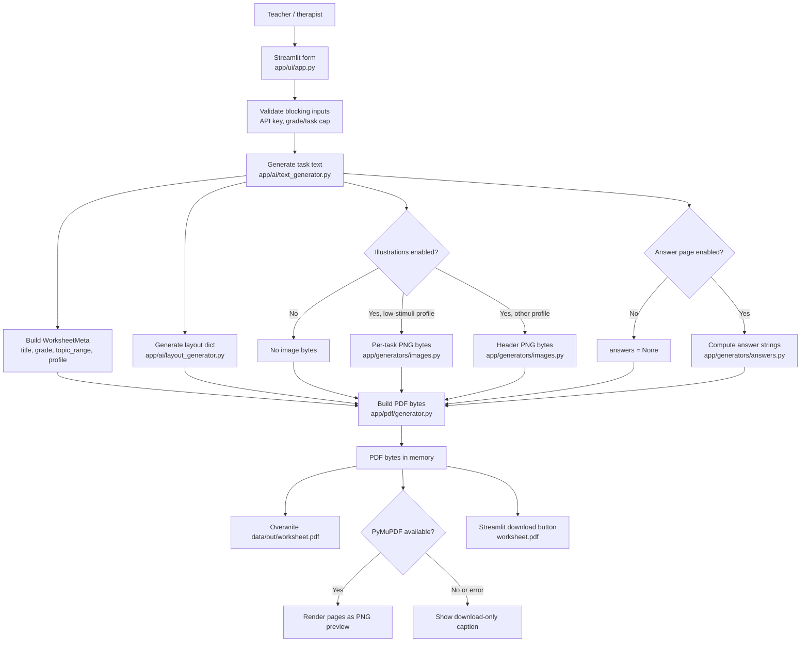
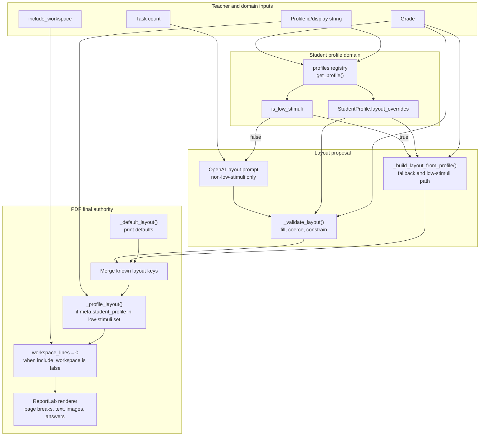

# PDF Composition And Printable Output Domain

## Executive Summary

PDF composition is the final product boundary in Friendly Math v1. The teacher does not leave with an AI response, a JSON payload, or a preview widget. The business artifact is a printable A4 worksheet that can be used immediately in class, in therapy, or as homework.

The current implementation is pragmatic and mostly deterministic. `app/ui/app.py` gathers generated tasks, layout settings, optional images, optional answers, and a `WorksheetMeta` object, then calls `app/pdf/generator.py` to produce PDF bytes through ReportLab. The same bytes are written to `data/out/worksheet.pdf`, converted to preview images when PyMuPDF is installed, and exposed through Streamlit as a browser download.

The strongest design choice is that final PDF composition is isolated from the OpenAI call path. Even when task generation, layout generation, image generation, or preview rendering fail partially, the system tries to keep the teacher on a path toward a usable worksheet. The main architectural risks are contract looseness, topic/profile string drift, missing font assets, silent degradation, and limited print/accessibility validation.

## Business Role Of Printable A4 Output

Printable A4 output is central to the product promise. Friendly Math serves teachers and therapists who need low-friction, individualized materials for Polish primary school students, especially students with PPP-related needs. The PDF must therefore behave like a real classroom handout, not just a digital rendering.

Business value depends on the PDF being:

- Immediately printable on common school printers without manual formatting.
- Readable for early grades and support profiles, with larger fonts, clear spacing, and low visual clutter.
- Trustworthy enough that teachers can hand it to a student without rechecking every page break and visual.
- Portable across devices and classrooms, independent of the Streamlit runtime after download.
- Stable enough to be trusted in the Streamlit v2 MVP and, later, to become a persisted artifact if a multi-user platform is justified.

The PDF layer is also where several upstream promises become visible: curriculum topic choice, student profile adaptation, optional visuals, optional workspace lines, and optional answers. If this layer fails, the rest of the generation pipeline loses most of its business value.

## Current PDF Assembly Flow

## WorksheetMeta And Output Contract

`WorksheetMeta` is the explicit metadata object passed into PDF composition:

- `title`: currently `Karta pracy - klasa {grade}` from the UI.
- `grade`: string representation of the selected class.
- `topic_range`: the selected topic label from the UI.
- `student_profile`: the selected profile label/id from the UI.

The final PDF function is `build_worksheet_pdf_bytes(meta, tasks, layout=None, image_bytes=None, task_images=None, answers=None, include_workspace=True) -> bytes`.

The input contract is intentionally lightweight:

- `tasks` is any iterable of student-facing task strings. The PDF builder materializes it as a list.
- `layout` is an optional dictionary of known layout keys. Unknown keys are ignored.
- `image_bytes` is an optional single PNG-like byte string for a header image.
- `task_images` is an optional list where each entry corresponds to a task; empty bytes mean "skip this image".
- `answers` is an optional list of answer strings. The answer page is rendered only when its length matches the task list.
- `include_workspace` controls whether dotted workspace lines are shown under tasks.

The output contract is a complete PDF byte string. `app/pdf/generator.py` does not write to disk and does not know about Streamlit. That separation is useful: it makes the PDF builder a candidate for future service extraction and automated regression tests.

Contract gaps remain:

- The meta fields are display strings rather than stable domain identifiers.
- There is no explicit `WorksheetDocument` or `GeneratedWorksheet` object carrying warnings, page count, skipped images, unsupported answers, or font fallback status.
- `layout` has no typed schema shared between `layout_generator.py` and `pdf/generator.py`.
- The answer contract allows `"—"` as a value, but the PDF layer cannot distinguish "unsupported answer" from a deliberate answer string.

## Layout Authority Map

## Layout Merging And Final Rendering Policy

There are two default layout systems:

- `app/ai/layout_generator.py` has `_base_defaults()` for AI validation and profile fallback.
- `app/pdf/generator.py` has `_default_layout()` for final ReportLab rendering.

The final PDF builder starts from its own defaults, applies only recognized keys from the incoming `layout` dictionary, then applies `_profile_layout()` again when `meta.student_profile` is one of `dyskalkulia`, `ADHD`, or `trudności w nauce`. Finally, `include_workspace=False` sets `workspace_lines` to zero.

That means final authority is not purely AI and not purely profile registry. The PDF module can override earlier layout decisions, especially for low-stimuli profiles. This protects readability in v1, but it also duplicates profile policy outside the central profile registry.

Important current layout settings include:

- A4 page size from ReportLab.
- Margins around 50 pt by default, 60 pt for low-stimuli PDF override.
- Larger-than-v1 font defaults: title 22 pt, section 16 pt, task 14 pt.
- Low-stimuli profile override: title 24 pt, section 18 pt, task 16 pt, more spacing, four workspace lines, and near-white background.
- Dotted workspace lines under each task unless disabled.
- Page footer: `Friendly Math - strona {page_num}`.

The layout approach is understandable for an MVP, but v2 should consolidate final layout policy into a typed schema with one authority for profile overrides.

## Font Handling

The PDF layer expects `assets/fonts/DejaVuSans.ttf` so Polish characters render correctly. `_register_font()` registers that TTF under `DejaVuSans` when present. Because only the regular face is expected, bold is emulated by drawing the same text three times with tiny offsets.

If the font file is missing or registration fails, the system falls back to Helvetica and Helvetica-Bold. The PDF still builds, but Polish characters may render incorrectly. The current repository scan did not find a DejaVu font asset, so this is a real packaging risk rather than a theoretical edge case.

Font handling has direct business impact:

- Polish worksheet text must support characters such as `ą`, `ć`, `ę`, `ł`, `ń`, `ó`, `ś`, `ź`, and `ż`.
- Teachers may not notice broken glyphs until after download or print.
- Browser preview can mask or reveal font issues differently than a local PDF viewer or printer.
- Emulated bold is acceptable for v1, but it is not the same as a proper bold face for accessibility or typographic consistency.

Pragmatic next step: commit the intended font files or make font availability a startup check with a visible UI warning.

## Task Rendering

Tasks are rendered sequentially after a section header `Zadania`. Each task block contains:

- An optional per-task image above the task text.
- A bold-emulated task number such as `1.`.
- Wrapped task text.
- Optional dotted workspace lines.
- Spacing before the next task.

Text wrapping is character-count based rather than measured by actual ReportLab string width. This is simple and fast, but it can misestimate lines for wide Polish words, symbols, fractions, or mixed punctuation. Continuation lines are indented to align with task content rather than the number.

Page breaking is handled incrementally. Before drawing lines, the builder checks whether the current vertical position is near the bottom margin and opens a new page if needed. After each task, it estimates the minimum block height needed for the next task and breaks early when necessary.

Rendering risks:

- Per-task images are drawn before a page break check specific to image height, so a large image near the bottom can pressure layout more than text alone.
- Character-count wrapping does not fully respect actual font metrics.
- A very long unbroken token is truncated into chunks by max character count, but this is still not true word layout.
- There is no widow/orphan control for keeping a task number, text, image, and workspace together as an indivisible block.

For v1 worksheets with modest task lengths, this is acceptable. For v2 or larger worksheets, task blocks should be measured before drawing.

## Fractions

Fractions are a special PDF rendering case. When a task line contains a pattern like `a/b`, `_draw_task_content()` routes the line through `_draw_task_line_with_fractions()`. The line is split into text segments and fraction segments. Each fraction is drawn as a school-style stacked fraction: numerator above a horizontal bar, denominator below it.

This is a strong product detail because early-grade fraction worksheets are easier to read when `1/2` becomes a visual fraction form. It aligns the PDF with classroom notation better than plain slash text.

Current limitations:

- Only simple numeric `\d+/\d+` fractions are recognized.
- Mixed numbers, spaces around the slash, symbolic fractions, and simplified typography across line wrapping are not fully handled by the PDF renderer.
- Fraction height is not incorporated into line spacing beyond the existing task line height, so dense fraction lines could appear visually tight.
- Answer strings containing fractions use the same task-content drawing helper on the answer page, which is good, but unsupported answers remain `"—"`.

## Images In The PDF

The PDF builder supports two visual modes:

- `image_bytes`: one header illustration near the top of the worksheet, used when no per-task image list is active.
- `task_images`: a list of image bytes matching the task list length, drawn above individual task text.

If `task_images` exists and has exactly the same length as `tasks`, it takes precedence over the header image. Empty bytes in the list are skipped. Image drawing exceptions are caught and ignored so a bad image does not block worksheet creation.

This matches the visual domain's honesty principle: missing or unsafe images should disappear rather than breaking the worksheet or showing a misleading graphic. It also means image failures are mostly silent at the PDF boundary.

Print considerations:

- Header images are fixed at 160 x 90 pt.
- Per-task images span the available text width and use a height derived from the 480 x 100 source aspect ratio, with a minimum of 60 pt.
- The image system uses light backgrounds and colored icons. This should be checked in grayscale and low-quality school printer settings.
- Per-task visuals can significantly increase page count and reduce room for workspace lines.

## Workspace Lines

Workspace lines are dotted, light gray horizontal rules under each task. They are a core support feature, especially for younger students and students with dyscalculia, ADHD, or general learning difficulties.

The current PDF default is three workspace lines per task. Low-stimuli PDF override uses four lines with larger gaps. The UI exposes a single checkbox, `Miejsce na obliczenia`; disabling it sets the final `workspace_lines` value to zero.

Business role:

- Gives students a visible place to calculate directly on the worksheet.
- Reduces the need for separate scratch paper.
- Supports teachers who want the worksheet to show reasoning, not only final answers.

Risks:

- The number of lines is global for the worksheet, not task-specific.
- Text-only conceptual tasks may not need workspace, while multi-step tasks may need more.
- More workspace improves usability but increases page count and printing cost.

## Answer Page

When the teacher enables the answer key, `app/ui/app.py` calls `compute_answers(tasks)` and passes the resulting list into the PDF builder. The answer page is rendered only when `answers` exists and has the same length as `tasks`.

The answer section starts on a new page titled `Karta odpowiedzi`, with metadata and a section header `Odpowiedzi`. Each answer is numbered and drawn using the same content helper as tasks, so simple fraction strings can receive fraction rendering.

The answer generator supports selected deterministic formats:

- Basic arithmetic.
- Number comparison.
- Box equations in common forms.
- Counting sequences.
- Same-denominator fraction operations.
- Simple intuitive fractions such as half or quarter of a number.

Unsupported or complex tasks return `"—"`, especially story problems, money, time, length, and perimeter. This is safe from a correctness perspective but weak from a teacher-experience perspective because the option "Dołącz stronę z odpowiedziami" can produce a page with partial blanks and no explanation.

Pragmatic next step: return answer metadata such as `supported`, `reason`, and `value`, then show a UI warning before PDF generation when coverage is partial.

## Preview, Save, And Download Behavior

After building PDF bytes, the UI writes them to `data/out/worksheet.pdf`. The path is created if needed and overwritten on every successful generation. The same bytes are then passed to `_pdf_bytes_to_images()`, which uses PyMuPDF (`fitz`) to render each page as a PNG preview at 120 DPI. If PyMuPDF is missing or conversion fails, the UI shows a caption telling the user to download and open the PDF locally.

The Streamlit download button always uses the in-memory bytes and names the browser download `worksheet.pdf`.

Current behavior is appropriate for a single-user MVP:

- The local file is useful for development and manual inspection.
- Download does not depend on reading the file back from disk.
- Preview is optional and non-blocking.

It is not appropriate as a durable artifact model:

- The saved file has no unique name, timestamp, profile, or request id.
- Concurrent sessions would overwrite the same path.
- There is no worksheet history or ownership model.
- Preview rendering may fail silently, while the generated PDF is still valid.

For v2, the PDF bytes should be associated with a generation id and stored in object storage or a user-scoped artifact table.

## Reliability Risks

Key reliability risks in the PDF composition domain:

- Missing font asset: fallback to Helvetica can break Polish characters.
- Silent degradation: image draw failures, color failures, preview failures, and skipped images are often swallowed.
- Loose layout schema: AI layout, profile layout, and PDF layout defaults are not governed by one typed contract.
- Duplicate profile policy: low-stimuli overrides exist in both profile/layout generation and the PDF module's `_LOW_STIMULI` set.
- Topic label drift: metadata, images, answers, and task generation all receive raw display labels.
- Partial answer keys: unsupported answers appear as `"—"` without per-task explanation.
- Weak pagination guarantees: blocks are not premeasured before drawing.
- Local overwrite: `data/out/worksheet.pdf` is a shared mutable output path.
- Limited regression testing: there is no automated assertion around page count, glyph support, answer page inclusion, or visual omission behavior.

The broad failure philosophy is good: produce a worksheet whenever possible. The missing piece is structured visibility into what degraded.

## Print And Accessibility Concerns

Printable worksheets have accessibility requirements that differ from web UI requirements. Current strengths include large font defaults, larger low-stimuli profile spacing, low-clutter pages, optional workspace, and conservative visuals.

Concerns to validate:

- Polish glyph rendering on clean installs and deployed environments.
- Grayscale and low-toner printer legibility for dotted workspace lines and icon illustrations.
- Contrast of muted metadata and workspace line colors.
- Page breaks with maximum task counts and per-task images.
- Readability for dyslexia, including line spacing, font choice, and avoidance of dense text.
- Excess visual stimulation when per-task images and workspace lines combine.
- Lack of semantic PDF tagging. The generated PDF is visually readable but likely not accessible to screen readers.
- No explicit print margins or bleed/safe-area tests for common A4 printers.

The core user journey is print-first, so visual PDF regression tests should include rasterized page snapshots, not only byte generation.

## Pragmatic Improvements

High-value improvements that fit the current architecture:

- Add `assets/fonts/DejaVuSans.ttf` or another licensed Polish-capable font, and fail visibly when it is missing.
- Introduce a typed `WorksheetLayout` schema shared by layout generation and PDF composition.
- Move low-stimuli layout policy into profile classes only, then let the PDF builder consume the resolved layout without duplicating profile string sets.
- Add a `PdfBuildReport` or `GeneratedWorksheet` result alongside PDF bytes, containing page count, font fallback, skipped images, unsupported answers, and warnings.
- Normalize topic ids before they reach text generation, images, answers, metadata, and PDF composition.
- Premeasure task blocks before rendering so images, text, and workspace lines stay together more reliably.
- Add focused PDF tests: bytes are produced, answer page appears only when expected, Polish characters render with the intended font, workspace toggles work, and per-task image length mismatches fall back safely.
- Make saved filenames unique in development, for example by timestamp or request hash, while keeping the browser download name teacher-friendly.
- Add a preview warning when PyMuPDF is unavailable rather than treating preview absence as equivalent to a normal no-preview environment.
- Evaluate grayscale print samples for all visual modes and support profiles.

## Target Direction For V2

The target Streamlit v2 architecture should treat PDF composition as a document service with explicit inputs and outputs. Streamlit should render the product workflow, but it should not own final document semantics; a future platform could reuse the same boundary later.

Recommended shape:

- `WorksheetRequest`: stable grade, topic id, profile id, task count, visual option, workspace option, answer option.
- `GeneratedWorksheetContent`: tasks, warnings, images, answers, resolved metadata.
- `ResolvedWorksheetLayout`: final typed layout after profile, grade, and accessibility rules.
- `PdfDocumentResult`: bytes, page count, warnings, preview images or preview status, storage key.

This keeps the current MVP's best trait - deterministic, recoverable PDF generation - while making the output suitable for multi-user storage, auditability, and future classroom-scale reliability.
