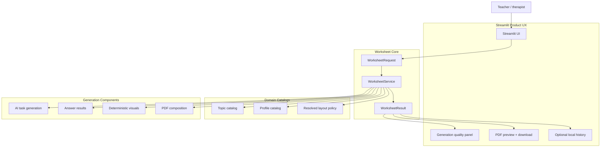
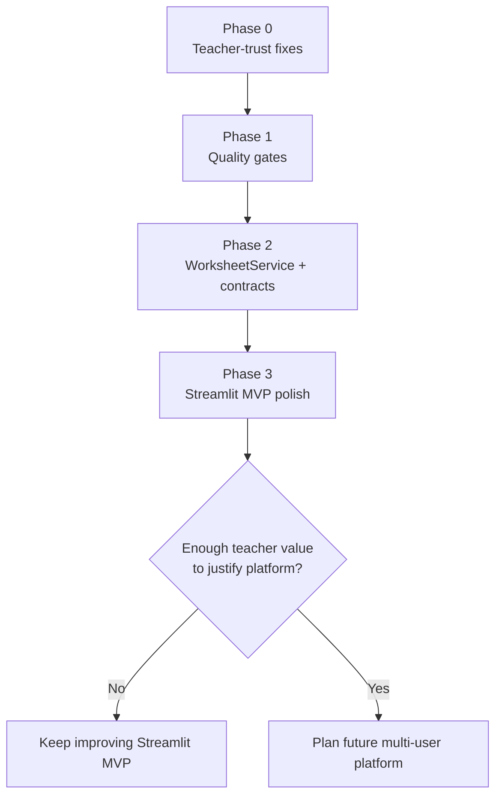
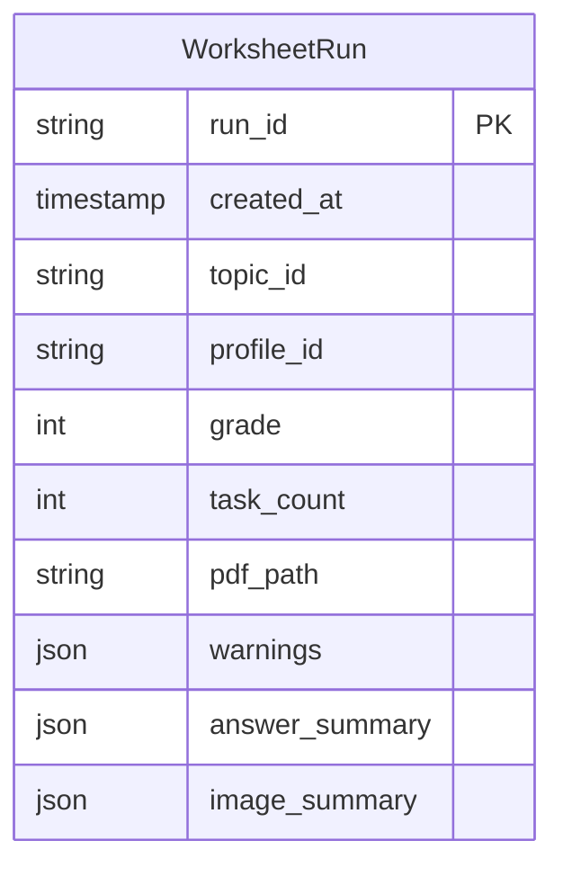
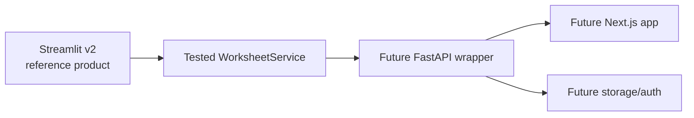

# Platform Evolution V2: Streamlit-First MVP

## Decision

Friendly Math v2 stays on **Streamlit**. The product goal is to deliver the best possible worksheet-generation prototype/MVP before investing in FastAPI, Next.js, Supabase, multi-user accounts, chat, or voice.

This changes the role of the platform domain. It is no longer a migration plan for a new stack. It is a guardrail document that keeps v2 focused on worksheet quality, Streamlit UX, testability, and teacher trust.

## Business Rationale

The business risk today is not that the app lacks a modern platform. The risk is that a teacher can receive a polished PDF that hides degraded generation, incomplete answers, skipped or misleading visuals, profile drift, or broken Polish glyphs.

Streamlit is good enough for the next product milestone because it already supports the core workflow:

1. Teacher chooses grade, topic, profile, and options.
2. System generates tasks.
3. System builds a PDF.
4. Teacher previews/downloads the result.

The highest-value v2 work is making that flow reliable and honest.

## Streamlit V2 Target Architecture

## What V2 Must Deliver

- Stable topic and profile catalogs used by Streamlit and generators.
- Topic-preserving fallback behavior or a blocking warning.
- Transparent answer-key support in Streamlit and PDF.
- Reliable Polish PDF rendering.
- Reference-driven offline tests.
- Streamlit quality panel showing warnings before download.
- Optional local worksheet history without accounts or real student data.
- A `WorksheetService` only where it improves testability and keeps Streamlit thin.

## What V2 Explicitly Does Not Deliver

- FastAPI backend.
- Next.js frontend.
- Supabase Auth/Postgres/Storage.
- Multi-user accounts.
- Persistent student records.
- Chat assistant.
- Semantic memory.
- Voice assistant.
- Payments.

These remain possible future directions, but they are not part of Streamlit v2.

## Streamlit V2 Roadmap

### Phase 0: Teacher-Trust Fixes

Fix the issues that can make a PDF look correct while being unreliable:

- Topic catalog and capability matrix.
- Profile catalog aligned with Streamlit UI.
- Polish font packaging.
- Structured answer statuses.
- Topic-preserving fallbacks.
- Streamlit generation quality panel.

### Phase 1: Quality Gates

Turn existing reference artifacts into tests:

- Reference worksheet schema checks.
- Answer parser checks.
- PDF smoke tests.
- Polish glyph checks.
- Visual render/skip checks.
- Profile/UI consistency checks.

### Phase 2: Contracts And Service Boundary

Introduce minimal contracts:

- `WorksheetRequest`
- `WorksheetResult`
- `TopicResolution`
- `ProfileCatalogEntry`
- `AnswerResult`
- `VisualResult`
- `ResolvedWorksheetLayout`

Then extract `WorksheetService` so tests and Streamlit use the same generation path.

### Phase 3: Streamlit MVP Polish

Improve the product around the proven core:

- Local worksheet history with unique artifact ids.
- Better preview/download flow.
- Teacher-friendly Polish warning copy.
- Example-good worksheets for demos.
- Review loop with real teachers.

## Local History Rules

If local history is added, it should stay prototype-safe:

- Use generation ids, timestamps, topic/profile/grade metadata, warnings, and PDF paths.
- Avoid real student names by default.
- Allow pseudonyms or no student label.
- Store locally only.
- Make deletion simple.

## Future Platform Decision Gate

Reconsider FastAPI/Next.js/Supabase only after:

- Streamlit v2 reliably generates high-quality worksheets.
- Offline tests cover core quality risks.
- Teachers repeatedly use the prototype.
- Local history or Streamlit deployment becomes a real limitation.
- There is a validated need for accounts, sharing, long-term storage, or payments.

If the platform is resumed later, it should wrap `WorksheetService`, not copy logic from `app/ui/app.py`.

## Future Platform Shape, If Needed Later

This is intentionally a later option, not the v2 plan.

## Risks Of Ignoring This Decision

- A platform rewrite could make poor worksheets look more polished.
- Multi-user storage would persist unstable topic/profile contracts.
- Chat and memory would amplify unreliable profile semantics.
- Voice would add privacy and cost before the core worksheet product is proven.
- Engineering time would move away from the business-critical problem: generating trustworthy cards.

## Success Criteria

Streamlit v2 succeeds when a teacher can generate a worksheet and clearly see:

- what topic/profile/grade was requested,
- whether generation matched the request,
- whether fallback or downgrade happened,
- which answers are supported,
- which visuals were rendered or skipped,
- whether the PDF is print-safe,
- and why the final artifact can be trusted.

