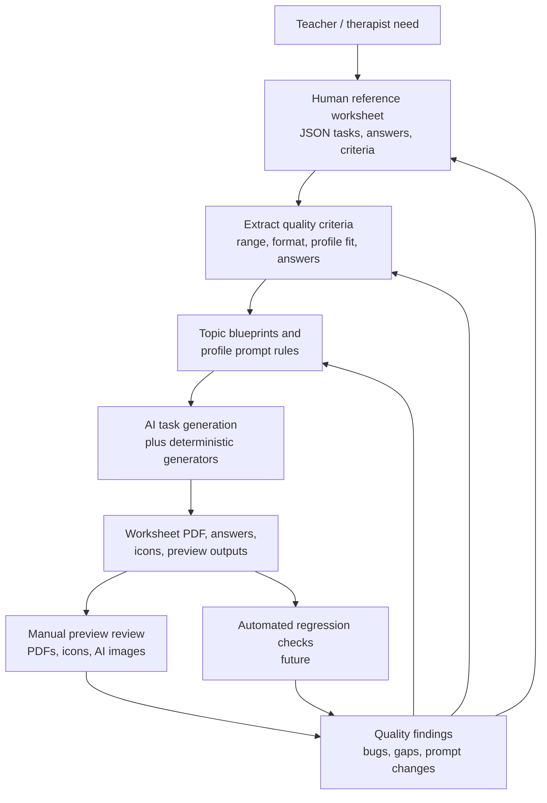
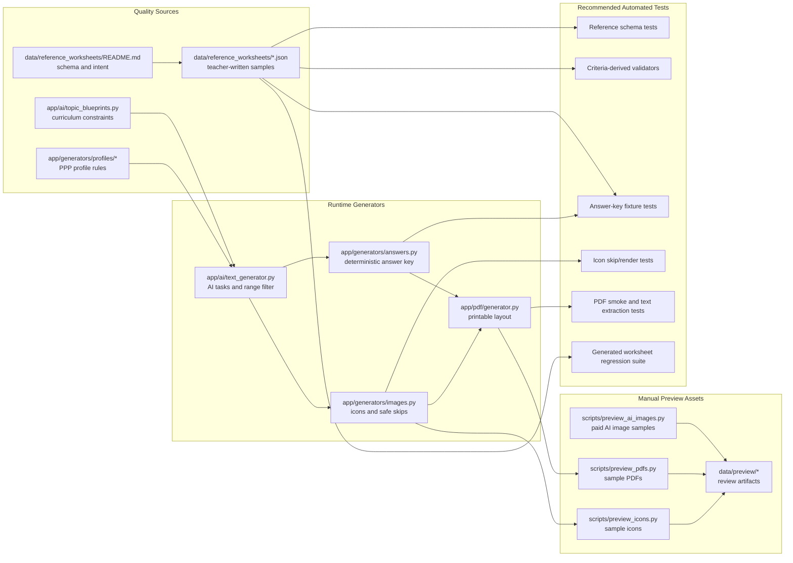

# Reference Quality Evaluation Domain

## Purpose

The reference-quality evaluation domain defines how Friendly Math decides whether generated worksheets are good enough to trust. It connects human-written reference worksheets, preview artifacts, manual review scripts, topic blueprints, answer keys, visuals, and future automated regression tests.

From a business perspective, this domain is the product's quality spine. Friendly Math is not only promising that AI can produce printable math tasks; it is promising that a teacher or therapist can quickly generate a worksheet that is grade-appropriate, profile-aware, readable, printable, and unlikely to embarrass the teacher in front of a student or parent. Reference artifacts are the most concrete expression of that promise.

## Business Role Of Reference Artifacts

Reference worksheets in `data/reference_worksheets` are manually written examples of what "good" means for a specific grade, topic, and student profile. They are not production output. They are a compact teacher-quality standard that can serve three jobs at once:

- Quality benchmark: they show the expected task length, numeric range, consistency, answer shape, and profile adaptation.
- Prompt material: they can replace or augment inline few-shot examples currently embedded in `app/ai/topic_blueprints.py` and profile classes.
- Evaluation data: they can become fixtures for automated checks that generated worksheets follow the same domain rules.

The business value is highest because quality in this product is otherwise subjective. Without references, "better worksheet" becomes an opinion. With references, the team can discuss concrete deltas: too many words for ADHD, numbers too large for dyscalculia, missing answer coverage for fractions, visual supports that do not match the task, or a PDF that wastes too little or too much space.

Reference artifacts should eventually be treated as product acceptance criteria. A new generator, prompt, profile, layout rule, or PDF engine should be allowed to change output style, but it should not regress the core properties represented by these samples.

## Current Sample And Evaluation Assets

The current repository already contains the beginning of an evaluation corpus, but it is still sparse and manually operated.

### Reference Worksheets

`data/reference_worksheets/README.md` defines the reference worksheet format:

- `metadata`: title, grade, topic, profile, author, source, and notes.
- `tasks`: student-facing task strings.
- `answers`: expected answers aligned by task index.
- `quality_criteria`: plain-language acceptance criteria for the worksheet.

Current reference files:

- `1_dodawanie_adhd.json`: grade 1 addition for ADHD. It emphasizes numbers up to 10, identical short commands, one operation per task, six tasks, and no word problems.
- `2_dodawanie_dyskalkulia.json`: grade 2 addition for dyscalculia. It emphasizes numbers from 1 to 12, result no higher than 20, one-line tasks, and consistent `Policz: a + b = ____` format.
- `5_mnozenie_standardowy.json`: grade 5 multiplication for a standard profile. It uses one two-digit factor, results roughly up to 150, consistent arithmetic format, and no negative numbers.
- `6_ulamki_dysleksja.json`: grade 6 fractions for dyslexia. It keeps instructions short and repeated, uses simple denominators, avoids narrative decoding, and accepts unsimplified equivalent-looking answers in the sample.

This set is intentionally small, but it covers important profile differences: ADHD and dyscalculia reduce cognitive load; dyslexia preserves mathematical level while reducing reading burden; standardowy represents a less constrained baseline.

### Manual Preview Scripts

The preview scripts create sample artifacts for human inspection. They are useful smoke checks, but they are not tests because they do not assert expected behavior.

- `scripts/preview_pdfs.py` generates three offline PDFs into `data/preview/pdfs`. It uses hardcoded representative tasks and deterministic answer computation, then calls the ReportLab PDF builder.
- `scripts/preview_icons.py` generates deterministic icon samples into `data/preview/icons`. It intentionally includes safe and unsafe cases, where unsafe per-task visuals should return empty bytes and be skipped.
- `scripts/preview_ai_images.py` generates paid AI image samples into `data/preview/ai_images` using `gpt-image-1`. It is a visual exploration and cost check, not part of the main Streamlit worksheet flow.

The checked-in preview files are helpful for quick review of PDF layout and icon style, but they currently lack a baseline comparison mechanism. A human can see that a file exists and looks plausible, but the system does not know whether typography, Polish characters, answer pages, spacing, or visual skips have regressed.

### Exploratory Profile Test

`test_profiles.py` exercises `app/ai/text_generator.generate_tasks` for a few profile scenarios and prints generated tasks, length, and digit counts. It documents the intended differences between profiles, for example ADHD should have shorter tasks and dyscalculia should use easier numbers.

This is useful as a manual diagnostic, but it is not an automated test suite:

- It calls the OpenAI-backed generator, so it depends on credentials, network, model behavior, and cost.
- It prints observations instead of making assertions.
- It uses legacy broad topics such as `dodawanie` and `mnożenie`, while newer curriculum blueprints include more precise topics such as `dodawanie do 20`, `dodawanie do 100`, and `tabliczka mnożenia`.
- It does not consume `data/reference_worksheets`, so the strongest evaluation assets do not yet drive the test behavior.

## Current Runtime Quality Controls

Friendly Math v1 has several local quality controls, but they are distributed across generators rather than organized into a single evaluation pipeline.

`app/ai/topic_blueprints.py` is the main curriculum guardrail. It maps topic and grade to instructions, examples, optional result limits, and expected task formats. For classes 1-3, this gives the generator concrete number ranges and task forms. The lookup also supports downgrade behavior: if an exact grade entry is missing, it can use the nearest lower grade for the same topic.

`app/ai/text_generator.py` builds the AI prompt from the blueprint plus a student profile overlay. It then strips accidental numbering, filters obvious out-of-range arithmetic using `max_result`, and fills missing tasks with simple placeholders if too many generated tasks were dropped.

`app/generators/answers.py` deterministically computes answers for supported task patterns. It covers simple arithmetic, comparisons, sequences, box equations, intuitive fractions, and same-denominator fractions. It explicitly returns `"—"` for unsupported or unrecognized cases.

`app/generators/images.py` and `app/generators/icons.py` provide deterministic visual checks by returning empty bytes for unsafe or unsupported per-task visuals. This is important for evaluation because a skipped image can be correct behavior when the visual would be misleading.

`app/pdf/generator.py` provides deterministic composition, which makes PDF regression testing more feasible than AI output testing. Layout, answer pages, workspace lines, and image placement are all candidates for snapshot or structural checks.

## Quality Feedback Loop

The intended loop is not "generate once and eyeball it." The intended loop is continuous: references define quality, generators attempt to meet it, previews and tests expose gaps, and those gaps improve the references, prompts, validators, and deterministic generators.

## Artifact And Test Map

## Quality Criteria

Evaluation should combine business quality, pedagogical quality, and technical correctness. The current reference `quality_criteria` fields already point in the right direction, but they should become more systematic over time.

### Worksheet-Level Criteria

- The generated worksheet must match the requested grade, topic, profile, and task count.
- The worksheet should stay within the mathematical range defined by the topic blueprint or reference criteria.
- Tasks should be printable in a single line when the profile requires reduced decoding load.
- The task set should be internally consistent: same topic, same notation family, no accidental mixed curriculum.
- The answer list should align one-to-one with tasks when answers are requested.
- The PDF should preserve Polish characters, readable typography, adequate whitespace, and a clear answer page when included.

### Task-Level Criteria

- Each task should be solvable and unambiguous.
- Simple arithmetic should produce non-negative results for early grades unless the topic explicitly allows negatives.
- Unsupported answer formats should be visible as unsupported rather than silently wrong.
- Fractions should respect the intended grade level: intuitive half/quarter tasks for early grades, written fractions for older or legacy paths.
- Word problems should have enough context to solve but not so much narrative that profile-specific reading load is violated.

### Profile-Level Criteria

- ADHD: short, repeated instruction patterns, few tasks, little visual clutter, one operation per task.
- Dyscalculia: small numbers, concrete or visualizable quantities, one-step tasks, strong consistency.
- Dyslexia: normal mathematical difficulty when appropriate, but reduced reading burden and repeated command forms.
- Trudności w nauce: slower progression, simpler language, reduced task complexity, supportive layout.
- Zdolny: appropriately richer challenge without violating grade/topic constraints.
- Standardowy: grade-appropriate baseline without unnecessary profile-specific simplification.

### Artifact-Level Criteria

- Reference JSON files should have valid schema, aligned task and answer counts, and criteria that can be converted into checks.
- Preview PDFs should render without exceptions and contain expected task text, metadata, workspace, and answer content.
- Deterministic icons should render for safe examples and skip unsafe examples intentionally.
- AI image previews should record cost and latency expectations and remain separated from the default worksheet path until quality is proven.

## Gaps In Automated Testing

The largest current gap is that the repository has quality assets but no automated evaluation harness that uses them.

Key gaps:

- Reference worksheets are not loaded by tests.
- `quality_criteria` are human-readable only; there is no mapping from criteria to executable validators.
- Preview scripts write artifacts but do not assert file count, PDF text, answer correctness, or expected visual skip behavior.
- `test_profiles.py` is a manual script, not a test module with assertions.
- AI task generation has no deterministic fixture path. Failures, model drift, and prompt regressions would mostly be detected by manual review.
- Topic/profile identifiers are still raw display strings in several places, which makes regression coverage brittle.
- Answer-key support is broader than before but still partial, and unsupported `"—"` results are not summarized as a quality signal.
- PDF output is not checked for Polish font support, page count, answer-page presence, or basic extractable text.
- Preview artifacts in `data/preview` are not compared against expected baselines.

The result is a trust gap: a worksheet can look successful in Streamlit while still violating a reference criterion.

## How Reference Worksheets Should Drive Regression Tests

Reference worksheets should become the first layer of deterministic regression tests because they avoid the hardest part of AI evaluation: deciding what the model "should have meant." The current JSON files already contain tasks, answers, metadata, and criteria, so they can test multiple domains without calling the AI.

Pragmatic first tests:

1. Schema and integrity tests: every reference file has required metadata, non-empty tasks, answer count equal to task count, and at least one quality criterion.
2. Answer-key tests: `compute_answers(reference.tasks)` should equal `reference.answers` for supported examples, or explicitly mark accepted exceptions where the reference expects a format the parser does not yet support.
3. PDF smoke tests: each reference worksheet can be rendered through `build_worksheet_pdf_bytes` with answers and workspace enabled, producing non-empty PDF bytes and expected metadata text.
4. Criteria-derived validators: start with simple machine-checkable criteria such as max number, max result, task count range, one-line task count, forbidden word-problem cues, and consistent operation format.
5. Visual tests: for reference tasks with deterministic visual support, assert whether `generate_worksheet_images_for_tasks` should return image bytes or intentional empty bytes.
6. Prompt regression tests: use references as few-shot fixtures and compare generated tasks against validators rather than exact text.

For AI-backed generation, regression should not expect exact output. It should score generated worksheets against reference-derived validators:

- Did the task count match?
- Did all tasks stay within numeric range?
- Did task forms match the reference style?
- Did answer coverage remain acceptable?
- Did the profile-specific reading load stay within thresholds such as max length or repeated command format?
- Did the generator emit warnings for unsupported topic/grade combinations?

This separates stable domain correctness from model phrasing. Exact text snapshots are useful for deterministic code paths, but too brittle for LLM output.

## Risks

The main business risk is false confidence. A teacher-facing PDF can be polished while the underlying task quality is wrong, too hard, too wordy, unsupported by answers, or poorly adapted to a PPP profile.

Important risks:

- Sparse references: four JSON files are enough to start, but not enough to cover the product surface across grades, topics, and profiles.
- Reference drift: if references, blueprints, and profile rules evolve separately, they may contradict each other.
- Raw topic labels: labels such as `dodawanie`, `dodawanie do 20`, and `dodawanie do 100` can mean different things to blueprints, images, tests, and preview scripts.
- Grade mismatch: current references include grade 5 and grade 6 legacy paths, while the strongest blueprint coverage is for classes 1-3.
- Silent unsupported answers: `"—"` can be correct technically but poor UX if the teacher expected a complete answer key.
- Visual mismatch: an icon can be visually pleasing but pedagogically wrong if it represents different quantities than the task.
- AI image cost and unpredictability: paid image previews should not become part of routine tests without explicit opt-in.
- Manual-only review: preview artifacts can go stale or be ignored unless tied to repeatable checks.
- PDF environment sensitivity: fonts, ReportLab behavior, and optional PyMuPDF preview can differ across machines.

## Pragmatic Improvements

The next improvements should be small, deterministic, and directly tied to reference artifacts.

Recommended near-term work:

- Add a `tests/fixtures/reference_worksheets` loader or use the existing `data/reference_worksheets` directly in read-only tests.
- Add schema/integrity tests for every reference JSON file.
- Add answer-key fixture tests from reference tasks, with explicit expected failures where current parser coverage is intentionally incomplete.
- Convert `test_profiles.py` into pytest-style tests that assert measurable profile properties without requiring live OpenAI by testing prompt construction, validators, and reference-derived heuristics.
- Extend each reference JSON with optional machine-readable criteria, for example `max_operand`, `max_result`, `allowed_operations`, `forbidden_phrases`, `max_task_length`, and `requires_consistent_format`.
- Normalize topic IDs separately from display labels before expanding evaluation coverage.
- Add preview script checks that assert the number of generated PDFs/icons and intentional skip counts.
- Add a cheap PDF smoke test that renders a reference worksheet and verifies non-empty bytes, expected page count where stable, and extractable task text when tooling is available.
- Keep AI image evaluation behind an explicit paid/manual command and record cost, latency, prompt, model, and output path.
- Use reference worksheets as candidates for prompt examples only after adding tests that protect against accidental leakage of exact repeated tasks when variety is desired.

## Recommended Evaluation Maturity Path

### Phase 1: Make Existing Assets Testable

Load every reference JSON, validate its shape, compute answers, and render PDFs. This phase should be offline, deterministic, and cheap.

### Phase 2: Convert Human Criteria Into Validators

Add machine-readable criteria next to the existing human-readable `quality_criteria`. Keep the natural-language criteria because they are useful for teachers and reviewers, but use structured fields for automated checks.

### Phase 3: Score AI Output Against References

Run AI generation for selected grade/topic/profile combinations only in opt-in evaluation jobs. Score outputs against reference-derived validators rather than exact expected text.

### Phase 4: Gate Product Changes

Before a v2 service extraction or UI rewrite, require deterministic regression tests to pass for references, answers, visuals, and PDF smoke checks. Keep live AI evals as a scheduled or manual quality signal, not a mandatory unit-test dependency.

## Architectural Takeaway

Friendly Math already has the raw ingredients for a practical quality system: reference worksheets, curriculum blueprints, profile overlays, deterministic answers, deterministic icons, PDF previews, and exploratory AI image previews. The missing layer is not a large evaluation platform. It is a small set of reference-driven validators that turn teacher-quality examples into repeatable acceptance checks.

The most important principle is to let references define the product standard, then make every generator prove that it still meets that standard after each change.
