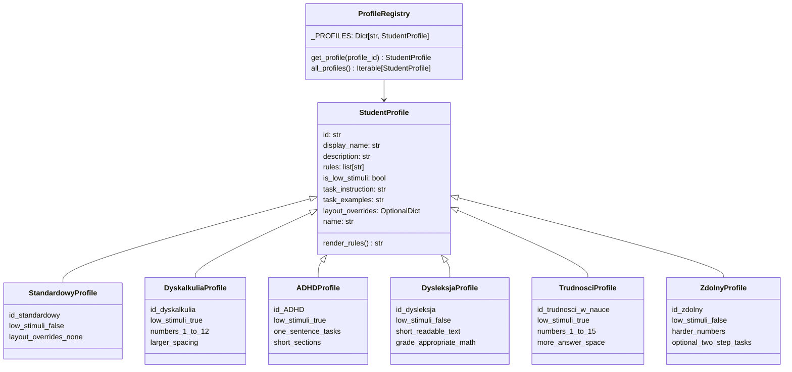
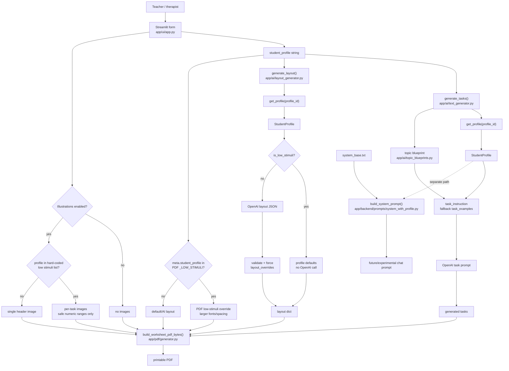
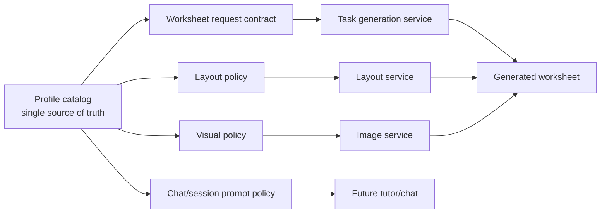

# Student Profiles / PPP Pedagogy Domain

## Executive Summary

Student Profiles are the product's main pedagogical personalization mechanism. They encode PPP-inspired teaching presets for Polish primary-school math worksheets: dyscalculia, ADHD, dyslexia, general learning difficulties, giftedness, and a standard baseline. In the current v1 Streamlit MVP, a selected profile affects task-generation prompts, layout generation, PDF rendering, illustration placement, and an early chat/system-prompt helper.

Architecturally, the profile model is promising because it has a central registry and explicit profile classes. The main business risk is that the profile contract is not yet consistently used across the product. Worksheet generation uses `StudentProfile` subclasses and `get_profile()`, but the UI still hard-codes selectable ids, low-stimuli behavior is duplicated in multiple files, the PDF layer applies its own low-stimuli override after layout generation, and the chat prompt helper is separate from the worksheet prompt path. Before v2 introduces persistent student records, chat memory, or multi-user services, profile ids, semantics, and prompt usage should be stabilized as a first-class domain contract.

## Business Purpose

Friendly Math is not just a generic worksheet generator. Its business value is individualized, printable math practice for teachers and therapists working with students who may need PPP-style accommodations. Profiles let a teacher select a pedagogical mode without entering personal student data.

The profile domain supports these business goals:

- Faster teacher workflow: choose a preset instead of manually rewriting task style, spacing, and difficulty.
- Lower cognitive load for students: use shorter tasks, bigger type, clearer spacing, and conservative visuals for students who benefit from reduced stimuli.
- Safer pedagogical defaults: prevent overcomplicated prompts for dyscalculia, long text blocks for dyslexia/ADHD, or under-challenging tasks for gifted students.
- Future personalization path: provide a stable bridge from anonymous presets in v1 to persistent student records and adaptive profiles in v2.

Current documentation in `README.md` describes profiles as PPP prompt presets and mentions dyscalculia and ADHD as examples. The implementation has already expanded beyond that: six profiles are registered, five are selectable in the UI, and dyslexia exists in the registry but is not currently exposed in the UI.

## Domain Language

- **Student profile / PPP preset**: a reusable pedagogical preset, not a personal student record.
- **Profile id**: stable identifier passed between UI, generators, layout, PDF, and prompts, for example `dyskalkulia` or `ADHD`.
- **Profile rules**: chat-oriented teaching rules rendered into a system prompt.
- **Task instruction**: worksheet-generation instruction used as a profile overlay in `app/ai/text_generator.py`.
- **Task examples**: few-shot examples used when a topic blueprint is missing.
- **Layout overrides**: deterministic layout values applied by `app/ai/layout_generator.py`.
- **Low-stimuli profile**: a profile that should avoid unnecessary visual/cognitive load, currently `dyskalkulia`, `ADHD`, and `trudności w nauce`.

## Registry And Class Model

The core model lives under `app/generators/profiles/`.

`StudentProfile` is a lightweight base class with class-level fields:

- `id`
- `display_name`
- `description`
- `rules`
- `is_low_stimuli`
- `task_instruction`
- `task_examples`
- `layout_overrides`

`registry.py` instantiates every profile once and exposes:

- `get_profile(profile_id)`: resolves by exact id, then case-insensitive id, then falls back to `standardowy`.
- `all_profiles()`: returns all registered profile instances.

This is a good foundation for v2. The main missing piece is a single exported profile catalog that the UI, PDF layer, image logic, tests, and future API can all consume without duplicating ids.

## Profile Semantics

### Standardowy

`standardowy` is the neutral baseline. It uses grade-appropriate tasks, no low-stimuli flag, and no layout overrides. In task generation, `standardowy` intentionally does not add a profile-specific style section when a topic blueprint exists.

Business meaning: default worksheet for a student without selected accommodations.

### Dyskalkulia

`dyskalkulia` targets difficulty with numbers and mathematical symbols. It asks for very simple numbers, one step at a time, natural language near symbols, and no long instructions. It is low-stimuli and has larger margins, spacing, and a light background through layout overrides.

Business meaning: reduce numerical and symbolic overload while preserving basic math practice.

### ADHD

`ADHD` targets attention and working-memory constraints. It asks for very short tasks, one operation per task, clear "Policz: X op Y = ____" formatting, no extra information, short sections, and frequent checkpoints in chat-oriented rules. It is low-stimuli.

Business meaning: keep each interaction short, visibly structured, and easy to restart after attention shifts.

### Dysleksja

`dysleksja` targets text decoding, not mathematical difficulty. Its rules explicitly avoid lowering the math level just because reading is harder. It asks for short, consistent instructions, larger spacing, and clearer typography. It is registered and has layout overrides, but it is not currently available in the Streamlit profile selector.

Business meaning: reduce reading burden while preserving grade-level math expectations.

### Trudności W Nauce

`trudności w nauce` targets general learning difficulties: slower pace, simpler examples, repetition, praise for micro-progress, simple numbers, short instructions, and more answer space. It is low-stimuli.

Business meaning: a broad support preset when the teacher knows the student needs lower complexity but does not want to choose a narrower diagnosis.

### Zdolny

`zdolny` targets students who need more challenge. It allows harder numbers, optional two-step or chain operations, and more content density through smaller task font and spacing.

Business meaning: prevent boredom and provide enrichment while staying within the worksheet's selected grade/topic context.

## How Profiles Affect The Worksheet Pipeline

## Task Prompt Usage

`app/ai/text_generator.py` builds a worksheet task prompt from three layers:

1. Common teacher role and output constraints.
2. Topic and grade blueprint from `get_blueprint(topic, grade_int)`.
3. Profile-specific task style from `profile.task_instruction`, except for `standardowy`.

If a topic blueprint exists, the blueprint supplies the core mathematical requirements and examples. The profile acts as a style/accommodation overlay. If no blueprint exists, the profile's `task_instruction` and `task_examples` become the fallback source of task shape.

The generator then strips accidental numbering and filters simple arithmetic tasks that exceed grade/blueprint numeric limits. If too few tasks remain, it pads with generic placeholder addition tasks. That fallback is operationally useful, but it can weaken profile fidelity because the placeholder tasks are not profile-aware beyond being simple.

Business implication: profile behavior currently depends on topic blueprint coverage. Strong blueprint coverage makes profiles behave as style overlays; missing blueprints make profiles carry more pedagogical responsibility than they should.

## Layout Usage

`app/ai/layout_generator.py` resolves the selected profile through the registry and uses profile fields in two ways:

- Low-stimuli profiles skip OpenAI layout generation entirely and return deterministic defaults plus `layout_overrides`.
- Non-low-stimuli profiles may call OpenAI for layout JSON, then `_validate_layout()` fills missing values and forces any `layout_overrides`.

This is a pragmatic cost and reliability decision: the profiles most sensitive to layout quality avoid model variance. It also means profile classes are the real authority for low-stimuli layout, not the layout model.

Grade constraints are applied after profile/default layout construction: grades 1-3 get at least `task_font_size >= 12` and `margin >= 55`.

## PDF Usage

`app/pdf/generator.py` accepts the layout dict, merges it into its own PDF defaults, and then applies another low-stimuli override when `meta.student_profile` is in `_LOW_STIMULI = {"dyskalkulia", "ADHD", "trudności w nauce"}`.

This creates a second source of truth:

- `layout_generator.py` decides low-stimuli from `StudentProfile.is_low_stimuli`.
- `pdf/generator.py` decides low-stimuli from a local set of raw strings.

The PDF override is stronger than the passed layout for overlapping keys because it is applied after `layout`. That is useful for readability but makes it harder to reason about final layout and can silently override `layout_generator.py` decisions.

PDF also prints the raw `student_profile` string in metadata. It does not resolve `display_name`, so any future id/display-name split will require a deliberate change.

## Low-Stimuli Behavior

Low-stimuli behavior currently means:

- Avoid OpenAI layout calls and use deterministic profile layout.
- Larger margins, fonts, line spacing, task spacing, and light neutral background.
- More workspace lines in the PDF low-stimuli override.
- Per-task illustrations instead of a single header image when illustrations are enabled in the UI.
- Conservative image generation: per-task illustrations are only produced for tasks that can be honestly represented with small icon counts.

The low-stimuli concept is valuable, but it is duplicated:

- `StudentProfile.is_low_stimuli` in profile classes.
- `low_stimuli_profiles` list in `app/ui/app.py`.
- `_LOW_STIMULI` set in `app/pdf/generator.py`.
- Similar low-stimuli checking in `app/ai/image_generator.py`.

Duplication raises the chance that a future profile such as dyslexia or another support need will be registered but not handled consistently by UI images, PDF layout, and AI image prompts.

## UI Behavior And Gaps

The Streamlit UI hard-codes the profile selector:

- `standardowy`
- `dyskalkulia`
- `zdolny`
- `trudności w nauce`
- `ADHD`

The registry also contains `dysleksja`, but it is not selectable. The illustration help text mentions `dysleksja` as if it were available. This is a clear UI/docs mismatch.

Other UI gaps:

- The profile list is not generated from `all_profiles()`, so the registry is not the product catalog.
- UI help text compresses profile meaning into one generic sentence and does not explain the difference between dyscalculia, dyslexia, ADHD, general learning difficulties, and giftedness.
- The UI's low-stimuli image branching is based on a local string list instead of `get_profile(student_profile).is_low_stimuli`.
- Profile ids are displayed directly to users and in PDFs; there is no separation of stable id, Polish display label, and future localized description.
- Unsupported combinations are not surfaced as profile-specific warnings. For example, a dyscalculia profile may ask for simple numbers but a topic blueprint can still dominate the mathematical shape.

## Documentation Gaps

`README.md` still describes only dyscalculia and ADHD as examples and says profiles are prompt-level presets. That is incomplete for the current implementation because profiles also affect layout, PDF rendering, and illustration strategy.

`docs/architecture-and-domain.md` correctly identifies profiles as one of the primary domain boundaries and notes that some implemented profiles are not selectable or consistently documented. This document should become the detailed companion for that domain.

Recommended documentation updates:

- Make the supported profile list match the registry.
- Explain that profiles are anonymous presets, not stored student data.
- Document low-stimuli behavior explicitly.
- Document which profiles are available in UI vs implemented but hidden.
- Add a profile-by-profile pedagogical intent section for teachers.

## Dual Prompt/Profile Paths

There are two profile prompt paths today.

### Worksheet Task Prompt Path

Used by `app/ai/text_generator.py`.

Inputs:

- raw profile id from UI
- `get_profile(profile_id)`
- topic blueprint
- `profile.task_instruction`
- sometimes `profile.task_examples`

Output:

- a user prompt for task generation

This path is worksheet-specific and optimized for producing task lines.

### Chat/System Prompt Path

Defined by:

- `app/backend/prompts/system_base.txt`
- `app/backend/prompts/system_with_profile.py`
- profile `rules`
- profile `render_rules()`

Output:

- a combined system prompt for a chat/tutoring model

This path is not obviously wired into `app/ui/app.py` for the current worksheet flow. It appears to be an early backend/chat abstraction or future v2 work. It also uses `profile.name`, which is a backward-compatible alias for `profile.id`.

Business implication: the same profile class powers both worksheet and chat semantics, but the two prompt paths use different fields and are not governed by one prompt policy. That is acceptable for an MVP, but risky once chat becomes a user-facing feature. A student could receive worksheet tasks adapted by `task_instruction` and chat explanations adapted by `rules`, with no shared contract that the two adaptations are pedagogically aligned.

## Current Risks

- **Profile catalog drift**: the registry, UI selector, README, PDF low-stimuli set, image low-stimuli checks, and help text can disagree.
- **Raw string ids as contracts**: ids include case (`ADHD`) and spaces/diacritics (`trudności w nauce`), which are fine for Polish UI labels but brittle as long-term API identifiers.
- **Hidden dyslexia profile**: `dysleksja` exists in code and is mentioned in UI help text, but users cannot select it.
- **Duplicated low-stimuli rules**: low-stimuli behavior is encoded separately in profile classes, UI, PDF, and image generation.
- **PDF overrides are hard to reason about**: the PDF layer can override the layout already produced by `layout_generator.py`.
- **Prompt semantics are split**: worksheet generation and chat prompting use different profile fields and have no shared profile policy layer.
- **Fallbacks can dilute profile fidelity**: generic placeholder tasks are used if generation/filtering yields too few tasks.
- **No profile regression tests**: there is a preview script for prompt rendering, but no tests asserting registry completeness, UI catalog consistency, low-stimuli layout behavior, or prompt content.
- **No explicit accommodation limits**: profile instructions say things like "simple numbers" or "two steps", but there is no validator that enforces those profile-specific constraints after generation.
- **Potential over-personalization framing**: profiles are PPP-inspired presets, not diagnoses or medical recommendations. Product copy should avoid implying clinical assessment.

## Pragmatic Improvements

### 1. Make The Registry The Source Of Truth

Expose a structured profile catalog from `registry.py` and use it in the UI:

- `id`
- `display_name`
- `description`
- `is_low_stimuli`
- short teacher-facing help text
- availability flag if some profiles are experimental

Then remove hard-coded UI profile options and local low-stimuli lists where possible.

### 2. Normalize Stable Profile Ids

Keep Polish labels for display, but consider ASCII/sluggable ids for API and persistence:

- `standard`
- `dyscalculia`
- `adhd`
- `dyslexia`
- `learning_difficulties`
- `gifted`

If changing ids is too disruptive now, introduce `slug` or `api_id` while preserving current `id` for compatibility.

### 3. Centralize Low-Stimuli Policy

Create one function or property-based helper, for example:

- `is_low_stimuli_profile(profile_id) -> bool`
- `get_profile_layout(profile_id, grade) -> dict`
- `get_illustration_mode(profile_id) -> "none" | "header" | "per_task"`

This would let UI, layout, PDF, and image generation use the same decision model.

### 4. Separate Layout Authority

Choose one layer as authoritative for final layout:

- Option A: `layout_generator.py` returns final layout, and PDF only renders it.
- Option B: PDF owns final layout, and `layout_generator.py` only suggests values.

For v2, Option A is cleaner because layout can be tested as a domain service before rendering.

### 5. Align Worksheet And Chat Semantics

Define a `ProfilePromptPolicy` or similar concept that maps one profile to:

- task generation rules
- tutoring/chat rules
- layout rules
- safety/wording constraints

This does not need to be a large abstraction. A single documented schema and tests would be enough to prevent drift.

### 6. Add Profile-Focused Tests

High-value tests:

- every registered profile has non-empty `id`, `display_name`, `description`, `rules`, and `task_instruction`;
- UI profile options equal or intentionally subset `all_profiles()`;
- low-stimuli profiles skip OpenAI layout and receive expected spacing/font values;
- PDF does not override layout unexpectedly, or the override is explicitly tested;
- `build_system_prompt()` includes `render_rules()` for every profile;
- dyslexia profile preserves grade-level math difficulty in task prompt wording.

### 7. Make Profile Effects Visible To Teachers

In the UI, show a compact explanation after profile selection:

- "Dyskalkulia: simpler numbers, one step, more space."
- "Dysleksja: shorter text, clearer spacing, normal math level."
- "ADHD: short tasks, strong structure, no long text."
- "Zdolny: more challenge, possible two-step tasks."

This reduces the risk that teachers misunderstand profile intent.

### 8. Add Profile-Aware Validation

After task generation, validate profile-specific expectations where feasible:

- ADHD: one line, one operation, short length.
- Dyscalculia / general learning difficulties: small numbers unless topic explicitly requires otherwise.
- Dyslexia: short wording, no long story problems unless topic requires them.
- Gifted: allow challenge but still respect grade/topic blueprint.

Validators should warn or regenerate, not silently rewrite too aggressively.

## Target Direction For V2

For Streamlit v2, the profile domain should be promoted from "raw strings plus subclasses" to a stable contract before adding more UX or revisiting FastAPI, Supabase, chat memory, or student records:

The immediate goal is not a heavy personalization engine. It is a reliable profile catalog with clear semantics, deterministic low-stimuli decisions, and consistent use across worksheet, PDF, visual, and chat paths.

