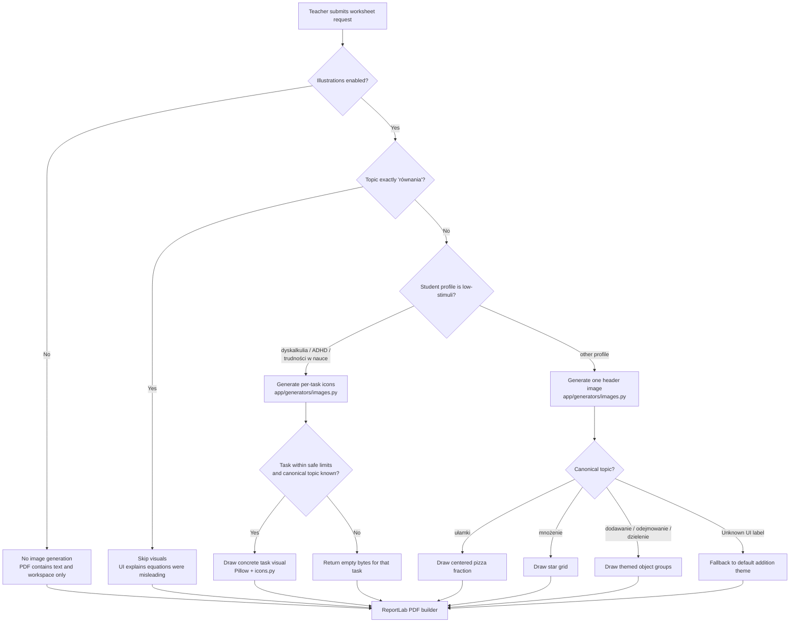
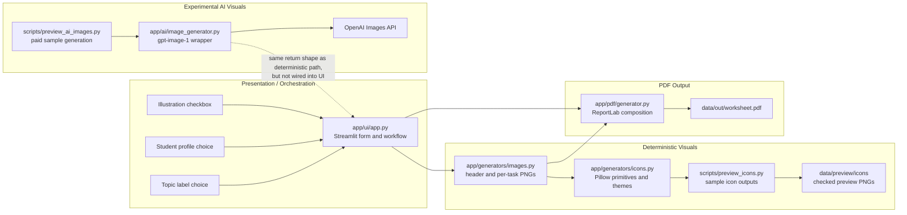

# Visual Assets And Image Generation Domain

## Executive Summary

Visuals in Friendly Math are not decorative assets first. Their business role is to make early math worksheets easier to understand, less intimidating, and more useful for students who benefit from concrete representations. The current v1 system wisely keeps the default visual path deterministic: icons are drawn locally with Pillow, inserted into the PDF by ReportLab, and skipped when they would be misleading.

The visual domain has two active modes:

- A single header illustration for standard, gifted, and similar non-low-stimuli profiles.
- Per-task illustrations for dyscalculia, ADHD, and general learning difficulties, but only when a task can be represented honestly with small concrete quantities.

There is also an experimental AI image path using OpenAI `gpt-image-1`. It is not wired into the Streamlit worksheet flow today. It is useful for previewing quality, estimating cost, and testing whether generated images can become a future option, but it is not yet reliable or cheap enough to replace deterministic icons for the core product.

The main architectural issue is topic normalization. The UI exposes curriculum labels such as `dodawanie do 20`, `tabliczka mnożenia`, and `równania z okienkiem`, while the deterministic image system mostly understands canonical topic names such as `dodawanie`, `mnożenie`, `dzielenie`, `ułamki`, and `równania`. This causes inconsistent visual behavior: some topics fall back to generic addition icons, some silently skip per-task images, and some unsafe topics may not be excluded because the label does not match exactly.

## Business Role Of Visuals

Visuals support the product promise of individualized printable math materials. For teachers and therapists, they reduce the time needed to prepare concrete visual scaffolding. For students, they can turn abstract operations into countable objects: apples for addition, bitten cookies for subtraction, grids of stars for multiplication, grouped fish for division, and divided pizza for fractions.

Business value is highest when visuals are:

- Pedagogically faithful: the picture must show the same mathematical structure as the task.
- Low effort for teachers: no asset upload, no image search, no manual formatting.
- Printable: graphics must survive black-and-white printing and fit on A4 worksheets.
- Profile-aware: students who need low-stimuli worksheets should receive fewer, simpler, more task-local supports.
- Predictable: the teacher should know when illustrations are unavailable and why.

The current deterministic icon system serves those needs better than AI images for v1. It is fast, free at runtime, reproducible, and avoids unpredictable generated content. AI images may become valuable later for richer scenes, story problems, or premium/custom worksheets, but only after stronger controls are in place.

## Current Visual Generation Decision Flow



## Component And Dependency Map



## Deterministic Icon System

The deterministic system lives in `app/generators/images.py` and `app/generators/icons.py`. It creates PNG bytes locally using Pillow, then passes those bytes into `app/pdf/generator.py`.

`icons.py` is the low-level drawing library. It has no external asset dependency: apples, stars, fish, cookies, candy, pizzas, and operation symbols are drawn from primitives. This is a strong architectural choice for the MVP because it avoids bundled SVG/PNG management, licensing, network calls, and inconsistent image styles. The palette is intentionally child-friendly but not highly saturated, and the outline style keeps icons more legible in print.

`images.py` is the domain adapter. It decides what scene to draw for a worksheet topic, parses numbers and fractions from generated task text, applies safety limits, and returns either a PNG or `b""`. Returning empty bytes is the system's soft-failure contract: the PDF builder treats an empty image as absent rather than failing the worksheet.

Current deterministic topic mapping:

- `dodawanie`: two groups of apples with a plus sign.
- `odejmowanie`: cookies, with removed items represented as bitten cookies.
- `mnożenie`: a rectangular grid of stars.
- `dzielenie`: fish grouped equally.
- `ułamki`: pizza divided into fractional slices.
- `równania`: intentionally skipped in the deterministic path.

This is deliberately concrete and limited. That is appropriate for early numeracy and PPP-style supports, but it also means images should not be treated as a universal illustration layer for every curriculum topic.

## Header Images Versus Per-Task Images

The UI currently chooses the visual mode based on profile:

- `standardowy`, `zdolny`, and any non-low-stimuli profile get one header image under the worksheet metadata.
- `dyskalkulia`, `ADHD`, and `trudności w nauce` get per-task images when possible.

The distinction is pedagogically meaningful. Header images are light decoration and orientation: they make the page friendlier without consuming much vertical space. Per-task images are instructional scaffolding: they sit next to the exact task and must match the numbers in that task.

In `app/pdf/generator.py`, header images are small fixed-size illustrations near the top of the first page. Per-task images span the available content width and use an expected aspect ratio matching the 480x100 PNG target. When `task_images` is present and has the same length as the task list, the PDF builder ignores the header image and attempts to draw each non-empty task image before its task text.

The per-task mode has a higher layout cost. It consumes vertical space, can increase page count, and competes with workspace lines. That cost is justified for low-stimuli/support profiles only when the picture adds concrete mathematical help.

## Safety Limits And Honesty Contract

The deterministic per-task path has explicit safety limits:

- Addition: operands up to 8 and sum up to 16.
- Subtraction: operands up to 10, with the second operand smaller than the first.
- Multiplication: factors up to 5 by 5.
- Division: dividend up to 12, divisor up to 3, and exact divisibility required.
- Fractions: denominators up to 6, numerators from 0 through denominator.

These limits are a core product rule, not an implementation detail. The visual should never lie. Showing a simplified picture for `15 x 6` would be worse than showing no picture because it teaches the wrong model. The code follows the right principle: "better no illustration than a misleading one."

For unsupported topics or tasks that cannot be parsed, the generator returns empty bytes. This protects reliability, but the teacher currently sees only broad UI messages, not a task-level explanation of why some images are missing. That is acceptable for an MVP but should become more transparent before visual support is marketed as a feature.

## Topic Mapping Issues

The largest current domain risk is inconsistent topic naming.

The UI exposes rich topic labels:

- `dodawanie do 20`, `dodawanie do 100`, `dodawanie do 1000`
- `odejmowanie do 20`, `odejmowanie do 100`, `odejmowanie do 1000`
- `tabliczka mnożenia`, `mnożenie przez 10`
- `równania z okienkiem`
- `pieniądze`, `czas`, `pomiary długości`, `obwody`, `zadania tekstowe`
- plus canonical labels such as `dodawanie`, `odejmowanie`, `mnożenie`, `dzielenie`, `ułamki`, `równania`

The visual generator mostly expects canonical labels. This creates several behaviors:

- Header images for unknown labels can fall back to default addition-style apples, which may be pedagogically wrong for `czas`, `pieniądze`, or `równania z okienkiem`.
- Per-task images for unknown labels are silently skipped because there are no safety limits for those labels.
- Equation images are skipped only when the exact topic label is `równania`; `równania z okienkiem` does not match that exclusion in the UI or `_TOPICS_WITHOUT_IMAGES`.
- `tabliczka mnożenia` and `mnożenie przez 10` may not receive multiplication visuals unless normalized to `mnożenie`.
- `dodawanie do 20` is conceptually illustratable, but without normalization it is not treated like `dodawanie`.

This should be solved with a shared topic identifier layer, not by adding more string comparisons in each module. The curriculum blueprint, text generation, answer key, visual generation, and UI should all receive a stable topic id such as `addition`, `subtraction`, `multiplication`, `division`, `fractions`, `equations`, `money`, or `time`, plus display labels and grade-specific constraints.

## Experimental AI Image Path

`app/ai/image_generator.py` provides an experimental `generate_task_images_ai(tasks, topic, profile)` function with the same broad return shape as the deterministic per-task icon function: a list of PNG bytes where `b""` means failure or omission.

The AI path uses `gpt-image-1`, default quality `low`, default size `1024x1024`, and then resizes/crops the result down to a 480x100-ish banner for PDF use. It includes:

- Cost estimation through `estimate()`.
- Parallel generation with `ThreadPoolExecutor`.
- A small in-memory process cache keyed by model, quality, size, topic, profile, and task text.
- Prompt rules asking for flat, low-stimuli, text-free, number-free images.
- Broad exception handling so image failures do not break worksheet generation.

This path is not imported or used by `app/ui/app.py`. The only current integration is `scripts/preview_ai_images.py`, which generates paid samples into `data/preview/ai_images/`.

Architecturally, the AI path is a useful experiment because its function shape can replace the deterministic function at the UI boundary. Product-wise, it should remain opt-in and clearly labeled until it passes quality, safety, cost, and accessibility checks.

## Cost And Performance

The deterministic path has near-zero marginal cost. It is CPU-local, fast enough for synchronous Streamlit use, and reproducible. The main cost is development time to add or refine icon scenes.

The AI path has direct variable cost and latency:

- Low quality: about `$0.011` per image.
- Medium quality: about `$0.042` per image.
- High quality: about `$0.167` per image.
- Observed/estimated latency is roughly 8 seconds per low-quality image, with parallelism reducing wall-clock time but not cost.

For a 10-task worksheet with per-task AI images, low quality is roughly `$0.11` before text-generation costs. At classroom scale this becomes material quickly. For example, 30 worksheets with 10 images each would be roughly `$3.30` in image cost alone at low quality, and much more at higher quality.

AI image generation also adds operational uncertainty: API availability, rate limits, timeout behavior, and content variation. It should not be part of the default teacher workflow unless there is a budget guardrail, clear preview step, and a way to regenerate or remove unsuitable images.

## Reliability And Failure Modes

The visual subsystem currently degrades softly:

- If illustrations are disabled, no generator is called.
- If deterministic generation returns `b""`, the PDF skips the image.
- If an image cannot be read by ReportLab, the PDF builder catches the exception and continues.
- If AI image generation fails, the wrapper returns `b""`.

This is good for worksheet completion. A teacher should still get a printable PDF if visuals fail.

Reliability gaps remain:

- Missing task-level visibility: skipped per-task images are not reported back to the teacher.
- Broad exception swallowing hides recurring image/PDF issues during development.
- Topic-label mismatches create silent wrong fallback or silent omission.
- AI image cache is process-local only, so reruns after restart can repeat paid generation.
- Preview assets are generated by scripts but not validated in automated tests.
- There is no regression check that a given topic/profile produces the expected image mode.

## Accessibility And Low-Stimuli Implications

The low-stimuli design direction is strong. Visuals for dyscalculia, ADHD, and general learning difficulties are task-local, simple, and constrained by quantity. PDF layout overlays increase fonts, margins, spacing, workspace lines, and use a softer background color for low-stimuli profiles.

Important accessibility principles for this domain:

- Images should reduce cognitive load, not add decoration.
- A task-local visual should be sparse, countable, and aligned with the task's numbers.
- Color should not be the only carrier of meaning; outlines, grouping, shape, and position matter for black-and-white printing.
- Repeated icons should remain consistent across worksheets so students learn the visual language.
- Students with ADHD may benefit from fewer competing elements, so per-task visuals should be used only when they clarify the task.
- Dyscalculia support should prioritize one-to-one correspondence, grouping, and spatial clarity over visual richness.
- Dyslexia support may benefit more from typography and spacing than from extra images; currently it is not selectable in the UI, despite being mentioned in some visual help text.

The deterministic icon system is naturally better aligned with these requirements than generative AI. AI can produce attractive images, but it may add clutter, vary object counts, include text-like artifacts, or fail to represent exact quantities.

## Risks

- Topic naming drift can produce incorrect visuals, especially when UI display labels differ from canonical generator labels.
- Header fallback to addition-style apples for unknown topics can mislead students and teachers.
- The exact skip rule for equations does not cover all equation-like labels.
- AI images may miscount objects, include text/numbers despite prompts, or create busy scenes that conflict with low-stimuli needs.
- Per-task images consume page space and may reduce room for calculations if too many are generated.
- The profile split is encoded as raw strings in the UI and PDF generator, rather than coming from profile metadata.
- The system has no automated visual regression tests or contract tests for image generation decisions.
- Cost controls for AI images are informational in preview scripts, not enforced in product workflow.

## Pragmatic Improvements

1. Introduce canonical topic ids.

   Add a shared mapping from UI labels to domain ids and use it in text generation, answer keys, visual generation, and PDF metadata. This single change would fix most visual mismatch risks.

2. Replace exact image skip strings with topic capabilities.

   Model visual support as capability metadata: `header_visual_supported`, `task_visual_supported`, `requires_safe_numeric_parse`, and `skip_reason`. This is clearer than checking `topic.lower() == "równania"` in multiple places.

3. Return visual generation diagnostics.

   Instead of only returning PNG bytes, return a small structure per task: image bytes, status, and reason. The UI can then say "3 of 10 tasks illustrated; 7 skipped because numbers were too large or topic unsupported."

4. Move profile visual policy into profile definitions.

   Profiles already drive layout and task style. They should also expose visual preferences such as `visual_mode = none | header | per_task`, `low_stimuli`, and max image density. This avoids duplicating profile string lists.

5. Add focused contract tests.

   Test that canonical topics produce the expected mode, unsafe tasks return skipped diagnostics, equation topics never use default apples, and UI labels normalize correctly.

6. Keep AI images behind an explicit experiment flag.

   If AI visuals are exposed, require a budget estimate, a warning about cost, and an explicit teacher confirmation. Cache successful outputs persistently if the product will reuse worksheets.

7. Add visual preview acceptance checks.

   Keep `scripts/preview_icons.py` as a manual preview tool, but add a lightweight automated check that output files are non-empty for supported cases and empty for intentionally skipped cases.

8. Protect printable accessibility.

   Maintain deterministic icons as the default. Any new icons should use moderate contrast, simple shapes, consistent outlines, and countable arrangements. Avoid decorative backgrounds, gradients, and dense scenes.

## Recommended V2 Direction

For v2, visual generation should be treated as a domain service behind a stable interface:

```python
VisualRequest(
    topic_id,
    profile_id,
    tasks,
    requested_mode,
    max_cost_usd,
)

VisualResult(
    mode_used,
    header_image,
    task_images,
    diagnostics,
    estimated_cost,
    actual_cost,
)
```

The default implementation should remain deterministic. AI image generation can be a secondary implementation selected only for supported topics, explicit experiments, or premium workflows. The service should make the absence of visuals explicit and harmless: a worksheet without images is valid, but a worksheet with misleading images is not.

The practical next milestone is not more image variety. It is a shared topic/profile contract and transparent diagnostics. Once those are in place, adding richer visual styles becomes much safer.
