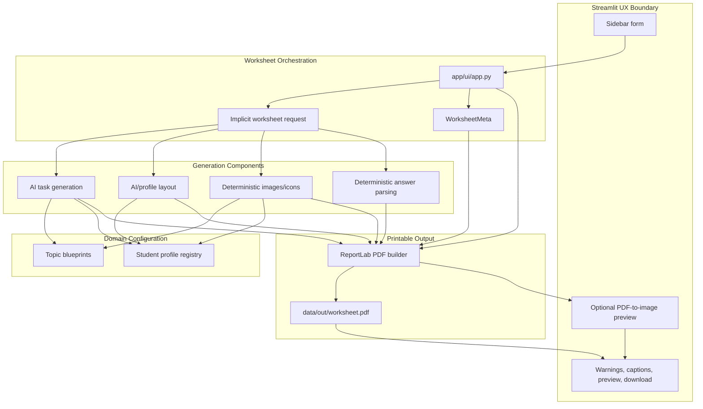

# Worksheet Orchestration And Streamlit UX Domain

## Purpose

This domain turns a teacher's worksheet intent into a printable PDF. In v1, the Streamlit app is both the user experience and the application orchestrator: it collects worksheet parameters, calls AI and deterministic generators, assembles the PDF, writes the latest artifact to disk, and exposes preview/download actions.

From a business perspective, this is the highest-value workflow in Friendly Math. The product promise is not only "generate math tasks", but "quickly produce a readable, low-stimulus, PPP-aware worksheet that a teacher or therapist can use immediately in class."

## Business Workflow

Primary actor: teacher or therapist.

Business outcome: a PDF worksheet for one teaching session, adapted by grade, topic, task count, student support profile, optional illustrations, workspace lines, and optional answers.

Current v1 workflow:

1. The teacher opens the Streamlit app and chooses worksheet parameters in the sidebar.
2. The app validates only blocking constraints: `OPENAI_API_KEY` must exist, and grades 1-3 cannot request more than 15 tasks.
3. The app calls task generation through OpenAI-backed prompt logic.
4. The teacher sees generated task text before the PDF area.
5. The app requests layout, optionally generates visuals, optionally computes answers, and builds a PDF.
6. The app writes `data/out/worksheet.pdf`, renders a preview when PyMuPDF is available, and offers a browser download.

Important product characteristic: the workflow is synchronous. The teacher waits in the UI while AI, image generation, PDF composition, disk write, and preview conversion run in one request.

## Current Responsibilities

`app/ui/app.py` is the current application service. It owns responsibilities that would normally be split across presentation, orchestration, validation, and persistence.

| Area | Current owner | Current behavior |
| --- | --- | --- |
| UX form | `app/ui/app.py` | Sidebar controls for grade, topic, count, profile, illustration, workspace, and answer key. |
| Request validation | `app/ui/app.py` | Checks missing `OPENAI_API_KEY`; rejects more than 15 tasks for grades 1-3. |
| Task orchestration | `app/ui/app.py` -> `app/ai/text_generator.py` | Generates AI task text, displays warnings/errors, uses fallback tasks on failure. |
| Layout orchestration | `app/ui/app.py` -> `app/ai/layout_generator.py` | Requests AI layout for non-low-stimuli profiles; profile defaults for low-stimuli/failures. |
| Illustration policy | `app/ui/app.py` + `app/generators/images.py` | Decides header image vs per-task images by profile; image generator applies topic/safety limits. |
| Answer key | `app/ui/app.py` -> `app/generators/answers.py` | Computes deterministic answers where parsers support the task type. |
| PDF composition | `app/ui/app.py` -> `app/pdf/generator.py` | Creates `WorksheetMeta`, merges layout/images/answers, receives PDF bytes. |
| Local artifact | `app/ui/app.py` | Writes the latest PDF to `data/out/worksheet.pdf`; no history or isolation. |
| Preview/download | `app/ui/app.py` | Converts PDF bytes to PNG pages with PyMuPDF when available; exposes `st.download_button`. |

## Inputs And Outputs

### Inputs

Teacher-facing inputs:

- `grade`: string from `"1"` through `"8"`.
- `topic`: display label from the Streamlit selectbox, such as `"dodawanie do 20"`, `"ułamki"`, or `"równania"`.
- `number_of_tasks`: integer 1-30, with business cap 15 for grades 1-3.
- `student_profile`: display/id string such as `"standardowy"`, `"dyskalkulia"`, `"ADHD"`, `"trudności w nauce"`, or `"zdolny"`.
- `include_illustration`: boolean.
- `include_workspace`: boolean.
- `include_answers`: boolean.

Environmental/runtime inputs:

- `OPENAI_API_KEY`, required by task generation and non-low-stimuli AI layout generation.
- Optional PyMuPDF (`fitz`) for in-browser page previews.
- ReportLab, Pillow, and a local font path (`assets/fonts/DejaVuSans.ttf`) for PDF rendering.
- Local filesystem write access to `data/out`.

### Intermediate Outputs

- `result` from `generate_tasks`: dictionary with `tasks`, `profile`, `grade`, `topic`, optional `_warning`, and optional `_error`.
- `layout` from `generate_layout`: dictionary of font sizes, spacing, margin, colors, and related PDF settings.
- `image_bytes`: optional single header image.
- `task_images`: optional list of per-task image bytes, with empty bytes for skipped images.
- `answers`: optional list of answer strings, where unsupported items return `"—"`.

### Final Outputs

- PDF bytes returned from `build_worksheet_pdf_bytes`.
- `data/out/worksheet.pdf`, overwritten on each successful generation.
- Streamlit preview images when PyMuPDF can render the PDF.
- Browser download named `worksheet.pdf`.

## Orchestration Sequence

```mermaid
sequenceDiagram
    actor Teacher
    participant UI as Streamlit UI / app.py
    participant Tasks as Text generator
    participant Layout as Layout generator
    participant Visuals as Image generator
    participant Answers as Answer calculator
    participant PDF as PDF builder
    participant Disk as Local filesystem

    Teacher->>UI: Submit worksheet form
    UI->>UI: Validate API key and grade/task cap
    alt Validation fails
        UI-->>Teacher: Streamlit error and stop/no PDF
    else Validation passes
        UI->>Tasks: profile, grade, topic, number_of_tasks
        Tasks->>Tasks: Resolve topic blueprint and student profile
        Tasks->>Tasks: Call OpenAI and normalize task lines
        Tasks->>Tasks: Filter obvious out-of-range arithmetic
        alt Task API fails
            Tasks-->>UI: Fallback tasks with _error
            UI-->>Teacher: Warning; PDF can still be generated
        else Task API succeeds
            Tasks-->>UI: Tasks plus optional warning
        end
        UI-->>Teacher: Display generated task list
        UI->>Layout: profile, grade, number_of_tasks
        Layout-->>UI: AI layout or profile-default fallback
        opt Illustrations enabled
            UI->>Visuals: topic, profile, tasks
            Visuals-->>UI: Header image or per-task image list
        end
        opt Answer key enabled
            UI->>Answers: tasks
            Answers-->>UI: Answer strings or "—"
        end
        UI->>PDF: meta, tasks, layout, images, answers, workspace flag
        PDF-->>UI: PDF bytes
        UI->>Disk: Overwrite data/out/worksheet.pdf
        UI-->>Teacher: Preview if available and download button
    end
```

## Responsibility And Domain Map



## Validation And Error Behavior

### Blocking Validation

- Missing `OPENAI_API_KEY` stops the Streamlit request before task generation. The user sees a clear setup error.
- For grades 1-3, `number_of_tasks > 15` shows an error and does not proceed to generation.
- The Streamlit controls constrain grade and task count enough to prevent many invalid values in normal UI use.

### Recoverable Failures

- Task generation catches all exceptions and returns three fallback arithmetic tasks with `_error`.
- The UI treats task-generation errors as a warning, displays fallback tasks, and still allows PDF generation.
- Layout generation catches exceptions internally, logs to stdout, and returns a profile-default layout. The extra `try/except` in `app.py` is therefore mostly a second safety net.
- Image generation failures are caught in `app.py`; the PDF is still built without images.
- PDF preview conversion catches exceptions and silently returns no preview images; the user is told to download the PDF.
- PDF drawing operations swallow many image/font/color rendering errors and continue producing a PDF.

### Partial Or Silent Behavior

- Unsupported answer types return `"—"` instead of a warning. This is technically safe but can surprise a teacher who enabled "Dołącz stronę z odpowiedziami".
- Per-task images return empty bytes for unsupported or unsafe tasks; the PDF simply omits those images.
- Missing `assets/fonts/DejaVuSans.ttf` falls back to Helvetica, which may compromise Polish characters.
- `data/out/worksheet.pdf` is overwritten every generation, so the saved file is not a durable business record.

## Dependencies

Internal dependencies:

- `app/ai/text_generator.py`: OpenAI task generation, topic blueprint selection, profile prompt overlay, output cleanup, range filtering, fallback tasks.
- `app/ai/layout_generator.py`: OpenAI layout for standard/non-low-stimuli profiles, profile layout overrides, grade constraints, default fallback.
- `app/ai/topic_blueprints.py`: topic and grade curriculum semantics used by task generation.
- `app/generators/profiles/registry.py`: profile lookup and fallback to `standardowy`.
- `app/generators/images.py` and `app/generators/icons.py`: deterministic visual generation and conservative image-safety checks.
- `app/generators/answers.py`: deterministic answer parsing for selected task formats.
- `app/pdf/generator.py`: PDF composition, page breaking, workspace lines, optional images, optional answer page, font handling.

External dependencies:

- OpenAI API (`gpt-4o-mini`) for task generation and some layout generation.
- Streamlit for UI, request lifecycle, messaging, and download.
- ReportLab for PDF generation.
- Pillow for image generation.
- PyMuPDF for optional preview rendering.
- Local filesystem for `.env`, font assets, and PDF output.

## Risks And Inconsistencies

- Orchestration is coupled to Streamlit. There is no pure worksheet generation service, which makes testing, Streamlit quality UX, local history, and any future platform option harder.
- The worksheet request is implicit. The system passes raw strings and dictionaries rather than a typed `WorksheetRequest` / `WorksheetResult` contract.
- Topic identifiers are UI labels. The same label must match UI options, topic blueprints, image safety rules, icon themes, answer parsers, and PDF metadata. This already creates gaps: image themes know `"dodawanie"`, while the UI commonly sends `"dodawanie do 20"` or `"dodawanie do 100"`.
- Profile identifiers are mostly centralized in the registry, but the UI hardcodes its own profile list and low-stimuli policy. The registered `"dysleksja"` profile is not currently selectable in the UI even though UI help text mentions it.
- Error behavior is inconsistent. Missing API key is blocking, task API failure is recoverable with fallback tasks, layout failures are mostly silent, answer coverage gaps are silent, and preview failures are only lightly messaged.
- Answer-key confidence is not exposed. A worksheet can include many `"—"` entries with no summary of unsupported tasks.
- AI task fallback always produces three generic tasks, then the PDF proceeds regardless of the requested topic/count. This protects the flow, but it can produce a worksheet that does not match teacher intent.
- The layout contract differs between `layout_generator` defaults and `pdf/generator` defaults. Unknown layout keys are ignored by the PDF builder, and PDF low-stimuli overrides can supersede the layout returned earlier.
- The PDF output path is shared and mutable. It is fine for a local MVP, but unsafe for multi-user use, concurrent sessions, auditability, or worksheet history.
- Quality control is thin. There is no automated regression suite around prompt output, answer correctness, image eligibility, PDF generation, or reference worksheet comparison.

## Pragmatic Improvement Opportunities

### 1. Extract A Worksheet Application Service

Create a callable service, for example `generate_worksheet(request: WorksheetRequest) -> WorksheetResult`, outside Streamlit. Keep Streamlit responsible for form rendering and messages only.

Near-term value:

- Unit-test the generation flow without launching Streamlit.
- Keep the same service reusable from a future platform endpoint if that decision is revisited later.
- Centralize warnings, degraded behavior, and output metadata.

Suggested result shape:

```python
@dataclass(frozen=True)
class WorksheetResult:
    tasks: list[str]
    layout: dict
    pdf_bytes: bytes
    answers: list[str] | None
    warnings: list[str]
    errors: list[str]
    saved_path: Path | None = None
```

### 2. Introduce Stable Domain IDs

Separate stable IDs from display labels:

- `topic_id`: `addition_to_20`, `fractions`, `box_equations`.
- `topic_label_pl`: `"dodawanie do 20"`, `"ułamki"`, `"równania z okienkiem"`.
- `profile_id`: stable lowercase ASCII where possible, with a display name for Polish UI/PDF.

This reduces breakage across blueprints, images, answer parsers, previews, and future APIs.

### 3. Make Capability Warnings Explicit

Return user-visible capability metadata:

- `answers_supported_count` / `answers_unsupported_count`.
- `images_generated_count` / `images_skipped_count`.
- `used_topic_blueprint: bool`.
- `used_fallback_tasks: bool`.
- `used_fallback_layout: bool`.

The UI can then say: "Generated answer key for 3/5 tasks; 2 require manual review" instead of silently printing `"—"`.

### 4. Align Topic, Image, And Answer Coverage

Build a small matrix that maps each topic to:

- task-generation blueprint support,
- answer parser support,
- header image support,
- per-task image support,
- known limitations.

This matrix should drive UI help text and disable/annotate options where support is partial.

### 5. Centralize Profile Presentation And Policy

Use `all_profiles()` to populate the UI rather than hardcoding profile options. Move low-stimuli decisions to profile objects, so the UI does not need its own list of special profiles.

Immediate fix candidates:

- Add `"dysleksja"` to the UI or remove it from UI help text until exposed.
- Let profile metadata decide header image vs per-task images.
- Display profile `display_name` in the PDF instead of raw ids where appropriate.

### 6. Normalize Degraded Generation

Fallback behavior should preserve teacher intent as much as possible. If OpenAI task generation fails, fallback tasks should be generated from topic/grade blueprints or deterministic templates, not a fixed three-task addition/subtraction set.

Recommended rule: degraded output is acceptable only when the PDF clearly states or the UI clearly warns what degraded and what stayed faithful to the request.

### 7. Harden PDF Output For Product Use

For v1, keep local output simple but add safer conventions:

- Generate unique filenames with timestamp/topic/profile when saving locally.
- Keep returning `pdf_bytes` as the source of truth for download.
- Verify or vendor the Polish-capable font asset.
- Add smoke tests that build PDFs for representative topic/profile combinations.

For v2, store artifacts in user-scoped object storage and keep metadata in the database.

## Suggested Near-Term Backlog

1. Extract `WorksheetRequest` and `WorksheetResult` dataclasses.
2. Move the orchestration block from `app/ui/app.py` into a service module.
3. Replace hardcoded UI profiles with registry-driven options.
4. Add a topic capability matrix and surface partial answer/image support in the UI.
5. Add deterministic fallback tasks based on topic blueprints.
6. Add regression tests for: grade/task validation, fallback task generation, answer coverage, image skipping, and PDF byte creation.
7. Stop overwriting `data/out/worksheet.pdf` for local saved artifacts, or treat it explicitly as a temporary preview file.

## Architectural Bottom Line

The current orchestration is effective for an MVP because one Streamlit file gives the teacher a complete path from intent to PDF. The main architectural debt is that business workflow, UI messaging, AI orchestration, degradation policy, and local persistence are all intertwined. For Streamlit v2, the worksheet generation flow should be extracted into an explicit, testable domain service with stable request/result contracts and visible capability warnings; FastAPI/Next.js and chat memory should remain future options.
