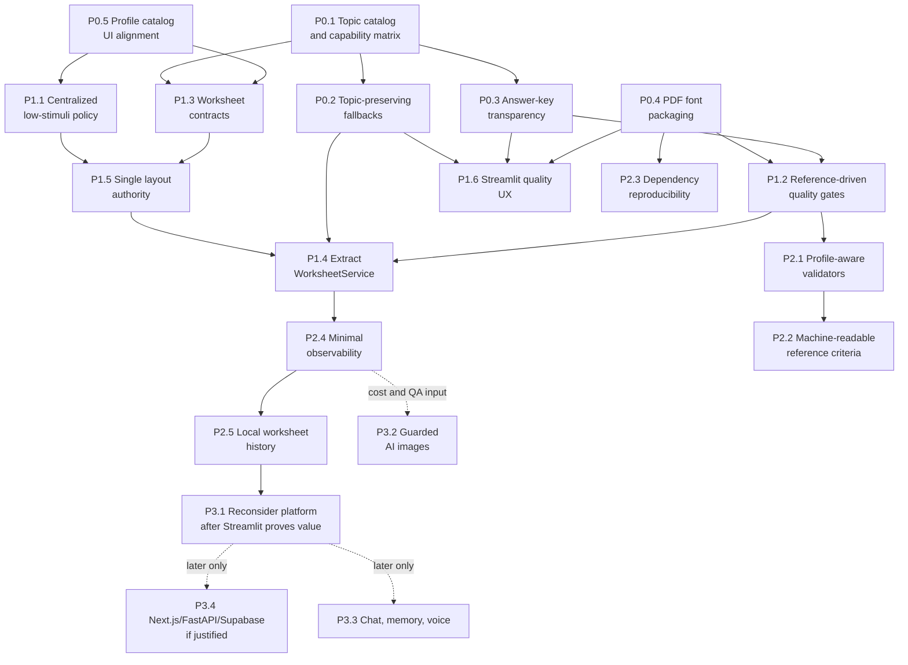

# Friendly Math Prioritized Tasks

## Decision

**Product direction changed:** v2 stays on **Streamlit**. The goal is to ship the best possible worksheet-generation prototype/MVP before any FastAPI, Next.js, Supabase, chat, or voice work.

This backlog now optimizes for:

1. Teacher trust in generated worksheets.
2. PPP-aware quality of the core worksheet flow.
3. Clear Streamlit UX around degraded generation, partial answers, skipped visuals, and PDF readiness.
4. Offline regression tests and reference worksheets.
5. A cleaner internal service boundary only where it improves Streamlit v2 and testing.

FastAPI/Next.js/Supabase are no longer v2 scope. They become a later platform decision after the Streamlit MVP proves worksheet quality and usage.

## Priority Model

- **P0:** Immediate teacher-trust and worksheet-correctness issues.
- **P1:** High-impact quality, UX, and maintainability work for Streamlit v2.
- **P2:** Important robustness work after the core MVP is reliable.
- **P3:** Future platform/product bets to explicitly defer.

## P0: Immediate Teacher-Trust Issues

### P0.1 Introduce Stable Topic Catalog And Capability Matrix

**Why it matters:** Topic drift is the largest cross-domain product risk. Raw UI labels currently drive blueprints, images, answers, references, and PDF metadata. This can produce off-topic worksheets, wrong visuals, unsupported answers, and confusing Streamlit behavior.

**Estimated effort:** M

**Dependencies:** None.

**Acceptance criteria:**

- A central topic catalog defines stable `topic_id`, Polish display label, aliases, supported grades, blueprint mapping, answer support, visual support, validator depth, and fallback-template availability.
- Streamlit topic options are populated from the catalog or validated against it.
- Existing labels such as `dodawanie do 20`, `dodawanie do 100`, `ułamki`, and `równania z okienkiem` resolve to stable ids.
- Images, answers, references, and PDF metadata can consume `topic_id` without guessing from display labels.
- Unsupported or downgraded topic/grade combinations produce visible Streamlit warnings.

**Domains touched:** Curriculum topic blueprints, worksheet orchestration, visual assets, answer keys, PDF composition, reference quality evaluation.

### P0.2 Make Degraded Task Generation Honest And Topic-Preserving

**Why it matters:** A teacher can currently request fractions, measurements, time, money, or a PPP-adapted worksheet and receive generic arithmetic fallback tasks that still become a polished PDF. This directly breaks teacher trust.

**Estimated effort:** M

**Dependencies:** P0.1.

**Acceptance criteria:**

- Generic fallback addition/subtraction tasks are replaced with deterministic fallback templates keyed by `topic_id`, grade, and profile where available.
- If the system cannot preserve the requested topic, generation stops or returns a prominent blocking warning instead of silently producing an unrelated worksheet.
- Fallback use, padded tasks, dropped tasks, and blueprint downgrade/missing status are captured as structured warnings.
- Streamlit clearly shows degraded content before PDF preview/download.
- Tests cover at least one successful topic-preserving fallback and one blocked unsupported fallback.

**Domains touched:** AI generation, curriculum topic blueprints, student profiles PPP, worksheet orchestration, reference quality evaluation.

### P0.3 Make Answer-Key Coverage Transparent

**Why it matters:** Answer pages are teacher-facing trust assets. Returning `"—"` without explanation can make a partial or unsupported answer key look complete.

**Estimated effort:** S

**Dependencies:** P0.1.

**Acceptance criteria:**

- Answer computation returns structured status per task: supported, unsupported, ambiguous, or error.
- The worksheet result includes an answer support summary such as `3/5 answers generated; 2 require manual review`.
- Streamlit and the PDF answer page explain unsupported answers instead of only printing `"—"`.
- Topic-level answer support comes from the topic capability matrix.
- Reference worksheet answer tests cover supported outputs and intentional unsupported gaps.

**Domains touched:** Answer keys, worksheet orchestration, PDF composition, curriculum topic blueprints, reference quality evaluation.

### P0.4 Fix Polish PDF Font Packaging

**Why it matters:** The final business artifact is a printable Polish worksheet. If Polish glyphs break on a clean install or Streamlit deployment, the product fails even if generation logic works.

**Estimated effort:** S

**Dependencies:** None.

**Acceptance criteria:**

- A Polish-capable font is packaged or installed through a documented, repeatable dependency path.
- PDF generation returns a structured warning when the expected font is unavailable.
- A clean-environment smoke test renders Polish text with diacritics.
- The PDF warning is surfaced to Streamlit or test output, not only stdout.

**Domains touched:** PDF composition, worksheet orchestration, reference quality evaluation.

### P0.5 Align Profile Catalog With Teacher-Facing UI

**Why it matters:** PPP profiles are the product differentiator. The registry includes dyslexia, while the UI omits it and still references it in help text. That weakens teacher confidence.

**Estimated effort:** S

**Dependencies:** None.

**Acceptance criteria:**

- The Streamlit profile selector is driven by the profile registry or by an explicit availability flag in a central profile catalog.
- `dysleksja` is either exposed consistently or marked hidden/experimental with help text updated accordingly.
- UI copy explains each profile in teacher-facing terms without diagnostic overclaiming.
- PDF metadata uses profile display names where appropriate while preserving stable ids internally.
- Tests assert registry completeness and UI/profile catalog consistency.

**Domains touched:** Student profiles PPP, worksheet orchestration, PDF composition.

## P1: Streamlit V2 Quality And UX

### P1.1 Centralize Low-Stimuli And Visual Policy

**Why it matters:** Low-stimuli behavior affects layout, PDF rendering, and image strategy. Duplicated string lists mean support profiles can behave differently across the product.

**Estimated effort:** M

**Dependencies:** P0.5.

**Acceptance criteria:**

- Profile metadata is the single source for `is_low_stimuli`, layout policy, and illustration mode.
- Streamlit image branching, layout generation, PDF rendering, and AI image prompts no longer maintain separate low-stimuli profile lists.
- Per-task image vs header image behavior is determined by profile policy.
- Tests cover low-stimuli behavior for dyscalculia, ADHD, and general learning difficulties.

**Domains touched:** Student profiles PPP, visual assets, AI generation, PDF composition, worksheet orchestration.

### P1.2 Add Reference-Driven Deterministic Tests

**Why it matters:** The repo already has reference worksheets, but they do not protect product quality. Turning them into tests creates a practical quality gate before more features are added.

**Estimated effort:** M

**Dependencies:** P0.1, P0.3, P0.4.

**Acceptance criteria:**

- Tests load every JSON file in `data/reference_worksheets`.
- Schema/integrity checks verify metadata, non-empty tasks, answer alignment, and quality criteria.
- Answer-key tests compare reference tasks to expected answers, with explicit accepted gaps.
- PDF smoke tests render each reference worksheet and verify non-empty bytes, expected metadata text, answer-page behavior, and Polish font availability.
- Visual tests assert safe render vs intentional skip for representative tasks.
- These tests run offline without calling OpenAI.

**Domains touched:** Reference quality evaluation, answer keys, PDF composition, visual assets, curriculum topic blueprints, student profiles PPP.

### P1.3 Define Worksheet Request And Result Contracts

**Why it matters:** The current workflow passes raw strings, dictionaries, `_warning`, `_error`, bytes, and local paths through the app. Streamlit v2 needs explicit contracts so the UI can show exactly what happened.

**Estimated effort:** M

**Dependencies:** P0.1, P0.3, P0.5.

**Acceptance criteria:**

- `WorksheetRequest` captures grade, `topic_id`, `profile_id`, task count, illustration option, workspace option, answers option, and optional context.
- `WorksheetResult` captures tasks, resolved topic/profile, layout, answers with support metadata, images with skip reasons, PDF bytes, warnings, errors, fallback indicators, and artifact metadata.
- Existing Streamlit behavior can be represented through these contracts without changing the teacher workflow.
- Warnings are structured enough for Streamlit display, tests, and logs.

**Domains touched:** Worksheet orchestration, AI generation, answer keys, visual assets, PDF composition.

### P1.4 Extract A Streamlit-Friendly WorksheetService

**Why it matters:** Streamlit should remain the product shell in v2, but it should not own all orchestration. A service improves testability and lets the UI focus on teacher workflow.

**Estimated effort:** L

**Dependencies:** P1.3, P1.1.

**Acceptance criteria:**

- A callable service such as `generate_worksheet(request: WorksheetRequest) -> WorksheetResult` owns orchestration outside Streamlit.
- Streamlit becomes a thin adapter for forms, warnings, preview, and download.
- The service resolves topics/profiles, calls task/layout/image/answer/PDF components, and returns structured diagnostics.
- Service tests can run without launching Streamlit.
- No FastAPI, auth, database, or storage logic is introduced in this step.

**Domains touched:** Worksheet orchestration, AI generation, visual assets, answer keys, PDF composition, student profiles PPP.

### P1.5 Choose One Final Layout Authority

**Why it matters:** Layout is currently resolved in `layout_generator.py` and then partly overridden in `pdf/generator.py`. Accessibility and print behavior are hard to explain or test when final layout decisions are split.

**Estimated effort:** M

**Dependencies:** P1.1, P1.3.

**Acceptance criteria:**

- A typed or documented `ResolvedWorksheetLayout` defines final font sizes, margins, spacing, workspace lines, colors, and image placement.
- One service resolves final layout from grade, profile, task count, and options.
- PDF rendering consumes the resolved layout and does not silently re-decide profile policy.
- Tests cover low-stimuli layout, grade 1-3 minimum readability, and standard/gifted layout differences.

**Domains touched:** AI generation, student profiles PPP, PDF composition, worksheet orchestration.

### P1.6 Improve Streamlit MVP UX Around Generation Quality

**Why it matters:** Teachers need to understand whether a generated PDF is fully reliable, partially degraded, or needs manual review before they download it.

**Estimated effort:** M

**Dependencies:** P0.2, P0.3, P1.3.

**Acceptance criteria:**

- Streamlit shows a generation quality panel with topic resolution, fallback status, answer coverage, image coverage, and PDF/font status.
- Warnings are grouped by severity and written in teacher-friendly Polish.
- The PDF download button is disabled or clearly marked when a blocking issue exists.
- The preview remains simple and does not introduce a new frontend stack.

**Domains touched:** Worksheet orchestration, Streamlit UX, answer keys, visual assets, PDF composition.

## P2: Robustness After Core Quality

### P2.1 Add Profile-Aware Validators

**Why it matters:** Profile promises are pedagogically sensitive. Validators help ensure ADHD tasks stay short, dyscalculia numbers stay manageable, dyslexia reduces reading load without lowering math level, and gifted tasks stay on topic.

**Estimated effort:** M

**Dependencies:** P0.5, P1.2, P1.3.

**Acceptance criteria:**

- Validators check measurable properties such as task length, operation count, numeric range, repeated format, and word-problem load.
- Validators produce warnings or regeneration signals; they do not silently rewrite tasks in surprising ways.
- Reference worksheets seed profile-specific thresholds.
- At least ADHD, dyscalculia, dyslexia, and gifted profiles have initial automated checks.

**Domains touched:** Student profiles PPP, AI generation, reference quality evaluation, curriculum topic blueprints.

### P2.2 Expand Machine-Readable Reference Criteria

**Why it matters:** Human quality criteria are useful, but executable criteria make quality repeatable and reviewable.

**Estimated effort:** M

**Dependencies:** P1.2, P2.1.

**Acceptance criteria:**

- Reference JSON supports optional machine-readable criteria such as max operand, max result, allowed operations, forbidden phrases, max task length, and required format consistency.
- Existing natural-language criteria remain intact for teacher review.
- Validators consume the structured criteria.
- At least the current reference worksheets include initial structured criteria.

**Domains touched:** Reference quality evaluation, curriculum topic blueprints, student profiles PPP, answer keys.

### P2.3 Clean Dependency And Packaging Reproducibility

**Why it matters:** Unpinned or duplicate dependencies can change OpenAI SDK behavior, PDF output, or preview behavior unexpectedly across machines and Streamlit deployments.

**Estimated effort:** S

**Dependencies:** P0.4.

**Acceptance criteria:**

- Dependency definitions are consistent, with duplicate/conflicting entries removed.
- A lockfile or documented install policy exists.
- Clean setup instructions include font assets and optional preview dependencies.
- CI or local smoke command verifies imports and PDF generation.

**Domains touched:** PDF composition, AI generation, reference quality evaluation, Streamlit deployment.

### P2.4 Add Minimal Observability Events

**Why it matters:** Even in Streamlit, the team must know how often worksheets degrade, which topics fail, and what OpenAI/PDF paths cost. Without structured events, bad worksheets become anecdotes.

**Estimated effort:** M

**Dependencies:** P1.3.

**Acceptance criteria:**

- Generation emits structured events for request start, topic resolution, profile resolution, model call, fallback/padding, answer coverage, image coverage, PDF build, and download result.
- Events avoid logging full prompts, full student data, or sensitive notes by default.
- Each worksheet generation has a request id that ties warnings, AI calls, PDF generation, and future storage together.
- Events can be printed/logged locally and inspected during Streamlit sessions.

**Domains touched:** Worksheet orchestration, AI generation, answer keys, visual assets, PDF composition.

### P2.5 Add Local Worksheet History Without Accounts

**Why it matters:** A lightweight history improves teacher workflow and prototype demos without committing to auth, databases, or multi-user architecture.

**Estimated effort:** M

**Dependencies:** P1.3, P1.4, P2.4.

**Acceptance criteria:**

- Streamlit can list recent generated worksheets from a local `data/out` or `data/history` structure.
- Each generation gets a unique id and does not overwrite the only PDF artifact.
- Stored metadata includes topic, profile, grade, warnings, answer coverage, image coverage, and timestamp.
- The feature avoids real student personal data by default; teacher can use pseudonyms or no names.
- This remains local/prototype storage, not a multi-user privacy solution.

**Domains touched:** Worksheet orchestration, PDF composition, Streamlit UX, reference quality evaluation.

## P3: Future / Explicitly Deferred

### P3.1 Reconsider Multi-User Platform Only After Streamlit V2 Proves Value

**Why it matters:** FastAPI/Next.js/Supabase may still be the right product architecture later, but doing it now would split focus away from worksheet quality.

**Estimated effort:** L

**Dependencies:** Stable usage of Streamlit v2, quality gates, real teacher feedback.

**Acceptance criteria:**

- Decision is revisited only after Streamlit v2 demonstrates reliable worksheet quality and repeated teacher use.
- Requirements are based on observed needs: accounts, history, sharing, collaboration, payments, or school deployment.
- If platform migration resumes, it wraps the tested `WorksheetService`, not `app/ui/app.py`.

**Domains touched:** Platform evolution, worksheet orchestration, product strategy.

### P3.2 Evaluate AI Images Behind Strict Guardrails

**Why it matters:** AI images may improve engagement, but they carry cost, latency, hallucination, and visual correctness risk. Deterministic icons should remain the default until this is proven.

**Estimated effort:** M

**Dependencies:** P1.2, P2.4.

**Acceptance criteria:**

- AI image generation remains opt-in and outside default worksheet generation.
- Cost, latency, prompt, model, and output path are recorded for every AI image preview.
- Visual QA criteria exist for classroom suitability and math correctness.
- Caching and budget limits are defined before any teacher-facing rollout.

**Domains touched:** Visual assets, AI generation, reference quality evaluation.

### P3.3 Defer Chat, Memory, And Voice

**Why it matters:** Chat, memory, and voice introduce privacy, retention, cost, safety, and UX complexity. They are future product bets, not prerequisites for a strong worksheet MVP.

**Estimated effort:** L

**Dependencies:** Revalidated product strategy after Streamlit v2.

**Acceptance criteria:**

- Chat is not started until worksheet generation quality is reliable.
- Memory is not started until there is an explicit student-data privacy model.
- Voice is not started until chat has value and consent/cost constraints are understood.

**Domains touched:** Platform evolution, student profiles PPP, AI generation.

### P3.4 Build Next.js/FastAPI/Supabase Platform Later If Needed

**Why it matters:** A modern platform may improve scale and multi-user workflow, but it is no longer the v2 goal.

**Estimated effort:** L

**Dependencies:** P3.1 decision gate.

**Acceptance criteria:**

- Any future platform plan starts from proven Streamlit v2 contracts, test suite, and `WorksheetService`.
- Accounts, storage, and RLS are justified by real user workflows, not assumed upfront.
- Streamlit remains the reference implementation during any platform migration.

**Domains touched:** Platform evolution, product strategy, deployment.

## Phased Roadmap

### Phase 0: Streamlit V2 Stabilization

**Goal:** Keep the current Streamlit workflow, but remove the highest teacher-trust risks.

**Execute in order:**

1. P0.1 Topic catalog and capability matrix.
2. P0.5 Profile catalog/UI alignment.
3. P0.4 PDF font packaging.
4. P0.3 Answer-key transparency.
5. P0.2 Topic-preserving degraded generation.
6. P1.6 Streamlit generation quality UX.

**Exit criteria:** The worksheet still generates through Streamlit, topic/profile choices are stable, degraded behavior is visible, Polish PDFs render reliably, and answer/image limitations are clear.

### Phase 1: Quality Gates

**Goal:** Make the product artifact testable before adding more product surface area.

**Execute in order:**

1. P1.2 Reference-driven deterministic tests.
2. P2.1 Profile-aware validators.
3. P2.2 Machine-readable reference criteria.
4. P2.3 Dependency and packaging reproducibility.

**Exit criteria:** Offline tests cover references, answer behavior, PDF smoke output, font availability, visual skip/render behavior, and profile-specific measurable constraints.

### Phase 2: Internal Service Boundary For Streamlit

**Goal:** Create a reusable worksheet core without starting a platform rewrite.

**Execute in order:**

1. P1.3 Worksheet request/result contracts.
2. P1.1 Centralized low-stimuli and visual policy.
3. P1.5 Single layout authority.
4. P1.4 Streamlit-friendly `WorksheetService`.
5. P2.4 Minimal observability events.

**Exit criteria:** Streamlit calls a service instead of owning orchestration, tests call the same service directly, and all warnings/fallbacks are structured.

### Phase 3: Streamlit MVP Product Polish

**Goal:** Improve the prototype as a demoable, teacher-usable MVP without adopting a new stack.

**Execute in order:**

1. P2.5 Local worksheet history without accounts.
2. Streamlit UI polish around saved history, preview, and warnings.
3. Real teacher review loop using generated PDFs and reference criteria.
4. Decision checkpoint: continue Streamlit, package/deploy Streamlit, or revisit platform migration.

**Exit criteria:** A teacher can reliably generate, review, download, and revisit worksheets in Streamlit, with clear limitations and no silent quality failures.

## Roadmap And Dependency Graph

## What Not To Do Yet

- **Do not build FastAPI/Next.js/Supabase in v2.** The v2 product is Streamlit-first until the worksheet MVP proves quality and usage.
- **Do not build chat now.** Chat depends on stable profile/topic contracts, privacy rules, and worksheet quality.
- **Do not build voice now.** Voice adds consent, child audio handling, retention, latency, and cost complexity.
- **Do not productize AI images by default.** Keep deterministic icons as the default visual system until AI image cost, safety, and QA are proven.
- **Do not introduce persistent student personal data yet.** Use no names or pseudonyms in Streamlit v2 until privacy/storage decisions are explicit.
- **Do not perform broad refactors for style alone.** Prioritize teacher-visible correctness, quality gates, and Streamlit MVP usability.
- **Do not preserve broken branch behavior for compatibility.** If a current unshipped fallback or string contract is wrong, replace it with the stable contract instead of layering shims around it.

## Execution Notes

- Keep every task independently reviewable and testable.
- Prefer deterministic, offline checks before live AI evaluation.
- Preserve the current teacher workflow while stabilizing the domain underneath it.
- Treat references, topic capabilities, profile policies, answer support, visual support, and PDF warnings as product contracts, not internal implementation details.
- Streamlit v2 is successful when the system can clearly say what was requested, what was generated, what degraded, and why the teacher should trust the result.
