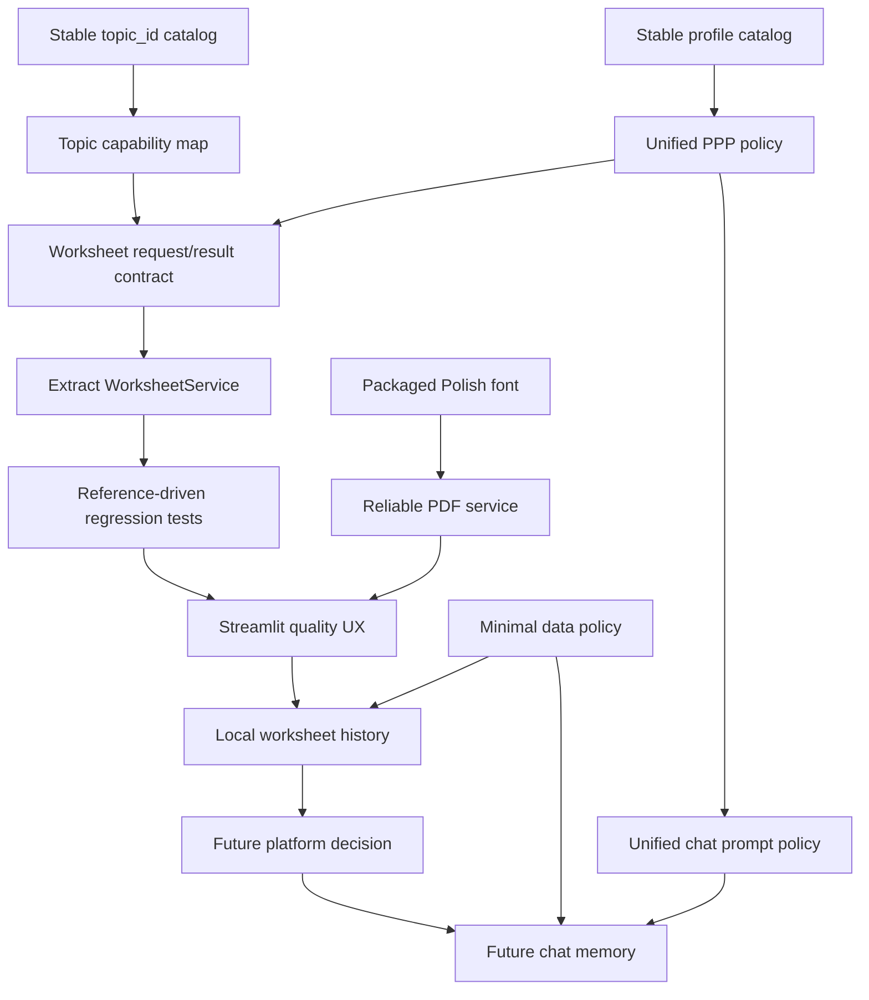
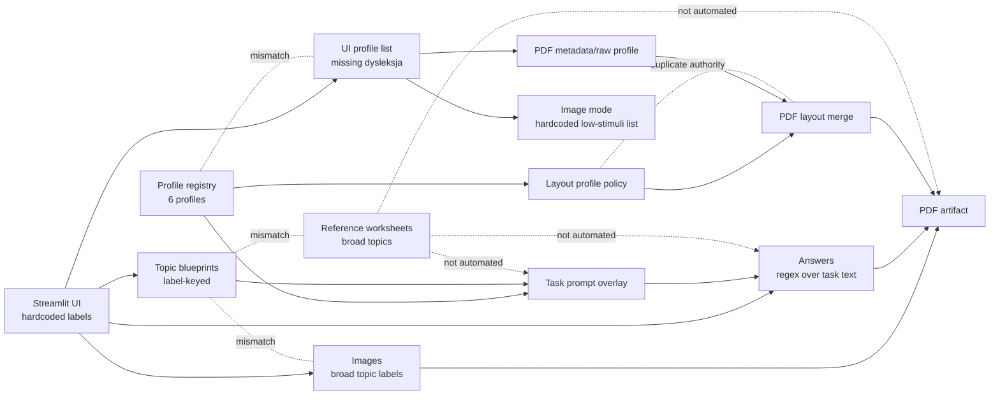
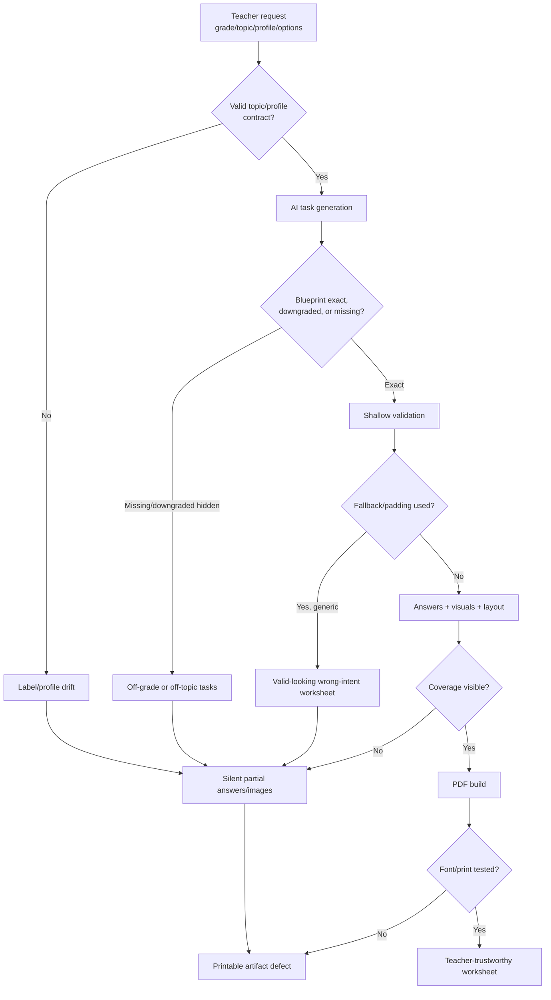

# Friendly Math System Analysis

## Executive Summary

Friendly Math v1 has the right product center: a short teacher workflow that turns grade, topic, PPP-inspired profile, worksheet options, AI task generation, deterministic visuals, answer keys, and PDF composition into a printable classroom artifact. The strongest foundations are the curriculum blueprint module, the PPP profile registry, deterministic PDF generation, deterministic icons, and the emerging reference worksheet corpus.

The system is not yet ready for a broader platform migration, and the v2 decision is now to stay on Streamlit. The biggest problem is not one broken module; it is contract drift across domains. Topics are UI labels, profile ids are display strings, layout authority is split, answer support is inferred from task text, visuals use a different topic vocabulary, and quality assets are not enforced by tests. These inconsistencies can produce worksheets that look successful while being off-topic, too hard, partially unsupported, visually misleading, or missing trustworthy answers.

The highest-risk business outcome is loss of teacher trust. A teacher can request a PPP-adapted worksheet with illustrations and answers, receive a polished PDF, and still get generic fallback arithmetic, hidden unsupported answers, skipped or wrong-topic visuals, downgraded curriculum content, or broken Polish glyphs. In a single-user Streamlit MVP these are reviewable quirks. In v2, with accounts, student history, storage, and possibly chat memory, they become persisted product defects and privacy/operational liabilities.

The pragmatic path is Streamlit v2 stabilization: establish stable topic/profile contracts, extract a worksheet service only where it improves testability, make degraded behavior visible in Streamlit, wire reference worksheets into deterministic tests, fix PDF font packaging, and defer multi-user platform complexity.

## Business Impact Analysis

### Teacher Trust

Teacher trust depends on whether the generated PDF can be handed to a student with minimal rechecking. Current risks directly weaken that trust:

- Answer keys can contain `"—"` without a clear UI/PDF explanation, even when the checkbox promises an answer page. Evidence: `docs/domains/answer-keys.md`, `app/generators/answers.py`, `app/ui/app.py`.
- Generic task fallback can replace the requested topic with three simple arithmetic tasks after an API failure. Evidence: `docs/domains/ai-generation.md`, `app/ai/text_generator.py`.
- Unsupported or unsafe images are silently omitted, while unknown header topics can fall back to addition-style visuals. Evidence: `docs/domains/visual-assets.md`, `app/generators/images.py`.
- Polish PDF rendering depends on `assets/fonts/DejaVuSans.ttf`, but the docs indicate the asset is not committed. Evidence: `docs/domains/pdf-composition.md`, `app/pdf/generator.py`.

If teachers repeatedly see incomplete answer pages, strange visuals, or inconsistent difficulty, the product becomes a novelty generator rather than a dependable preparation tool.

### PPP Differentiation

PPP differentiation is the main product differentiator, but profile semantics are not consistently enforced:

- The registry includes six profiles, including `dysleksja`, while the UI exposes five and help text mentions dyslexia as if it were selectable. Evidence: `docs/domains/student-profiles-ppp.md`, `app/generators/profiles/registry.py`, `app/ui/app.py`.
- Low-stimuli behavior is duplicated in profile classes, `app/ui/app.py`, `app/pdf/generator.py`, and image code. Evidence: `docs/domains/student-profiles-ppp.md`, `app/ai/layout_generator.py`, `app/pdf/generator.py`, `app/ui/app.py`.
- Profile instructions influence prompts, but there are no validators that prove ADHD tasks are short, dyscalculia numbers are small, dyslexia preserves grade-level math while reducing reading load, or gifted tasks remain grade/topic appropriate. Evidence: `docs/domains/reference-quality-evaluation.md`, `docs/domains/student-profiles-ppp.md`.

The business issue is not just hidden dyslexia. It is that profile promises are marketing-sensitive and student-sensitive. If a PPP preset behaves inconsistently, the product risks overclaiming pedagogical adaptation.

### Worksheet Quality

Worksheet quality has useful ingredients but no closed quality loop:

- Blueprints provide prompt-time constraints, but validation catches mostly simple arithmetic range issues. Evidence: `docs/domains/curriculum-topic-blueprints.md`, `app/ai/text_generator.py`.
- Reference worksheets exist, but they are not consumed by tests. Evidence: `docs/domains/reference-quality-evaluation.md`, `data/reference_worksheets/`.
- Preview scripts generate artifacts, but they do not assert PDF text, font support, answer correctness, image skip behavior, or visual regressions. Evidence: `docs/domains/reference-quality-evaluation.md`.
- The PDF layer is deterministic, which makes it testable, but current tests are not described as automated gates. Evidence: `docs/domains/pdf-composition.md`.

The product can therefore produce a visually polished PDF while violating grade, topic, answer, profile, or print-quality expectations.

### Streamlit V2 Readiness

The v2 direction is now coherent in a different way: keep Streamlit, make the worksheet MVP excellent, and postpone FastAPI/Next.js/Supabase, chat memory, and voice. The sequencing risk is starting platform work before the core worksheet contract is trustworthy.

Current v1 behaviors that block a strong Streamlit v2:

- `app/ui/app.py` is the application service, UI, validation layer, artifact writer, preview layer, and error presenter.
- `data/out/worksheet.pdf` is overwritten on each generation and has no generation id or local history.
- Topics and profiles are raw strings that create inconsistent UI, image, answer, and PDF behavior.
- The future chat/profile path is separate from worksheet profile prompt behavior, but chat is explicitly deferred.
- There is no privacy/storage model for real student data, so Streamlit v2 should avoid personal data and use pseudonyms/no names.

## Cross-Domain Inconsistency Matrix

| Area | Current Sources | Inconsistency | Business/Product Risk | Primary Fix |
| --- | --- | --- | --- | --- |
| Topic ids | `app/ui/app.py`, `app/ai/topic_blueprints.py`, `app/generators/images.py`, `app/generators/answers.py`, reference JSON | UI uses labels such as `dodawanie do 20`; images mostly understand broad labels such as `dodawanie`; references use broad legacy labels. | Wrong visuals, missing visuals, brittle tests, persisted v2 labels that later require migration. | Introduce stable `topic_id`, display labels, aliases, grade availability, and capability metadata. |
| Grade-topic availability | `available_topics()` exists in `topic_blueprints.py`; UI hardcodes all topics for all grades | Teacher can choose unsupported or downgraded combinations. | Off-grade worksheets that look successful. | Make UI/API registry-driven and surface exact/downgraded/missing blueprint status. |
| Profiles | `registry.py`, `app/ui/app.py`, docs/help text | `dysleksja` is registered but not selectable; UI profiles are hardcoded. | PPP differentiation appears incomplete and confusing. | Use `all_profiles()` or an exported profile catalog for UI/API. |
| Low-stimuli policy | profile classes, layout generator, UI image branch, PDF `_LOW_STIMULI`, AI image path | Same policy copied as string sets and flags. | New/changed profiles will receive inconsistent layout/images/PDF treatment. | Centralize profile policy: low-stimuli, visual mode, layout, display metadata. |
| Layout authority | `layout_generator.py`, `pdf/generator.py` | Layout generator resolves profile layout, then PDF applies its own defaults and low-stimuli overrides. | Final PDF can differ from generated/resolved layout; hard to test and explain. | Choose one final layout authority and type the layout schema. |
| Answer keys | `topic_blueprints.py`, `answers.py`, UI checkbox/help, PDF page | Topic capability is not shared with answer parser; unsupported items flatten to `"—"`. | Teacher may trust an incomplete or misleading answer key. | Return structured `AnswerResult` and topic-level answer capability. |
| Visual support | UI label, `_TOPICS_WITHOUT_IMAGES`, `_SAFE_LIMITS`, icon themes | Equation skip covers `równania`, not `równania z okienkiem`; scoped arithmetic labels do not map to broad safe limits. | Misleading header fallback or missing task visuals. | Topic capability registry for header/per-task visuals and skip reasons. |
| Docs vs code | Domain docs, README references, UI behavior | Docs describe intended contracts not yet enforced by code/tests. | False confidence in migration readiness. | Treat docs as target architecture and add executable contract tests. |
| Output persistence | `app/ui/app.py`, `pdf/generator.py`, v2 docs | Local overwrite path conflicts with v2 history/storage model. | No worksheet history, no isolation, concurrency risk. | Generation ids and user/student-scoped storage. |

## Serious Issues Ranked By Severity

### Critical

#### C1. No Stable Worksheet Contract Before V2

Evidence: `docs/architecture-and-domain.md`, `docs/domains/platform-evolution-v2.md`, `docs/domains/worksheet-orchestration.md`, `app/ui/app.py`.

`app/ui/app.py` passes raw strings and dictionaries through the entire workflow, owns orchestration, writes the PDF, shows warnings, and acts as the only application boundary. The v2 docs correctly warn that this should not be wrapped directly in API endpoints.

Impact: Leaving this unfixed would keep today's string drift and degradation behavior inside Streamlit v2. It would also block any future API, storage, tests, or chat integration if the platform direction is revisited later.

Root cause: The MVP optimized for a single Streamlit workflow and never introduced `WorksheetRequest`, `WorksheetResult`, `TopicResolution`, `AnswerResult`, `VisualResult`, or `PdfResult` contracts.

#### C2. Topic Identity Is A Display Label, Not A Domain Id

Evidence: `docs/domains/curriculum-topic-blueprints.md`, `docs/domains/visual-assets.md`, `docs/domains/answer-keys.md`, `app/ui/app.py`, `app/ai/topic_blueprints.py`, `app/generators/images.py`.

The UI hardcodes topic labels. `TOPIC_BLUEPRINTS` expects matching lowercase labels. Visuals use broad labels in `_SAFE_LIMITS`. The equation visual skip checks `równania`, while class 1-3 blueprints use `równania z okienkiem`. References use broad labels such as `dodawanie`.

Impact: Teachers can get missing visual supports, wrong fallback visuals, mismatched answer support, brittle references, and confusing grade-topic behavior. In v2, this becomes a database/API migration trap.

Root cause: UI labels were reused as stable identifiers because it was convenient in v1. Capability metadata never became part of the topic model.

#### C3. Degraded Generation Can Produce A Valid-Looking But Wrong-Intent Worksheet

Evidence: `docs/domains/ai-generation.md`, `docs/domains/worksheet-orchestration.md`, `app/ai/text_generator.py`, `app/ui/app.py`.

On task generation failure, `generate_tasks()` returns three generic addition/subtraction tasks regardless of requested topic, grade, task count, or profile. If generated tasks are filtered out, the generator pads with simple addition placeholders.

Impact: A request for fractions, time, money, measurements, or a PPP-specific worksheet can degrade into generic arithmetic while still flowing into PDF generation. This is a serious teacher trust risk.

Root cause: Fallbacks are operational rather than domain-aware. The system values "produce a PDF" over "preserve teacher intent or stop with a clear warning."

#### C4. No Automated Quality Gate For The Product Artifact

Evidence: `docs/domains/reference-quality-evaluation.md`, `docs/domains/pdf-composition.md`, `docs/domains/answer-keys.md`, reference files in `data/reference_worksheets/`.

The repo contains reference worksheets and preview assets, but docs state they are not wired into automated tests. There are no gates for reference schema, answer correctness, PDF smoke output, glyph support, image skip behavior, or profile-specific quality.

Impact: v2 can ship a better UI with worse worksheets. Product quality depends on manual review and model behavior.

Root cause: Reference artifacts were created as documentation and previews, not as acceptance tests. Deterministic components are testable but not yet covered.

#### C5. Multi-User Data And Privacy Model Is Not Yet Present

Evidence: `docs/domains/platform-evolution-v2.md`, `docs/domains/pdf-composition.md`, `docs/domains/worksheet-orchestration.md`, `app/ui/app.py`.

v1 has no users, ownership, student records, artifact isolation, retention, deletion, or audit model. It overwrites `data/out/worksheet.pdf` and downloads in-memory bytes.

Impact: Phase 1 v2 cannot safely store student profiles or worksheet history until ownership, RLS, storage keys, and deletion semantics are designed.

Root cause: v1 intentionally avoided persistence. The platform plan adds persistence before the current artifact and privacy boundaries exist.

### High

#### H1. PPP Profile Catalog Drift

Evidence: `docs/domains/student-profiles-ppp.md`, `app/generators/profiles/registry.py`, `app/ui/app.py`.

The registry contains `standardowy`, `dyskalkulia`, `ADHD`, `dysleksja`, `trudności w nauce`, and `zdolny`. The UI omits `dysleksja`, while illustration help text mentions it.

Impact: The product's core differentiation appears inconsistent and can mislead teachers looking for dyslexia support.

Root cause: The registry is not the source of truth for UI catalog and teacher-facing copy.

#### H2. Low-Stimuli Policy Is Duplicated Across Layers

Evidence: `docs/domains/student-profiles-ppp.md`, `app/ai/layout_generator.py`, `app/ui/app.py`, `app/pdf/generator.py`, `app/generators/images.py`.

Low-stimuli behavior is encoded as `StudentProfile.is_low_stimuli`, UI string lists, PDF `_LOW_STIMULI`, and similar image checks.

Impact: Adding or changing a support profile can silently alter only some of layout, image, and PDF behavior.

Root cause: Profile metadata exists but is not consumed consistently at each boundary.

#### H3. Answer Key UX Overpromises Coverage

Evidence: `docs/domains/answer-keys.md`, `docs/domains/pdf-composition.md`, `app/generators/answers.py`, `app/ui/app.py`, `app/pdf/generator.py`.

The answer parser supports useful deterministic forms but returns `"—"` for unsupported cases and can accidentally parse numeric fragments from unit/story problems. The PDF renders the dash without a legend or coverage summary.

Impact: Teachers may assume the answer page is complete and correct when it is partial or unitless.

Root cause: The answer service returns strings instead of structured status, and it does not receive topic/grade/form context.

#### H4. PDF Polish Font Packaging Risk

Evidence: `docs/domains/pdf-composition.md`, `app/pdf/generator.py`.

The PDF layer expects `assets/fonts/DejaVuSans.ttf`. If missing, it falls back to Helvetica and prints a warning to stdout.

Impact: Polish characters may break in the final classroom artifact, which is a direct product-quality failure.

Root cause: Font availability is treated as a best-effort runtime detail instead of a packaged dependency or startup check.

#### H5. Layout Authority Is Split And Untyped

Evidence: `docs/domains/pdf-composition.md`, `docs/domains/ai-generation.md`, `app/ai/layout_generator.py`, `app/pdf/generator.py`.

`layout_generator.py` has defaults and profile overrides; `pdf/generator.py` has separate defaults and applies another low-stimuli override after incoming layout.

Impact: Accessibility and print behavior are difficult to reason about, test, or expose through a v2 API.

Root cause: PDF rendering grew local safety overrides because there was no typed final layout contract.

#### H6. Grade 4-8 Product Surface Is Under-Specified

Evidence: `docs/domains/curriculum-topic-blueprints.md`, `app/ui/app.py`, `app/ai/topic_blueprints.py`.

The UI offers grades 1-8 and all topics, while the strongest curriculum blueprint coverage is classes 1-3. Older grades mostly use broad legacy topics and downgrade behavior.

Impact: Teachers can expect grade-aware worksheets for classes 4-8 that the domain model does not fully support.

Root cause: The UI product surface expanded beyond the depth of the blueprint catalog.

### Medium

#### M1. Observability Is Too Thin For Production

Evidence: `docs/domains/ai-generation.md`, `docs/domains/worksheet-orchestration.md`.

The system lacks structured events for blueprint resolution, fallback use, unsupported answers, skipped images, model/token usage, and PDF warnings.

Impact: The team cannot tell which topics fail, which profiles cost more, or how often teachers receive degraded output.

Root cause: The MVP only needed immediate Streamlit messages, not product telemetry.

#### M2. Dependency Reproducibility Is Weak

Evidence: `docs/domains/ai-generation.md`, `requirements.txt`.

`openai` is unpinned and `reportlab` appears both unpinned and pinned.

Impact: Fresh installs can change model SDK behavior or PDF rendering unexpectedly.

Root cause: Development dependencies were added incrementally without a lockfile or packaging policy.

#### M3. PDF Rendering Has Print Accessibility Blind Spots

Evidence: `docs/domains/pdf-composition.md`, `app/pdf/generator.py`.

The PDF uses character-count wrapping, limited page block premeasurement, untagged PDFs, muted workspace lines, and silent image draw failures.

Impact: Worksheets may print poorly in edge cases or be less accessible than intended.

Root cause: The renderer is pragmatic and deterministic, but not yet backed by print/accessibility regression checks.

#### M4. AI Image Experiment Has Cost/Safety Risk If Productized Too Early

Evidence: `docs/domains/visual-assets.md`, `docs/domains/platform-evolution-v2.md`.

AI images are currently preview-only, which is good. If exposed without cost budgets, persistent caching, and visual QA, per-task image costs and unpredictability could scale quickly.

Impact: Cost surprises and misleading visuals could damage a premium or classroom workflow.

Root cause: Experimental API shape exists before product guardrails.

## Root Causes

The repeated issues trace to a small set of deeper causes:

1. **MVP string contracts became domain contracts.** Topic and profile labels flow through UI, prompts, images, answers, PDF metadata, references, and planned storage without a stable id/capability layer.
2. **The UI became the application service.** Streamlit owns orchestration, validation, warning presentation, local persistence, preview, and product policy. This made the first version fast, but it now hides domain boundaries.
3. **Fallbacks optimize completion, not intent preservation.** The system tries to produce a PDF even when task generation, layout, images, answers, fonts, or preview degrade. That is useful, but degradation is not always visible or faithful to the request.
4. **Quality artifacts are not executable.** Reference worksheets, previews, and docs describe quality, but tests do not yet enforce them.
5. **Capability metadata is missing.** Topics do not declare answer support, visual support, validator depth, grade availability, fallback templates, or warning policy in one place.
6. **Profile semantics are not a single product catalog.** Profile classes exist, but UI, PDF, images, docs, and future chat use separate interpretations.
7. **V2 adds persistence before contracts are settled.** Accounts, students, history, storage, memory, and voice increase the cost of every ambiguous v1 behavior.

## Dependency Map For Streamlit V2

The following issues block or constrain Streamlit v2 sequencing:

| Blocker | Blocks | Why |
| --- | --- | --- |
| Stable topic ids and capability map | Streamlit topic selection, answer warnings, visual service, reference tests, PDF metadata | Raw Polish labels cannot safely drive multiple product behaviors. |
| Stable profile catalog | PPP settings, worksheet generation, layout policy, teacher-facing copy | Streamlit v2 needs stable profile semantics and display metadata. |
| Worksheet service extraction | Tests, Streamlit quality panel, local history, future platform option | Streamlit orchestration cannot be tested cleanly while embedded in UI code. |
| Structured result/warnings | Teacher UX, local logs, QA | v2 must tell teachers what degraded. |
| Reference-driven tests | Prompt changes, PDF changes, profile changes | Without tests, Streamlit v2 can regress worksheet quality. |
| Font/package fix | Streamlit deployment and PDF trust | Deployed PDFs must render Polish correctly. |
| Local artifact model | Local worksheet history and demos | Overwriting one PDF weakens prototype workflow. |
| Privacy/minimal-data policy | Local history and teacher demos | Streamlit v2 should avoid collecting real student data until a full platform exists. |

## Inconsistency Map

## Quality Risk Funnel

## What Is Working Well

The system has several strengths worth preserving:

- The product workflow is clear and valuable: a teacher can generate a worksheet, preview it, and download a PDF in one path.
- Curriculum blueprints are separated from profile classes, which is the right direction for keeping accommodations from replacing curriculum.
- The profile registry is a good consolidation point, even though it is not yet used everywhere.
- Low-stimuli layout skipping the LLM is a strong decision for cost, latency, and accessibility.
- Deterministic icons are a better v1 default than AI images because they are cheap, local, reproducible, and less likely to hallucinate quantities.
- The answer key avoids asking the LLM to solve its own generated tasks, which is the right safety principle.
- PDF composition is deterministic and mostly isolated from OpenAI behavior, making it a good candidate for regression tests and service extraction.
- Reference worksheets are the beginning of a serious quality standard; they just need to become executable fixtures.
- The revised Streamlit v2 plan correctly puts worksheet quality before auth, storage, student profiles, RLS, chat, or voice.

## Recommended Stabilization Themes Before Platform Migration

### 1. Establish Domain Contracts

Create explicit `WorksheetRequest`, `WorksheetResult`, `TopicResolution`, `ProfileCatalogEntry`, `AnswerResult`, `VisualResult`, `ResolvedWorksheetLayout`, and `PdfDocumentResult` shapes. Keep them small and pragmatic. The goal is not architecture ceremony; it is to stop leaking raw labels and ad hoc dictionaries across boundaries.

### 2. Normalize Topics Before Anything Else

Introduce a topic catalog with stable ids, Polish display labels, aliases, grade availability, blueprint mapping, answer capability, visual capability, validation depth, and fallback template availability. Use it from UI, text generation, images, answers, references, tests, PDF metadata, and future APIs.

### 3. Promote Profiles To A Product Catalog

Use the registry as the source of truth for UI/API options. Decide whether `dysleksja` is generally available or experimental, then make UI, help text, docs, layout, image policy, PDF display, and tests agree. Move low-stimuli and visual-mode decisions into profile metadata.

### 4. Extract WorksheetService From Streamlit

Move orchestration out of `app/ui/app.py` into a pure service callable by tests and Streamlit. Streamlit should render forms and messages; the service should resolve topics/profiles, generate tasks, collect warnings, compute answers/visuals, build PDFs, and return structured diagnostics.

### 5. Make Degradation Honest And Topic-Preserving

Replace generic fallback tasks with deterministic templates derived from topic/grade blueprints. If the system cannot preserve the teacher's requested topic, make that a prominent warning or block the worksheet rather than silently producing an unrelated PDF.

### 6. Turn References Into Regression Tests

Start with cheap deterministic tests:

- Validate every reference JSON schema.
- Check answer parser output against reference answers, with explicit expected gaps.
- Render reference PDFs and verify non-empty bytes, metadata, task text where available, answer page behavior, and Polish font availability.
- Test visual eligibility for known supported/skipped tasks.
- Add profile-specific heuristics such as task length, number ranges, and repeated format.

### 7. Fix PDF Packaging And Print Signals

Vendor or package a licensed Polish-capable font, add a visible warning if unavailable, and test PDF generation on clean installs. Add basic page-count, glyph, workspace, answer-page, and image-skip tests before the PDF code becomes a backend service.

### 8. Design V2 Data Boundaries Early

For Streamlit v2, avoid real student personal data by default. If local history is added, store generation metadata and PDFs with pseudonyms/no names. Define ownership, deletion, and retention expectations before any later multi-user platform work.

### 9. Add Minimal Observability

Emit structured events for request started, blueprint resolution, task generation result, fallback/padding, answer coverage, image coverage, PDF build result, and download/storage. Avoid logging full prompts or student data by default.

## Pragmatic Stabilization Sequence

1. Introduce topic/profile catalogs while preserving current UI labels as display values.
2. Extract `WorksheetService` and structured result objects.
3. Make warnings explicit for blueprint downgrade/missing, fallback tasks, unsupported answers, skipped visuals, and font fallback.
4. Add reference worksheet tests for schema, answers, PDF smoke, and selected visual behavior.
5. Replace generic fallback tasks with topic-aware deterministic templates.
6. Fix profile catalog drift, including `dysleksja` availability and low-stimuli policy centralization.
7. Package PDF fonts and clean dependency pinning.
8. Only then add local Streamlit history and teacher-facing polish; revisit FastAPI/Supabase/Next only after Streamlit v2 proves value.

The Streamlit v2 blocker is whether the worksheet domain can reliably say what was requested, what was generated, what degraded, what is supported, and why the teacher should trust the result. Platform choices come later.
